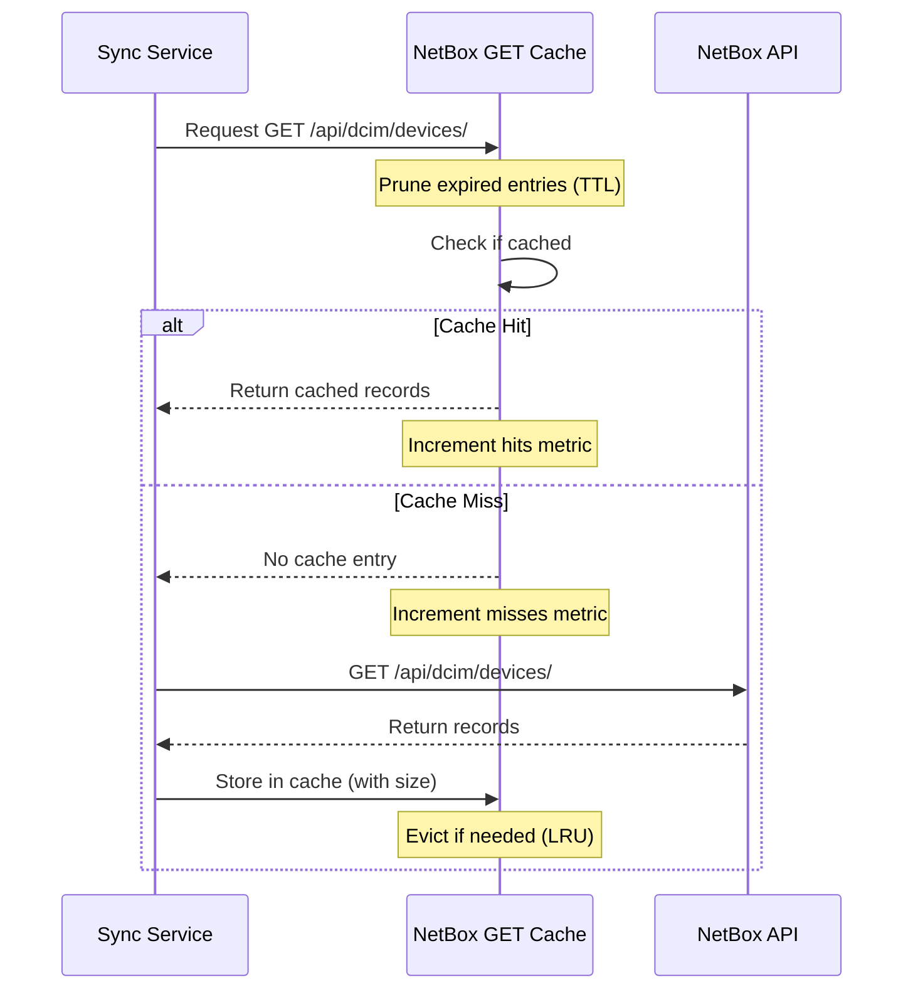
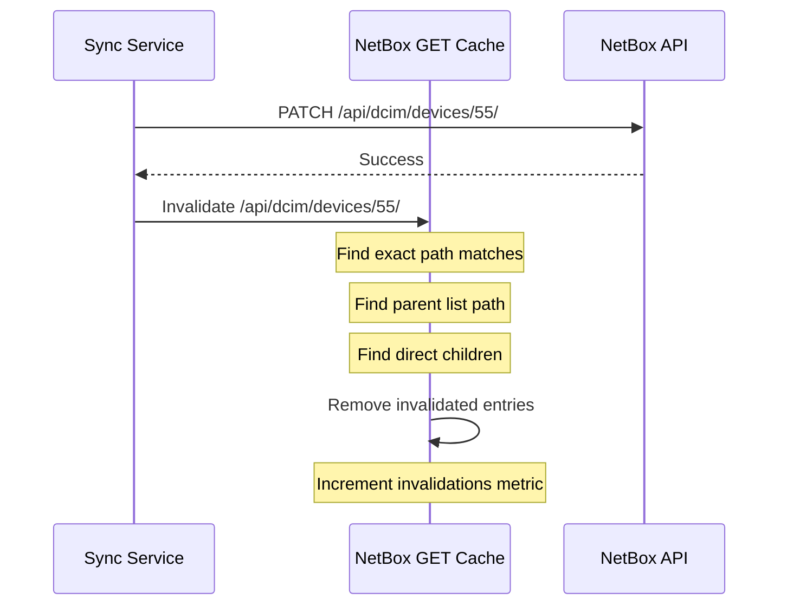
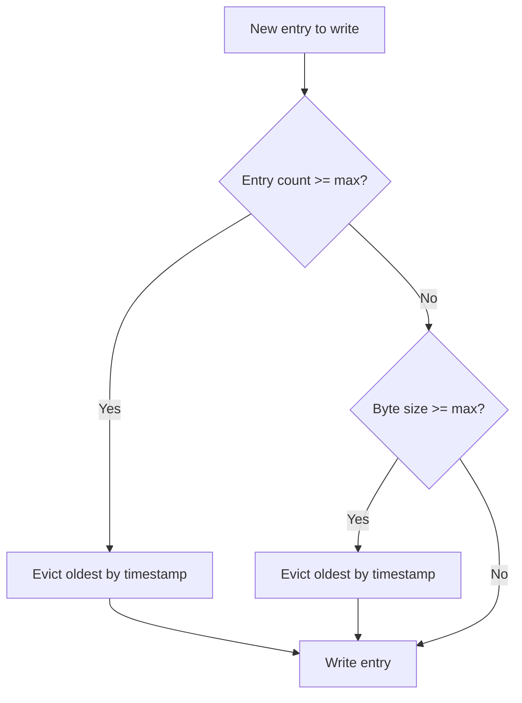

# Caching Architecture

This document describes the caching architecture in proxbox-api, including design decisions, flow diagrams, and configuration options.

## Overview

proxbox-api implements a request-level caching layer for NetBox GET operations to reduce database load during sync operations. The cache is in-memory only and does not persist across restarts.

## Cache Types

### NetBox GET Cache

Located in `proxbox_api/netbox_rest.py`, this cache stores responses from NetBox REST API GET requests. It's designed to:

- Reduce redundant NetBox API calls during sync operations
- Provide automatic cache invalidation on mutations (POST/PATCH/PUT/DELETE)
- Offer observability through metrics endpoints
- Support both entry count and byte size limits

### Proxbox Internal Cache

Located in `proxbox_api/cache.py`, this is a separate in-memory cache for internal Proxbox data structures. It's used for general-purpose caching within the application.

## Cache Flow

### GET Request Flow



### Cache Invalidation Flow



## Cache Configuration

| Environment Variable | Default | Description |
|---------------------|---------|-------------|
| `PROXBOX_NETBOX_GET_CACHE_TTL` | 60.0 | Cache TTL in seconds (0 to disable) |
| `PROXBOX_NETBOX_GET_CACHE_MAX_ENTRIES` | 4096 | Maximum number of cached entries |
| `PROXBOX_NETBOX_GET_CACHE_MAX_BYTES` | 52428800 | Maximum cache size in bytes (50MB) |
| `PROXBOX_DEBUG_CACHE` | 0 | Enable debug logging (1 to enable) |

## Eviction Policy

The cache uses a **Least Recently Used (LRU)** eviction policy. When either the entry count limit or byte size limit is reached, the oldest entries (by cached timestamp) are evicted first.

### Eviction Triggers

1. **TTL Expiry**: Entries older than `PROXBOX_NETBOX_GET_CACHE_TTL` seconds are automatically removed
2. **Entry Count Limit**: When `len(cache) >= max_entries`, oldest entries are evicted
3. **Byte Size Limit**: When `current_bytes + new_entry > max_bytes`, oldest entries are evicted

### Eviction Order



## Cache Invalidation Strategy

Cache invalidation is **precise** (not prefix-based) to avoid over-invalidation:

- Updating `/api/dcim/devices/55/` invalidates:
  - Exact path: `/api/dcim/devices/55/`
  - Parent list: `/api/dcim/devices/`
  - Direct children (if any): none for detail paths

- Updating `/api/dcim/devices/` (list) invalidates:
  - Exact path: `/api/dcim/devices/`
  - Direct children: `/api/dcim/devices/1/`, `/api/dcim/devices/2/`, etc.

This prevents the issue where updating device ID 1 would incorrectly invalidate device ID 10.

## Metrics and Observability

### Available Metrics

| Metric | Type | Description |
|--------|------|-------------|
| `hits` | counter | Total cache hits |
| `misses` | counter | Total cache misses |
| `hit_rate` | gauge | Cache hit rate percentage |
| `invalidations` | counter | Number of cache invalidations |
| `evictions_ttl` | counter | Entries evicted due to TTL expiry |
| `evictions_size` | counter | Entries evicted due to entry limit |
| `evictions_bytes` | counter | Bytes evicted due to byte limit |
| `current_entries` | gauge | Current cached entry count |
| `current_bytes` | gauge | Current cache size in bytes |
| `max_entries` | gauge | Maximum allowed entries |
| `max_bytes` | gauge | Maximum allowed bytes |

### Metrics Endpoints

- `GET /cache` - Combined cache view with metrics
- `GET /cache/metrics` - JSON metrics
- `GET /cache/metrics/prometheus` - Prometheus format

## Debug Logging

Enable detailed cache logging with:

```bash
export PROXBOX_DEBUG_CACHE=1
```

This logs:
- Cache HIT/MISS events
- Cache DISABLED (TTL=0)
- Cache EXPIRED events
- Cache INVALIDATE events with count

## Integration Points

The cache is integrated at the REST helper layer in `proxbox_api/netbox_rest.py`:

- `rest_list_async()` - List resources with caching
- `rest_first_async()` - Get first result with caching
- `rest_get_async()` - Get single resource with caching
- `rest_create_async()` - Create with cache invalidation
- `rest_update_async()` - Update with cache invalidation
- `rest_delete_async()` - Delete with cache invalidation

All sync services automatically benefit from this centralized cache layer without any changes needed.

## Performance Considerations

### Cache Hit Rate

A high cache hit rate (>70%) indicates effective caching. To improve hit rate:

1. Increase TTL for stable data
2. Adjust cache size limits for your workload
3. Ensure queries are deterministic (same query = same cache key)

### Memory Usage

The byte limit prevents unbounded memory growth. Monitor `current_bytes` metric to ensure adequate headroom.

### Cache Metrics Endpoints

The runtime exposes two endpoints for live cache observation:

- `GET /cache/metrics` - JSON snapshot (`hits`, `misses`, `evictions`, `entries`, `current_bytes`, derived hit ratio).
- `GET /cache/metrics/prometheus` - Prometheus exposition format suitable for scrape jobs.

Use these instead of patching custom counters; they reflect the live `NetBoxGetCache` state.
