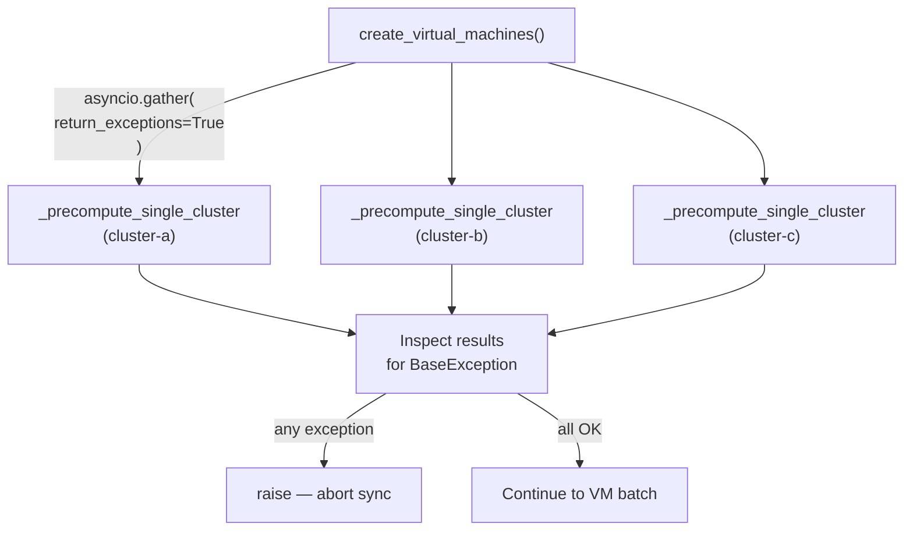
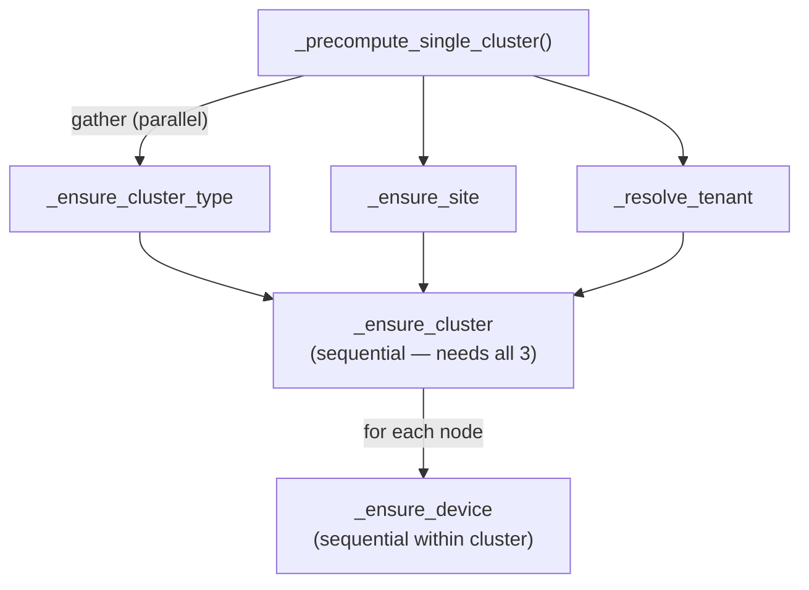

# Parallel Gather Patterns

## `asyncio.gather` Basics

`asyncio.gather(*coros)` runs all coroutines concurrently and returns a list of
their results in the same order. If any coroutine raises, `gather` cancels the
remaining ones (by default) and propagates the first exception to the caller.

```python
results = await asyncio.gather(coro_a(), coro_b(), coro_c())
# results = [result_a, result_b, result_c]
```

The `return_exceptions=True` variant changes this behaviour: exceptions are
returned as values instead of being raised. The caller must check each item.

```python
results = await asyncio.gather(coro_a(), coro_b(), coro_c(), return_exceptions=True)
# results may contain exceptions: [result_a, ValueError("..."), result_c]
for r in results:
    if isinstance(r, BaseException):
        handle_failure(r)
```

## Pattern 1: Cross-Cluster Parallel Precompute

All clusters in a sync pass are processed concurrently. A failure in any single
cluster precompute should abort the entire sync (the cluster data is required),
so the code uses `return_exceptions=True` to inspect results and then explicitly
re-raises the first failure.

```python
cluster_precompute_results = await asyncio.gather(
    *[_precompute_single_cluster(cn, vrs)
      for cn, vrs in resources_by_cluster.items()],
    return_exceptions=True,
)
for _cluster_result in cluster_precompute_results:
    if isinstance(_cluster_result, BaseException):
        raise _cluster_result   # <- re-raise: abort the sync
```

**Why not plain `gather` (without `return_exceptions`)?** With plain gather,
the default `asyncio.gather` cancels all remaining tasks when any one fails.
Using `return_exceptions=True` and re-raising manually gives the code a chance
to log which cluster failed before aborting.



## Pattern 2: Within-Cluster Parallel Dependency Resolution

Inside each cluster's precompute, three independent lookups run concurrently:

```python
cluster_type, site, tenant = await asyncio.gather(
    _ensure_cluster_type(nb, mode=cluster_mode, tag_refs=tag_refs),
    _ensure_site(nb, cluster_name=cluster_name, ...),
    _resolve_tenant(nb, placement=cluster_state),
)
# sequential: _ensure_cluster depends on cluster_type, site, tenant
cluster = await _ensure_cluster(nb, cluster_type=cluster_type, site=site, ...)
```

These three are mutually independent: cluster type, site, and tenant have no
dependency on each other. Running them in sequence would triple the latency.



Node device ensures run **sequentially** within the cluster because they depend
on the resolved cluster id returned by `_ensure_cluster`.

## Pattern 3: VM Operation Dispatch Queue

All `CREATE`, `GET`, and `UPDATE` VM operations are dispatched concurrently
under the write semaphore. Per-VM failures are isolated.

```python
async def _run_single(operation):
    key = _prepared_vm_result_key(operation.prepared)
    async with write_semaphore:
        try:
            result = await _dispatch_operation(nb, operation)
            resolved_records[key] = result
        except Exception as err:
            failed_keys.add(key)
            resolved_records.pop(key, None)

await asyncio.gather(
    *[_run_single(op) for op in operation_queue],
    return_exceptions=True,
)
return resolved_records, failed_keys
```

Here `return_exceptions=True` is used at the gather level as a safety net, but
failures are already captured inside `_run_single`. This guarantees the gather
never raises even if an unexpected exception escapes the inner handler.

```mermaid
sequenceDiagram
    participant G as asyncio.gather
    participant R1 as _run_single (VM 1)
    participant R2 as _run_single (VM 2) FAIL
    participant R3 as _run_single (VM 3)

    G->>R1: start concurrently
    G->>R2: start concurrently
    G->>R3: start concurrently

    R2->>R2: exception caught → failed_keys.add(key2)
    Note over R2: semaphore released; gather continues
    R1->>R1: success → resolved_records[key1]
    R3->>R3: success → resolved_records[key3]

    G-->>G: return [None, None, None] (all return_exceptions captured inside)
    Note over G: resolved_records = {key1, key3}, failed_keys = {key2}
```

## Choosing the Right Pattern

| Scenario | Pattern | `return_exceptions` |
|---|---|---|
| Cross-cluster precompute — any failure aborts | Re-raise after inspect | `True` |
| Within-cluster independent lookups — any failure aborts the cluster | Plain gather | `False` (default) |
| VM dispatch — per-item failures are counted, not propagated | Failure isolation inside each item | `True` (safety net) |
