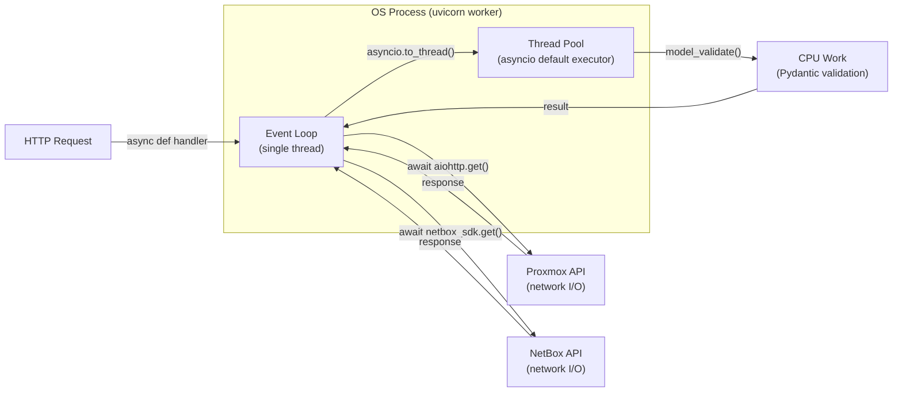
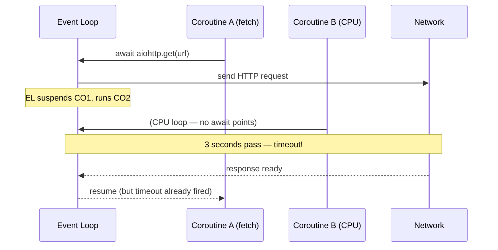

# Async Architecture Overview

## The Single-Threaded Event Loop

proxbox-api is a FastAPI application served by uvicorn. Each uvicorn worker runs
one Python **event loop** — a single-threaded scheduler that multiplexes thousands
of concurrent I/O-bound coroutines without OS threads.



The event loop owns its thread. Whenever a coroutine `await`s something, the
event loop suspends it and runs another coroutine that is ready. This is why
I/O-bound work scales well: while waiting for a Proxmox API response the loop
continues processing other requests.

## Why CPU-Bound Work Is Dangerous

A coroutine that runs pure Python without hitting any `await` points holds the
event loop **exclusively** until it finishes. During that time:

- Every other pending coroutine waits.
- aiohttp I/O callbacks are not dispatched.
- Wall-clock timeouts configured on `ClientSession` can fire — not because the
  network is slow, but because the event loop was busy doing CPU work.



The solution is `asyncio.to_thread()`.

## `asyncio.to_thread` — Offloading CPU Work

`asyncio.to_thread(fn, *args)` runs `fn(*args)` in a thread-pool thread and
returns an awaitable. The event loop is free while the thread runs.

```python
# BAD — blocks the event loop for every VM in the batch
for vm_config in fetched_configs:
    prepared = _build_vm_payload(vm_config)      # pure CPU, no await

# GOOD — offloads CPU work to thread pool
for vm_config in fetched_configs:
    prepared = await asyncio.to_thread(
        _build_vm_payload, vm_config
    )
```

The two-phase VM batch separates I/O-bound fetch (phase 1) from CPU-bound
processing (phase 2) precisely so that all aiohttp connections are drained
before any CPU work holds the loop. See
[Two-Phase VM Batch](async-two-phase-batch.md) for the full design.

## The Three Async Building Blocks

| Primitive | Purpose | Used in proxbox-api |
|---|---|---|
| `asyncio.Semaphore` | Bound concurrent access to a shared resource | Fetch, write, and interface-batch semaphores |
| `asyncio.gather` | Run multiple coroutines concurrently, collect results | Cluster precompute, VM dispatch, within-cluster dependency resolution |
| `asyncio.to_thread` | Offload blocking CPU or legacy sync code | Pydantic `model_validate`, payload builders |

Each of these is covered in detail in the following sections:

- [Semaphore-Bounded Concurrency](async-semaphores.md)
- [Parallel Gather Patterns](async-gather.md)
- [Two-Phase VM Batch](async-two-phase-batch.md)
- [Scoped Timeout Widening](async-timeout-scoping.md)
- [Runtime Concurrency Tunables](async-tunables.md)
