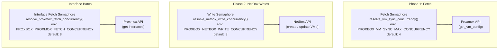
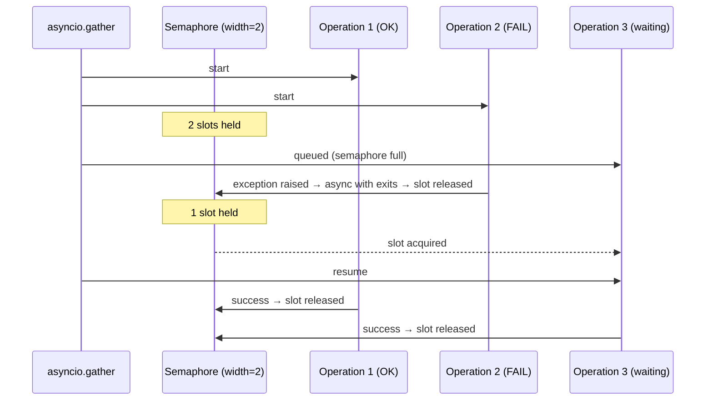

# Semaphore-Bounded Concurrency

## What Is an `asyncio.Semaphore`?

An `asyncio.Semaphore` is a counter that limits how many coroutines can hold it
at the same time. Attempting to `await` the semaphore when its counter is zero
suspends the caller until another coroutine releases it.

```python
sem = asyncio.Semaphore(4)  # at most 4 concurrent holders

async def task(i):
    async with sem:          # acquire (blocks if 4 already held)
        await do_work(i)     # up to 4 tasks run simultaneously
                             # release happens on exit
```

Unlike `threading.Semaphore`, `asyncio.Semaphore` never uses OS threads or
locks; it is entirely cooperative and safe to use from coroutines.

## The Three Semaphores in the VM Sync Pipeline



### 1. Fetch Semaphore

**Source:** `resolve_vm_sync_concurrency()` in
`proxbox_api/routes/virtualization/virtual_machines/helpers.py`

```python
fetch_semaphore = asyncio.Semaphore(max(1, resolve_vm_sync_concurrency()))

async def _fetch_with_limit(resource):
    async with fetch_semaphore:
        return await _fetch_vm_config_only(pxs=pxs, resource=resource)

fetch_results = await asyncio.gather(
    *[_fetch_with_limit(res) for _, res in operation_inputs],
    return_exceptions=True,
)
```

**Why it is needed:** Proxmox clusters can have thousands of VMs. Firing all
config requests simultaneously would overwhelm the Proxmox API's rate limiter
and exhaust the aiohttp connection pool. The semaphore serializes bursts to at
most `PROXBOX_VM_SYNC_MAX_CONCURRENCY` concurrent in-flight requests.

### 2. Write Semaphore

**Source:** `resolve_netbox_write_concurrency()` in the same helpers file.

```python
write_semaphore = asyncio.Semaphore(max(1, resolve_netbox_write_concurrency()))

async def _run_single(operation):
    key = _prepared_vm_result_key(operation.prepared)
    async with write_semaphore:          # <- inside the try/except
        try:
            result = await _dispatch_operation(nb, operation)
            resolved_records[key] = result
        except Exception as err:
            failed_keys.add(key)
            resolved_records.pop(key, None)
            logger.warning("VM dispatch failed: key=%s error=%s", key, err)
```

**Why it is needed:** NetBox's PostgreSQL backend has a limited connection pool.
Sending 500 concurrent write requests would hit pool exhaustion, causing
cascading timeouts. The default of 8 writes keeps PostgreSQL pressure
manageable while still achieving significant parallelism.

### 3. Interface Fetch Semaphore

**Source:** `resolve_proxmox_fetch_concurrency()` — guards concurrent Proxmox
reads for per-VM interface enumeration, separate from the VM config fetch.

## Failure Isolation Requires the Semaphore Inside the Error Handler

A common mistake is placing the `try/except` **inside** the `async with` block:

```python
# WRONG — exception is NOT caught inside the semaphore context
async def _run_single(operation):
    try:
        async with write_semaphore:    # acquire
            await _dispatch_operation(nb, operation)
    except Exception as err:           # caught here — semaphore already released
        failed_keys.add(key)
```

This actually works correctly for exception propagation, but the pattern used in
proxbox-api wraps `async with write_semaphore` inside `_run_single` so that
the semaphore scope, try/except, and failure accounting are co-located and
readable.  The critical invariant is:

**A failed operation must release its semaphore slot immediately** so
subsequent operations are not starved. Because `async with` is an async context
manager, the slot is always released on exit regardless of whether an exception
was raised — the `except` clause inside can safely record the failure without
holding up other operations.



## Sizing the Semaphore

The right width depends on the downstream service:

| Semaphore | Downstream | Key constraint | Default |
|---|---|---|---|
| Fetch | Proxmox cluster API | Rate limiting, connection pool | 4 |
| Write | NetBox PostgreSQL | DB connection pool size | 8 |
| Interface fetch | Proxmox guest agent | Rate limiting, per-VM overhead | 8 |

See [Runtime Concurrency Tunables](async-tunables.md) for how to tune these
through environment variables or the NetBox Proxbox plugin settings page.
