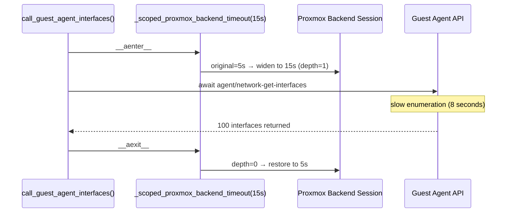
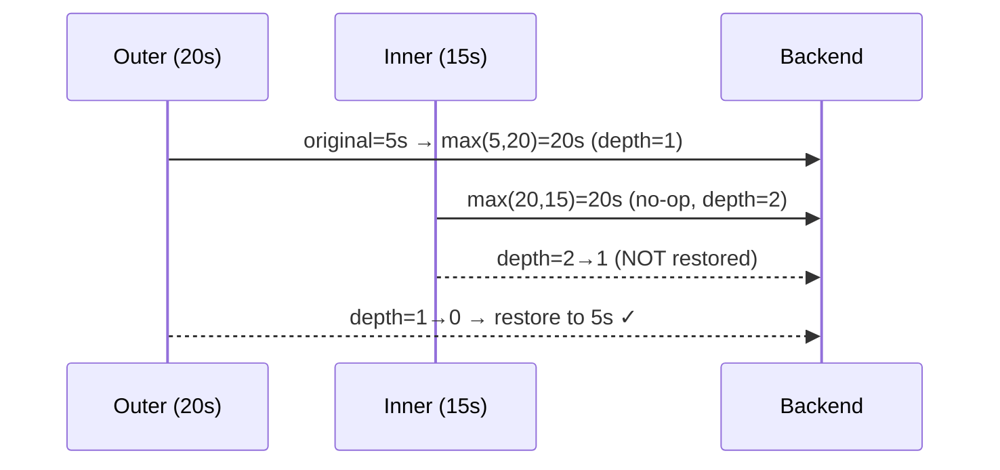

# Scoped Timeout Widening

## The Problem: Guest-Agent Enumeration Is Slow

When syncing VMs with many interfaces (e.g. a VRRP router with 100+ virtual
interfaces), `agent/network-get-interfaces` can take 10–30 seconds inside the
VM guest. The default Proxmox session timeout (5 seconds) was silently dropping
guest-agent data for these VMs.

Simply raising the global session timeout would affect every request, including
the tight VM config fetches in phase 1, potentially starving the event loop for
longer.

## `_scoped_proxmox_backend_timeout`

The solution is a context manager that **widens** the Proxmox backend timeout
only for the duration of the guest-agent call, then restores the original
timeout.

```python
@asynccontextmanager
async def _scoped_proxmox_backend_timeout(pxs, timeout_seconds: float):
    original = pxs._session.connector._timeout   # aiohttp ClientTimeout
    widened = aiohttp.ClientTimeout(
        total=max(original.total or 0, timeout_seconds),  # widen-only
        connect=original.connect,
        sock_connect=original.sock_connect,
        sock_read=original.sock_read,
    )
    pxs._session.connector._timeout = widened
    _depth_counter[pxs] += 1
    try:
        yield
    finally:
        _depth_counter[pxs] -= 1
        if _depth_counter[pxs] == 0:
            pxs._session.connector._timeout = original  # restore only at last exit
```

### Widen-Only Invariant

The new `total` is always `max(original, requested)`. This means:

- If the original timeout is already larger, it is unchanged.
- The context manager can never _narrow_ the timeout — a nested call with a
  smaller requested timeout has no effect on the outer scope.



### Depth Counter — Nested Call Safety

If two overlapping calls to `_scoped_proxmox_backend_timeout` are made on the
same backend, the timeout is only restored when the _last_ exit fires.



Without the depth counter, the inner exit would restore `5s` prematurely and
the outer call would run with the original narrow timeout.

## Guest-Agent Timeout Configuration

The guest-agent timeout is configured through:

- **Environment variable:** `PROXBOX_GUEST_AGENT_TIMEOUT` (seconds, float)
- **Plugin settings key:** `guest_agent_timeout` (on the NetBox Proxbox plugin
  settings page)
- **Default:** 15 seconds
- **Range:** 1–600 seconds

```python
guest_agent_timeout = get_float(
    settings_key="guest_agent_timeout",
    env="PROXBOX_GUEST_AGENT_TIMEOUT",
    default=15.0,
    minimum=1.0,
    maximum=600.0,
)

async def _get_guest_interfaces(pxs, vmid, node):
    async with _scoped_proxmox_backend_timeout(pxs, guest_agent_timeout):
        for attempt in range(2):   # one bounded retry
            try:
                return await pxs.agent_network_get_interfaces(vmid=vmid, node=node)
            except ProxmoxTimeoutError:
                if attempt == 0:
                    continue
                raise
```

The **one bounded retry** (not an infinite loop) handles transient timeout
spikes without masking genuine connectivity failures.

## When to Use This Pattern

Use `_scoped_proxmox_backend_timeout` whenever a specific Proxmox API call is
known to be slower than the session default and you do not want to raise the
global timeout:

```python
# ✅ Correct — guest-agent only widens for the specific call
async with _scoped_proxmox_backend_timeout(pxs, timeout_seconds=30):
    data = await pxs.agent_exec(vmid=vmid, node=node, command="df -h")

# ❌ Wrong — raises global timeout for all requests
pxs._session.connector._timeout = aiohttp.ClientTimeout(total=30)
data = await pxs.agent_exec(vmid=vmid, node=node, command="df -h")
# (original timeout never restored)
```
