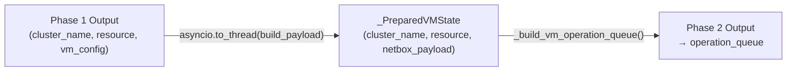

# Two-Phase VM Batch

## The Problem: Mixing I/O and CPU in a Single Phase

A naive implementation of VM sync would iterate over all VMs, fetch each
config, and immediately process it:

```python
# NAIVE — mixes I/O and CPU in the same loop
for cluster_name, resource in operation_inputs:
    vm_config = await _fetch_vm_config_only(pxs, resource)
    prepared = _build_netbox_virtual_machine_payload(vm_config)  # CPU
    prepared_vms.append(prepared)
```

This works for a handful of VMs, but breaks at scale. `_build_netbox_virtual_machine_payload`
runs Pydantic `model_validate` and several transformation steps — pure CPU work
with no `await` points. On a cluster of 500 VMs, the event loop is held for
hundreds of milliseconds of CPU time between each `await _fetch_vm_config_only`,
causing aiohttp to fire wall-clock timeouts even though the network is healthy.

```mermaid
gantt
    title Naive approach (500 VMs, 10ms CPU each)
    dateFormat X
    axisFormat %Lms

    section Event Loop
    fetch VM 1  : 0, 50
    CPU work VM 1 : 50, 60
    fetch VM 2  : 60, 110
    CPU work VM 2 : 110, 120
    fetch VM 3  : 120, 170
    CPU work VM 3 : 170, 180
    section aiohttp timeouts
    Timer fires (other sessions) : crit, 100, 105
```



## The Solution: Two Phases

`_run_full_update_vm_batch` separates the work into two strictly sequential
phases:

### Phase 1 — Fetch All Configs (I/O-Bound)

All Proxmox VM config requests fire concurrently under the fetch semaphore.
The event loop is kept free to process aiohttp callbacks between requests.

```python
fetch_semaphore = asyncio.Semaphore(max(1, resolve_vm_sync_concurrency()))

async def _fetch_with_limit(resource):
    async with fetch_semaphore:
        return await _fetch_vm_config_only(pxs=pxs, resource=resource)

fetch_results = await asyncio.gather(
    *[_fetch_with_limit(resource) for _, resource in operation_inputs],
    return_exceptions=True,
)
```

Phase 1 ends only after **every** config fetch has completed or failed.

### Phase 2 — Process Configs (CPU-Bound via `asyncio.to_thread`)

Successful configs are processed sequentially. Each `_prepare_vm_from_config`
call offloads the CPU-intensive Pydantic validation and payload building to the
thread pool via `asyncio.to_thread`.

```python
for cluster_name, resource, vm_config in fetched_vm_configs:
    try:
        prepared_vms.append(
            await _prepare_vm_from_config(
                cluster_name, resource, vm_config, prepare_context,
            )
        )
    except Exception as prepared_result:
        failed_vms += 1
```

Inside `_prepare_vm_from_config`, the heavy work is wrapped:

```python
async def _prepare_vm_from_config(cluster_name, resource, vm_config, ctx):
    state = await asyncio.to_thread(
        _build_netbox_virtual_machine_payload, vm_config, ctx
    )
    return _PreparedVMState(cluster_name=cluster_name, resource=resource, state=state)
```



```mermaid
gantt
    title Two-phase approach (500 VMs, 10ms CPU each)
    dateFormat X
    axisFormat %Lms

    section Phase 1 — Fetch (concurrent, semaphore width=4)
    Batch 1 (4 VMs) : 0, 50
    Batch 2 (4 VMs) : 50, 100
    Batch N         : 100, 150
    section Phase 2 — Process (thread pool)
    CPU VM 1 (thread) : 150, 160
    CPU VM 2 (thread) : 160, 170
    CPU VM 3 (thread) : 170, 180
    section Event Loop
    Free during thread work : 150, 180
```

## `_PreparedVMState` — The Hand-off Type

`_PreparedVMState` is a dataclass that carries the output of phase 1 (the raw
Proxmox config dict) and phase 2 (the Pydantic-validated NetBox payload). It
is the contract between the two phases.



## Failure Counting Across Both Phases

A VM can fail in either phase:

| Phase | Failure cause | Effect |
|---|---|---|
| Phase 1 (fetch) | Proxmox API error, timeout | `fetch_failed += 1`, `failed_vms += 1`, VM skipped |
| Phase 2 (process) | Pydantic validation error, mapping error | `failed_vms += 1`, VM skipped |
| Dispatch | NetBox write error | `failed_keys.add(key)`, counted by caller |

The caller receives `(synced_records, failed_vms)` from `_run_full_update_vm_batch`.
`total_vms = len(synced_records) + failed_vms` is always correct; a stage where
all VMs fail reports `total > 0, failed > 0` rather than the misleading
`total = 0, ok = 0, failed = 0` that an uncounted-failure implementation would
produce.

## Timing Logs

The batch emits an INFO log after phase 1 completes:

```
VM full-update phase timing: fetch_ms=1234.56 process_ms=567.89 fetched_ok=480 fetch_failed=20
```

Use `fetch_ms` to diagnose Proxmox API latency. Use `process_ms` to diagnose
CPU overhead. See [Runtime Concurrency Tunables](async-tunables.md) for how
to tune `PROXBOX_VM_SYNC_MAX_CONCURRENCY` to optimize fetch throughput.
