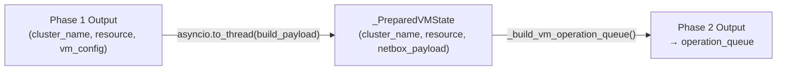

# Two-Phase VM Batch

## The Problem: Mixing I/O and CPU in a Single Phase

A naive implementation of VM sync would iterate over all VMs, fetch each
config, and immediately process it:

```python
# NAIVE — mixes I/O and CPU in the same loop
for cluster_name, resource in operation_inputs:
    vm_config = await _fetch_vm_config_only(pxs, resource)
    prepared = build_netbox_virtual_machine_payload(vm_config)  # CPU
    prepared_vms.append(prepared)
```

This works for a handful of VMs, but breaks at scale. `build_netbox_virtual_machine_payload`
runs Pydantic `model_validate` and several transformation steps — pure CPU work
with no `await` points. On a cluster of 500 VMs, the event loop is held for
hundreds of milliseconds of CPU time between each `await _fetch_vm_config_only`,
causing aiohttp to fire wall-clock timeouts even though the network is healthy.


```mermaid
gantt
    title Naive approach (500 VMs, 10ms CPU each)
    dateFormat X
    axisFormat %Lms

    section Event Loop
    fetch VM 1  : 0, 50
    CPU work VM 1 : 50, 60
    fetch VM 2  : 60, 110
    CPU work VM 2 : 110, 120
    fetch VM 3  : 120, 170
    CPU work VM 3 : 170, 180
    section aiohttp timeouts
    Timer fires (other sessions) : crit, 100, 105
```

## The Solution: Two Phases

`_run_full_update_vm_batch` separates the work into two strictly sequential
phases:

### Phase 1 — Fetch All Configs (I/O-Bound)

Proxmox VM config requests run through a fixed worker set and a bounded input
queue. This limits active requests and pending work; the event loop remains free
to process aiohttp callbacks between requests.

```python
fetch_results = await _map_bounded_ordered(
    operation_inputs,
    _fetch_one,
    worker_count=resolve_vm_sync_concurrency(),
)
```

Phase 1 ends only after **every** config fetch has completed or failed.

### Phase 2 — Process Configs (CPU-Bound via `asyncio.to_thread`)

Successful configs are processed sequentially. The following is pseudocode;
each item retains its endpoint-specific session and cluster settings. Each
`_prepare_vm_from_config` call offloads the CPU-intensive Pydantic validation
and payload building to the thread pool via `asyncio.to_thread`.

```python
for endpoint_id, cluster_name, resource, vm_config, px_source, cluster_source in fetched_vm_configs:
    try:
        prepared_vms.append(
            await _prepare_vm_from_config(
                cluster_name, resource, vm_config, prepare_context,
                endpoint_id=endpoint_id,
                px_source=px_source,
                cluster_source=cluster_source,
            )
        )
    except Exception as prepared_result:
        failed_vms += 1
```

Inside `_prepare_vm_from_config`, the relevant flow is equivalent to this
pseudocode; the production helper also resolves dependencies and supplies every
required `_PreparedVMState` field:

```python
async def _prepare_vm_from_config(cluster_name, resource, vm_config, context):
    config_model, resource_model = await asyncio.to_thread(
        _validate_vm_inputs, vm_config, resource
    )
    desired_payload = await asyncio.to_thread(
        build_netbox_virtual_machine_payload,
        proxmox_resource=resource_model,
        proxmox_config=config_model,
        # resolved cluster, device, role, tag, site, tenant, type, and platform IDs
    )
    sync_state_fields = build_virtual_machine_sync_state_fields(
        proxmox_resource=resource_model,
        proxmox_config=config_model,
        # run timestamp and endpoint-scoped identity
    )
    return build_complete_prepared_state(
        resource=resource,
        vm_config=vm_config,
        vm_config_obj=config_model,
        desired_payload=desired_payload,
        sync_state_fields=sync_state_fields,
        # lookup, timestamp, VM type, and resolved policy fields
    )
```


```mermaid
gantt
    title Two-phase approach (500 VMs, 10ms CPU each)
    dateFormat X
    axisFormat %Lms

    section Phase 1 — Fetch (four fixed workers, bounded queue)
    Batch 1 (4 VMs) : 0, 50
    Batch 2 (4 VMs) : 50, 100
    Batch N         : 100, 150
    section Phase 2 — Process (thread pool)
    CPU VM 1 (thread) : 150, 160
    CPU VM 2 (thread) : 160, 170
    CPU VM 3 (thread) : 170, 180
    section Event Loop
    Free during thread work : 150, 180
```

## `_PreparedVMState` — The Hand-off Type

`_PreparedVMState` is a dataclass that carries the output of phase 1 (the raw
Proxmox config dict) and phase 2 (the Pydantic-validated NetBox payload). It
is the contract between the two phases.


```mermaid
flowchart LR
    P1["Phase 1 Output\n(cluster_name, resource, vm_config)"]
    PS["_PreparedVMState\n(cluster_name, resource, netbox_payload)"]
    P2["Phase 2 Output\n→ operation_queue"]

    P1 -->|"asyncio.to_thread(build_payload)"| PS
    PS -->|"_build_vm_operation_queue()"| P2
```

## Failure Counting Across Both Phases

A VM can fail in either phase:

| Phase | Failure cause | Effect |
|---|---|---|
| Phase 1 (fetch) | Proxmox API error, timeout | `fetch_failed += 1`, `failed_vms += 1`, VM skipped |
| Phase 2 (process) | Pydantic validation error, mapping error | `failed_vms += 1`, VM skipped |
| Dispatch | NetBox write error | `failed_keys.add(key)`, counted by caller |

The caller receives `(synced_records, failed_vms)` from `_run_full_update_vm_batch`.
`total_vms = len(synced_records) + failed_vms` is always correct; a stage where
all VMs fail reports `total > 0, failed > 0` rather than the misleading
`total = 0, ok = 0, failed = 0` that an uncounted-failure implementation would
produce.

## Timing Logs

The batch emits an INFO log after phase 1 completes:

```
VM full-update phase timing: fetch_ms=1234.56 process_ms=567.89 fetched_ok=480 fetch_failed=20
```

Use `fetch_ms` to diagnose Proxmox API latency. Use `process_ms` to diagnose
CPU overhead. See [Runtime Concurrency Tunables](async-tunables.md) for how
to tune `PROXBOX_VM_SYNC_MAX_CONCURRENCY` to optimize fetch throughput.

The complete batch also logs `process_cpu_ms`, snapshot loading, sidecar
hydration, name resolution, canonicalization, reconciliation, dispatch, and
persistence durations. Wall time and process CPU time answer different
questions; do not add overlapping request durations and report the sum as
end-to-end duration. The log includes the worker count and bounded queue
capacity. `process_cpu_ms` is process-wide and is attributable to this sync only
during an isolated run. Request counts and upstream latency must be collected from the SDK
transport metrics during controlled staging runs.

After name resolution, final desired payloads are validated once off the event
loop and retained in `_PreparedVMState.desired_state`. The Python planner reuses
that canonical model instead of reconstructing it. Cancellation before this
offload returns prevents its result from reaching dispatch; already-issued
writes retain their existing outcome handling.
