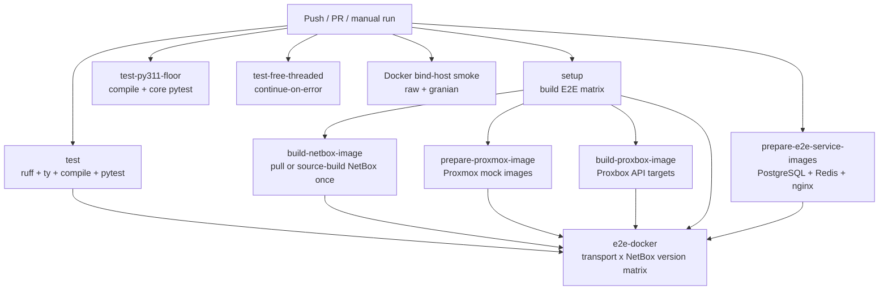
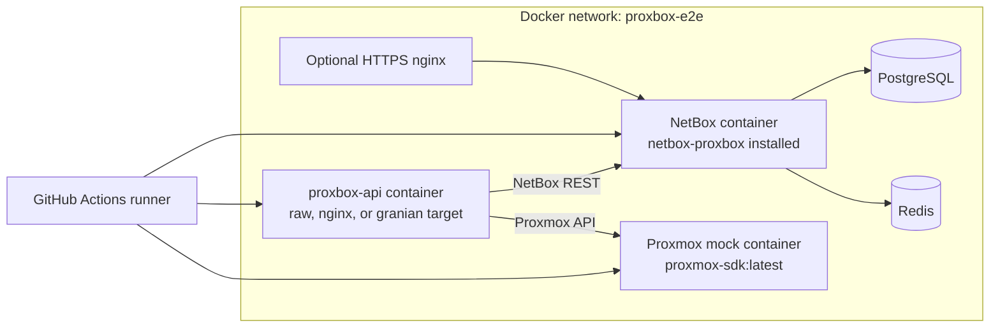
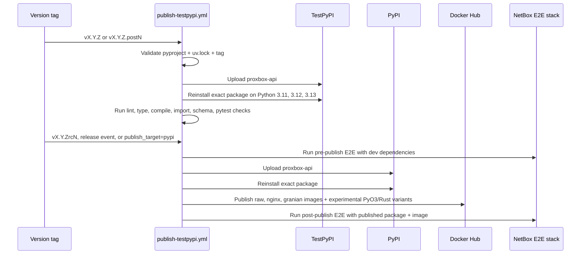

# CI and E2E Workflows

This page documents the developer-facing GitHub Actions surface for
`proxbox-api`: fast validation, Docker image smoke tests, the NetBox-backed E2E
matrix, and staged package publication.

## Workflow Map

| Workflow | Trigger | Purpose |
|---|---|---|
| `.github/workflows/ci.yml` | Push, pull request, release, manual dispatch | Runs core checks and the NetBox + Proxmox Docker E2E matrix. |
| `.github/workflows/publish-testpypi.yml` | Version tag, GitHub release, manual dispatch | Publishes immutable package versions through TestPyPI, PyPI release candidates, final PyPI releases, Docker images, and post-publish E2E. |
| `.github/workflows/docker-hub-publish.yml` | Reusable workflow / manual dispatch | Builds and publishes raw, nginx, granian, and experimental PyO3/Rust Docker image variants. |
| `.github/workflows/release-docker-verify.yml` | Release / manual dispatch | Pulls the published Docker image tags, including experimental PyO3/Rust tags, and verifies container startup. |
| `.github/workflows/docs.yml` | Docs changes on main / PR | Builds and publishes the MkDocs site. |
| `.github/workflows/nightly-schema-refresh.yml` | Schedule / manual dispatch | Refreshes generated Proxmox schemas and opens a PR when they change. |

## CI Job Flow

CI prepares Docker images once as short-lived workflow artifacts, then every
E2E matrix leg loads those artifacts before starting the stack. This keeps the
large NetBox-version matrix from repeatedly pulling Docker Hub images or
rebuilding Proxbox API targets. The NetBox prep job pulls the public image when
available and falls back to a source build when the registry image is missing.
The fallback source build follows the current upstream `netbox-docker` base
image, `ubuntu:26.04`, so the package set matches the upstream Dockerfile.

## E2E Stack

`ci.yml` starts a real stack and verifies that `proxbox-api` can authenticate,
configure NetBox endpoints, and run sync tests across supported transports.

Important E2E rules:

- NetBox readiness waits up to 20 minutes for migrations/search indexing.
- `/api/status/` must be ready before tokens and endpoints are configured.
- Docker images are loaded from prepared artifacts; E2E matrix jobs do not pull
  Docker Hub images or rebuild Proxbox API containers directly.
- Docker-backed Proxmox tests run with the `mock_http` marker.
- The in-process `MockBackend` pass runs separately with the `mock_backend`
  marker.
- Release events run both `dev` and `pypi` `netbox-proxbox` dependency modes;
  normal push/PR CI uses the development mode.

## Release Validation

Package uploads intentionally omit `twine --skip-existing`. If any validation
fails after upload, publish a fixed-forward version: `vX.Y.Z.postN` for TestPyPI
or post-release fixes, and `vX.Y.ZrcN` for PyPI release-candidate retries.
