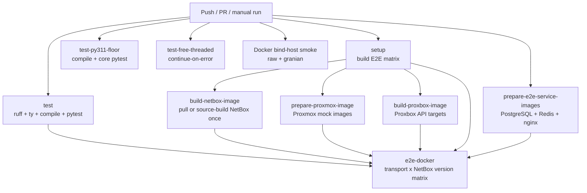
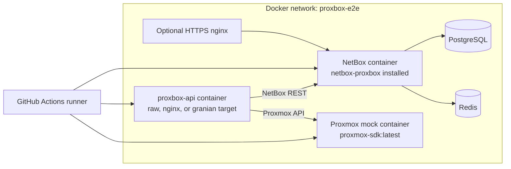
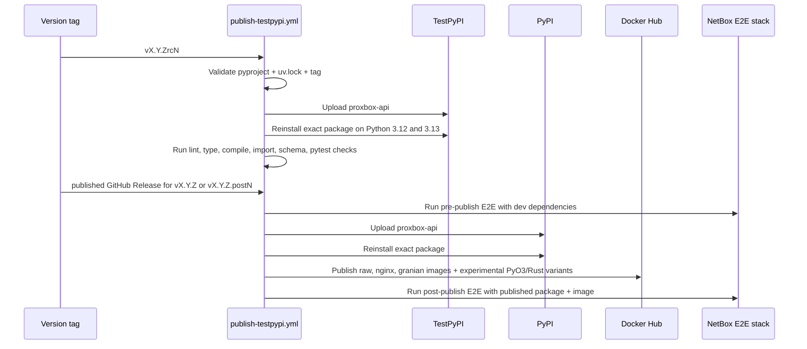

# CI and E2E Workflows

This page documents the developer-facing GitHub Actions surface for
`proxbox-api`: fast validation, Docker image smoke tests, the NetBox-backed E2E
matrix, and staged package publication.

## Workflow Map

| Workflow | Trigger | Purpose |
|---|---|---|
| `.github/workflows/ci.yml` | Push, pull request, release, manual dispatch | Runs core checks and the NetBox + Proxmox Docker E2E matrix. |
| `.github/workflows/publish-testpypi.yml` | RC tag or RC-only manual dispatch; published GitHub Release | Publishes immutable RCs to TestPyPI and final/post releases to PyPI, followed by Docker images and post-publish E2E. |
| `.github/workflows/docker-hub-publish.yml` | Reusable workflow / manual dispatch | Builds and publishes raw, nginx, granian, and experimental PyO3/Rust Docker image variants. |
| `.github/workflows/release-docker-verify.yml` | Called after successful Docker publication / manual dispatch | Pulls the published Docker image tags, including experimental PyO3/Rust tags, and verifies container startup. |
| `.github/workflows/docs.yml` | Docs changes on main / PR | Builds and publishes the MkDocs site. |
| `.github/workflows/nightly-schema-refresh.yml` | Schedule / manual dispatch | Refreshes generated Proxmox schemas and opens a PR when they change. |

## CI Job Flow

```mermaid
flowchart TD
    Push[Push / PR / manual run]
    Core[test\nruff + ty + compile + pytest]
    Py311[test-py311-floor\ncompile + core pytest]
    Free[test-free-threaded\ncontinue-on-error]
    Bind[Docker bind-host smoke\nraw + granian]
    Setup[setup\nbuild E2E matrix]
    BuildNB[build-netbox-image\npull or source-build NetBox once]
    BuildSvc[prepare-e2e-service-images\nPostgreSQL + Redis + nginx]
    BuildPM[prepare-proxmox-image\nProxmox mock images]
    BuildPB[build-proxbox-image\nProxbox API targets]
    E2E[e2e-docker\ntransport x NetBox version matrix]

    Push --> Core
    Push --> Py311
    Push --> Free
    Push --> Bind
    Push --> Setup
    Setup --> BuildNB
    Setup --> BuildPM
    Setup --> BuildPB
    Push --> BuildSvc
    Core --> E2E
    Setup --> E2E
    BuildNB --> E2E
    BuildSvc --> E2E
    BuildPM --> E2E
    BuildPB --> E2E
```

CI prepares Docker images once as short-lived workflow artifacts, then every
E2E matrix leg loads those artifacts before starting the stack. This keeps the
large NetBox-version matrix from repeatedly pulling Docker Hub images or
rebuilding Proxbox API targets. Official Python, PostgreSQL, Redis, nginx, and
NetBox fallback base images are pulled through `mirror.gcr.io/library` to avoid
Docker Hub quota failures. The Proxmox mock image is built from the checked-out
`proxmox-mock/` package for each `pve`, `pbs`, and `pdm` service marker. The
NetBox prep job pulls the public image when available and falls back to a
source build when the registry image is missing. The fallback source build
follows the current upstream `netbox-docker` base image, `ubuntu:26.04`, via the
mirror-backed image reference, so the package set matches the upstream
Dockerfile.

The non-blocking `test-free-threaded` job is a focused Python 3.14t compatibility
probe, not a declaration that the package supports Python 3.14. It installs only the
focused dependencies required to compile and import the package and to run
`python -m scripts.verify_free_threaded_auth_heartbeat`. That probe exercises the
authentication reservation heartbeat deterministically. The full suite stays on the
supported Python lanes because SQLAlchemy's C-extension event-registry teardown can
segfault during `engine.dispose()` on the free-threaded runtime, even with
`PYTHON_GIL=1`.

## E2E Stack

`ci.yml` starts a real stack and verifies that `proxbox-api` can authenticate,
configure NetBox endpoints, and run sync tests across supported transports.

```mermaid
flowchart LR
    GA[GitHub Actions runner]

    subgraph Stack[Docker network: proxbox-e2e]
        NB[NetBox container\nnetbox-proxbox installed]
        NGINX[Optional HTTPS nginx]
        API[proxbox-api container\nraw, nginx, or granian target]
        PM[Proxmox mock container\nproxmox-sdk:latest]
        PG[(PostgreSQL)]
        RD[(Redis)]
    end

    GA --> NB
    GA --> API
    GA --> PM
    NB --> PG
    NB --> RD
    API -->|NetBox REST| NB
    API -->|Proxmox API| PM
    NGINX --> NB
```

Important E2E rules:

- NetBox readiness waits up to 20 minutes for migrations/search indexing.
- `/api/status/` must be ready before tokens and endpoints are configured.
- Docker images are loaded from prepared artifacts; E2E matrix jobs do not pull
  Docker Hub images or rebuild Proxbox API containers directly.
- Proxmox mock containers use the local schema-driven mock package and expose
  `PROXMOX_MOCK_SERVICE` so PBS/PDM service smoke tests can verify the active
  service marker without pulling external mock images.
- Docker-backed Proxmox tests run with the `mock_http` marker.
- The in-process `MockBackend` pass runs separately with the `mock_backend`
  marker.
- Release events run both `dev` and `pypi` `netbox-proxbox` dependency modes;
  normal push/PR CI uses the development mode.

## Release Validation

```mermaid
sequenceDiagram
    participant Tag as Version tag
    participant WF as publish-testpypi.yml
    participant TP as TestPyPI
    participant PY as PyPI
    participant DH as Docker Hub
    participant E2E as NetBox E2E stack

    Tag->>WF: vX.Y.ZrcN
    WF->>WF: Validate pyproject + uv.lock + tag
    WF->>TP: Upload proxbox-api
    WF->>TP: Reinstall exact package on Python 3.12 and 3.13
    WF->>WF: Run lint, type, compile, import, schema, pytest checks

    Tag->>WF: published GitHub Release for vX.Y.Z or vX.Y.Z.postN
    WF->>E2E: Run pre-publish E2E with dev dependencies
    WF->>PY: Upload proxbox-api
    WF->>PY: Reinstall exact package
    WF->>DH: Publish raw, nginx, granian images + experimental PyO3/Rust variants
    WF->>E2E: Run post-publish E2E with published package + image
```

Package uploads intentionally omit `twine --skip-existing`. If any validation
fails after upload, publish a fixed-forward version: `vX.Y.ZrcN` for TestPyPI
release-candidate retries and `vX.Y.Z.postN` for post-release fixes.

### Gitea package publication

`.gitea/workflows/publish-gitea.yml` is the package-only control for the Gitea
Package Registry. It can be dispatched only from canonical `main` with an exact
immutable tag. It does not mirror tags, create GitHub releases, deploy services,
or contact any runtime environment.

The workflow checks out the requested tag in isolation, verifies its version,
builds exactly one wheel and one source distribution, and records their sizes
and SHA-256 digests in a canonical release manifest. The package version must be
absent by default. `resume_existing=true` is accepted only when every existing
registry artifact, repository link, source commit, size, and digest matches the
rebuilt manifest. Registry bytes are verified before the repository-linked
manifest is published, so the manifest remains the final deployability signal.

The workflow uses the repository's locked `publish` dependency group and the
existing `PKG_TOKEN` secret. Credentials are scoped only to the steps that read
or write the package registry. A failed or partially published version is never
overwritten; recovery requires an exact-byte resume or a new fixed-forward
version.
