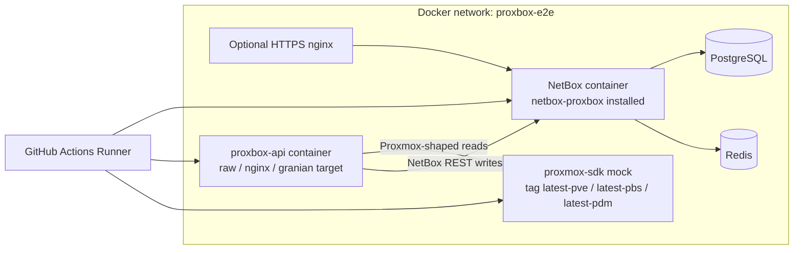

# E2E Proxmox Service Matrix

The `proxbox-api` E2E suite runs every Docker-backed cell against a dedicated
`proxmox-sdk` mock container. The mock is split by Proxmox service
(`pve`, `pbs`, `pdm`) and CI fans the suite across all three so a single push
exercises every supported service stub in parallel.

For the surrounding workflow layout — CI jobs, dependency modes, the staged
TestPyPI/PyPI publication lanes, and the Docker image variants — see
[CI and E2E Workflows](ci-e2e-workflows.md).

## Why a Service Axis

`proxmox-sdk` publishes three service-specific image tags from
[`emersonfelipesp/proxmox-sdk`](https://github.com/emersonfelipesp/proxmox-sdk):

| Service | Image tag | Coverage |
|---|---|---|
| `pve` | `emersonfelipesp/proxmox-sdk:latest-pve` | Full Proxmox VE OpenAPI surface (646 endpoints). Drives the historical sync pipeline. |
| `pbs` | `emersonfelipesp/proxmox-sdk:latest-pbs` | Proxmox Backup Server stub. `/health` + service identifier only; PVE-shaped routes are intentionally absent. |
| `pdm` | `emersonfelipesp/proxmox-sdk:latest-pdm` | Proxmox Datacenter Manager stub. Same shape as PBS today. |

Running the same backend, the same NetBox container, and the same fixtures
against all three tags is the cheapest way to catch a regression that would
break a real PBS or PDM connection — even before the upstream OpenAPI surface
is fully generated.

## Matrix Shape

### `ci.yml`

The CI matrix is generated dynamically by the `setup` job. The generator emits
the cross-product of:

| Axis | Source | Default |
|---|---|---|
| `base` (transport bundle) | Hard-coded list in `setup.gen` | 7 transport combinations covering `http_manage`, `https_nginx`, `https_granian`, and IPv6 dual-stack |
| `netbox_proxbox_mode` | `INPUT_NETBOX_PROXBOX_MODE` (workflow input) and the event type | `dev` for push/PR, `[dev, pypi]` on release |
| `netbox_version` | `.github/netbox-versions.json` | Currently three certified NetBox tags |
| `proxmox_service` | Hard-coded `["pve", "pbs", "pdm"]` | All three services on every run |

The full cross-product is therefore **7 (transport) × 1–2 (mode) × 3 (NetBox) × 3 (service) = 63–126 cells**.
Each cell uses `fail-fast: false`, so an unrelated cell failure does not abort
the rest of the run.

The image tag is rendered into the runner environment from the matrix and used
both for `docker pull` and for the live `proxmox-e2e-mock` container:

```yaml
env:
  PROXMOX_OPENAPI_IMAGE: emersonfelipesp/proxmox-sdk:latest-${{ matrix.proxmox_service }}
  PROXMOX_SERVICE: ${{ matrix.proxmox_service }}
```

### `publish-testpypi.yml`

The pre- and post-publish E2E jobs pin the same axis statically with
`proxmox_service: [pve, pbs, pdm]` so the published artifacts (TestPyPI dist,
Docker Hub image) are validated against every service stub before the release
is finalized.

## Architecture

Every cell stands up the same physical layout on its runner. The only difference
between cells is which `proxmox-sdk` tag is loaded into `proxmox-e2e-mock`.



## Fixture Layer

The Python fixture layer lives in `proxbox_api/e2e/fixtures/proxmox_sdk_mock.py`
and is the single place that decides "is this run PVE-shaped, or a service stub
that has no VM/cluster data?".

| Helper | Responsibility |
|---|---|
| `_resolve_proxmox_service(service="pve")` | Env-aware resolver. Reads `PROXMOX_SERVICE` when the caller did not pass an explicit service, lower-cases the value, and falls back to `pve`. |
| `_empty_cluster(name, service)` | Returns a service-labeled cluster with no nodes/VMs. Used for PBS and PDM cells. |
| `create_minimal_cluster(prefix, service="pve")` | One node, two VMs (QEMU + LXC) on PVE; an empty shell on non-PVE. |
| `create_multi_cluster(prefix, service="pve")` | Two PVE clusters with multiple nodes/VMs; a single empty shell on non-PVE. |
| `create_cluster_with_backups(prefix, service="pve")` | PVE cluster + backup metadata; on non-PVE returns the empty cluster and an empty backup list. |
| `create_custom_cluster(name, nodes_spec, vms_spec, prefix, service="pve")` | PVE custom topology; an empty shell on non-PVE. |

Tests do **not** need to know which service is loaded — they ask for a fixture,
and the fixture either returns realistic PVE state or a labeled empty cluster.
What changes between services is the *test selection*, not the fixture surface.

## Skip Policy

`tests/e2e/conftest.py` exposes two session-scoped fixtures that own service
routing:

```python
@pytest.fixture(scope="session")
def proxmox_service() -> str:
    return (os.environ.get("PROXMOX_SERVICE", "pve").strip().lower() or "pve")


@pytest.fixture(scope="session")
def requires_pve_schema(proxmox_service: str) -> None:
    if proxmox_service != "pve":
        pytest.skip(f"requires PVE schema; service={proxmox_service}")
```

Test modules that drive the full PVE sync pipeline declare the fixture
requirement at module level:

```python
pytestmark = pytest.mark.usefixtures("requires_pve_schema")
```

This applies today in:

- `tests/e2e/test_backups_sync.py`
- `tests/e2e/test_devices_sync.py`
- `tests/e2e/test_vm_sync.py`

When `PROXMOX_SERVICE` is `pbs` or `pdm` those entire modules are auto-skipped
with a visible reason in CI logs. The `minimal_cluster` / `multi_cluster` /
`mock_proxmox_session` fixtures still build their labeled empty cluster, so no
fixture import explodes when a stub is loaded.

## Service Smoke Test

A dedicated module verifies that the right service tag is actually mounted.
`tests/e2e/test_proxmox_mock_health.py` runs on PBS and PDM cells only and
checks that `/health` returns the loaded service identifier:

```python
@pytest.mark.asyncio(loop_scope="session")
@pytest.mark.mock_http
async def test_pbs_pdm_mock_health_reports_loaded_service(proxmox_service: str):
    if proxmox_service == "pve":
        pytest.skip("PBS/PDM service smoke only")

    base_url = os.environ.get(
        "PROXMOX_MOCK_PUBLISHED_URL", "http://localhost:8006"
    ).rstrip("/")
    async with httpx.AsyncClient(base_url=base_url, timeout=10.0) as client:
        response = await client.get("/health")

    assert response.status_code == 200
    assert proxmox_service in response.text.lower()
```

This is the test that would catch the wrong image tag being pulled, or a
service stub regressing its `/health` payload.

## Pytest Markers and CI Wiring

Two markers gate the Docker-backed E2E layer:

- `mock_http` — runs against the real `proxmox-sdk` container on the
  `proxbox-e2e` Docker network. Every cell runs this layer.
- `mock_backend` — runs against the in-process `MockBackend`. Only used as a
  separate pass.

The CI workflow runs them in two steps inside each cell:

```yaml
- name: Run E2E tests (Docker proxmox mock)
  env:
    PROXMOX_SERVICE: ${{ matrix.proxmox_service }}
  run: uv run pytest tests/e2e/ -m "mock_http" --tb=short -v

- name: Run E2E tests with in-process MockBackend
  if: github.ref == 'refs/heads/main' && matrix.proxmox_service == 'pve'
  env:
    PROXMOX_SERVICE: ${{ matrix.proxmox_service }}
  run: uv run pytest tests/e2e/ -m "mock_backend" --tb=short -v
```

The `mock_backend` step is gated to `main` **and** to `pve`. The in-process
backend reuses the PVE-shaped fixtures and is not meant to validate the service
container itself, so running it for `pbs` / `pdm` would add no signal.

## What Each Cell Verifies

| Verification | `pve` | `pbs` | `pdm` |
|---|:---:|:---:|:---:|
| Stack readiness (NetBox API, proxbox-api API, proxmox-sdk `/openapi.json`) | yes | yes | yes |
| Mock `/health` reports the loaded service identifier | (smoke skipped) | yes | yes |
| `auth/register-key` + `netbox/endpoint` + `netbox/status` smoke | yes | yes | yes |
| `extras/custom-fields/create` smoke | yes | yes | yes |
| `test_backups_sync.py` (`requires_pve_schema`) | yes | skip | skip |
| `test_devices_sync.py` (`requires_pve_schema`) | yes | skip | skip |
| `test_vm_sync.py` (`requires_pve_schema`) | yes | skip | skip |
| In-process `mock_backend` pass (main branch only) | yes | skip | skip |

PVE cells therefore continue to certify the full sync pipeline, while PBS and
PDM cells certify that the plugin, the backend, NetBox, and the mock can coexist
and reach each other under those service tags.

## Running a Single Cell Locally

```bash
# Pick the service you want to reproduce
export PROXMOX_SERVICE=pbs

# Pull the matching mock and start it on the standard port
docker pull "emersonfelipesp/proxmox-sdk:latest-${PROXMOX_SERVICE}"
docker run -d --name proxmox-e2e-mock -p 8006:8000 \
  -e PROXMOX_API_MODE=mock \
  "emersonfelipesp/proxmox-sdk:latest-${PROXMOX_SERVICE}" \
  sh -c 'exec uvicorn ${APP_MODULE} --host 0.0.0.0 --port 8000'

# Run the E2E suite the way CI runs it
export PROXBOX_E2E_NETBOX_URL=http://127.0.0.1:8000
export PROXBOX_E2E_NETBOX_TOKEN=<your local NetBox token>
export PROXMOX_MOCK_PUBLISHED_URL=http://localhost:8006

uv run pytest tests/e2e/ -m "mock_http" --tb=short -v
```

On `pbs` or `pdm` the `requires_pve_schema`-gated modules report
`SKIPPED [requires PVE schema; service=...]` and the
`test_proxmox_mock_health.py` smoke verifies the running container actually
exposes the requested service tag.

## When To Edit This Page

- A new `proxmox_service` value is added (or one is removed) — update the image
  tag table and the per-cell verification table.
- A new fixture helper gains a `service` parameter — list it under
  [Fixture Layer](#fixture-layer).
- A new test module either requires or stops requiring PVE schema — update
  [Skip Policy](#skip-policy).
- The pytest marker gating changes — update
  [Pytest Markers and CI Wiring](#pytest-markers-and-ci-wiring).

Keep [`docs/pt-BR/development/e2e-proxmox-service-matrix.md`](../pt-BR/development/e2e-proxmox-service-matrix.md)
in sync with this file when content changes.
