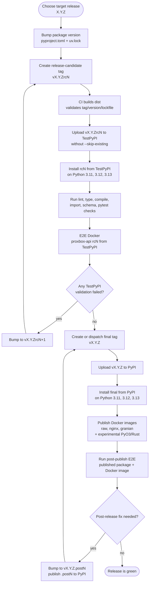
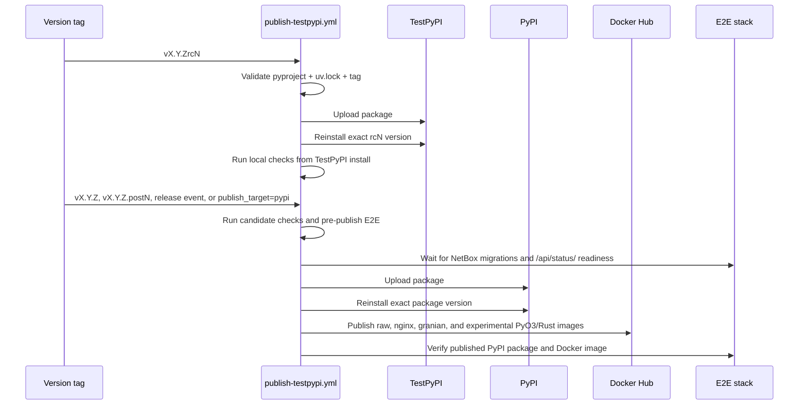

# Release Publishing

This page documents the staged `proxbox-api` package-release workflow. The
workflow validates release candidates on TestPyPI first, then promotes the
final release to PyPI and publishes Docker images only after PyPI installation
succeeds.

For the broader CI job map and NetBox-backed E2E matrix, see
[CI and E2E Workflows](ci-e2e-workflows.md).

## Release State Machine

## Workflow Lanes

## Workflow Rules

- `pyproject.toml`, `uv.lock`, and the Git tag must describe the same version.
- `rcN` tag pushes publish to TestPyPI for release-candidate validation.
- Non-rc tag pushes (`vX.Y.Z`, `vX.Y.Z.postN`), GitHub releases, or manual
  dispatch with `publish_target=pypi` publish to PyPI.
- Package uploads intentionally omit `twine --skip-existing`; if a version was
  consumed by any package index, fix forward with the next `.postN` or `rcN`.
- PyPI publication must pass package reinstall validation before Docker images
  are published.
- Docker image tags use the same version as the PyPI package that passed
  validation. Experimental PyO3/Rust images add `-pyo3-rust` tag suffixes and
  opt-in aliases (`experimental`, `pyo3-rust`, and HTTPS variant suffixes).
- Pre-publish and post-publish E2E jobs allow NetBox up to 20 minutes to finish
  migrations/search indexing and require `/api/status/` readiness before
  configuring tokens or backend endpoints.

## Operator Checklist

1. Bump `pyproject.toml` and refresh `uv.lock`.
2. Tag `vX.Y.Zrc1` for TestPyPI release-candidate validation. If validation
   fails after upload, continue with `rc2`, `rc3`, and so on.
3. Publish the final `vX.Y.Z` to PyPI only after an rc lane is green.
4. Use `vX.Y.Z.postN` for any code or packaging fix discovered after final
   PyPI publication.
