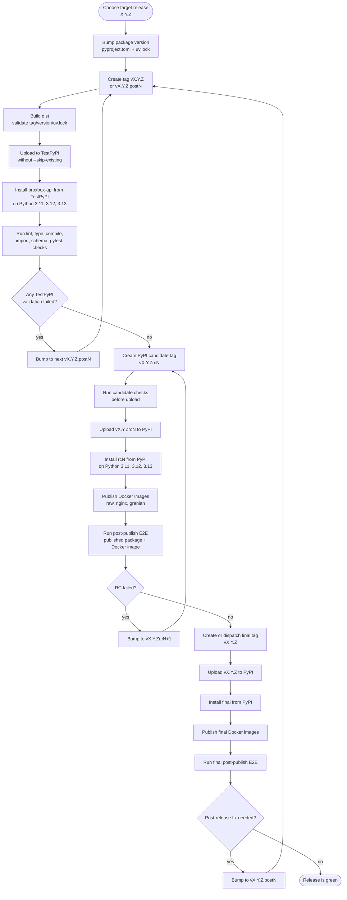
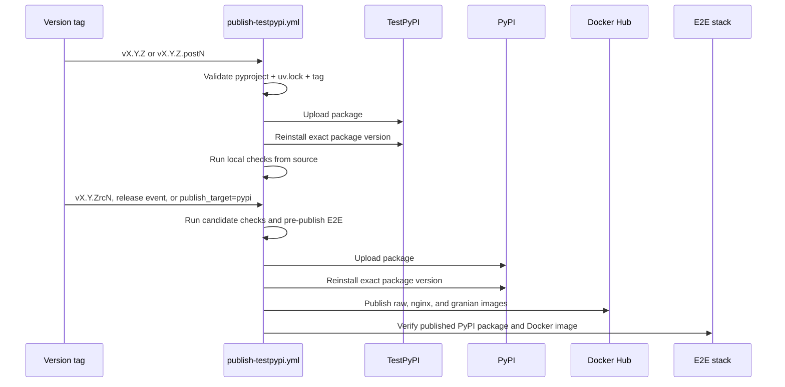

# Release Publishing

This page documents the staged `proxbox-api` package-release workflow. The
workflow validates packages on TestPyPI first, promotes release candidates on
PyPI, then publishes the final PyPI release and Docker images only after the
package is installable.

## Release State Machine

## Workflow Lanes

## Workflow Rules

- `pyproject.toml`, `uv.lock`, and the Git tag must describe the same version.
- Normal and `.postN` tag pushes publish to TestPyPI.
- `rcN` tag pushes, GitHub releases, or manual dispatch with
  `publish_target=pypi` publish to PyPI.
- Package uploads intentionally omit `twine --skip-existing`; if a version was
  consumed by any package index, fix forward with the next `.postN` or `rcN`.
- PyPI publication must pass package reinstall validation before Docker images
  are published.
- Docker image tags use the same version as the PyPI package that passed
  validation.

## Operator Checklist

1. Bump `pyproject.toml` and refresh `uv.lock`.
2. Tag `vX.Y.Z` and let the workflow publish to TestPyPI.
3. If TestPyPI validation fails after upload, bump to `vX.Y.Z.post1`, then
   `post2`, until green.
4. Tag `vX.Y.Zrc1` for PyPI release-candidate validation. If it fails after
   upload, continue with `rc2`, `rc3`, and so on.
5. Publish the final `vX.Y.Z` to PyPI only after an RC lane is green.
6. Use `vX.Y.Z.postN` for any code or packaging fix discovered after final
   publication.
