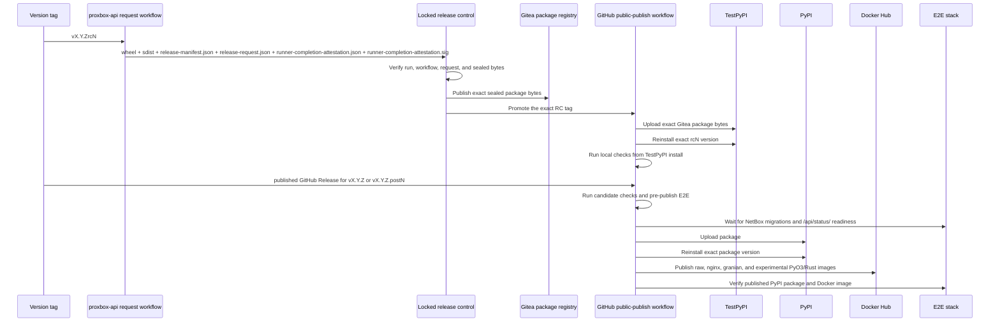

# Release Publishing

This page documents the staged `proxbox-api` package-release workflow. The
workflow validates release candidates on TestPyPI first, then promotes the
final release to PyPI and publishes Docker images only after PyPI installation
succeeds.

For the broader CI job map and NetBox-backed E2E matrix, see
[CI and E2E Workflows](ci-e2e-workflows.md).

## Release State Machine


```mermaid
flowchart TD
    Start([Choose target release\nX.Y.Z])
    Bump[Bump package version\npyproject.toml + uv.lock]
    RCTag[Create release-candidate tag\nvX.Y.ZrcN]
    RCCI[Target CI builds a six-file\ncredential-free signed control request]
    Control[Locked release control verifies\nand publishes exact sealed bytes]
    RCUpload[Upload vX.Y.ZrcN to TestPyPI\nwithout --skip-existing]
    RCValidate[Install rcN from TestPyPI\non Python 3.12 and 3.13]
    RCChecks[Run lint, type, compile,\nimport, schema, pytest checks]
    RCE2E[E2E Docker\nproxbox-api rcN from TestPyPI]
    RCFailed{Any TestPyPI\nvalidation failed?}
    NextRC[Bump to vX.Y.ZrcN+1]
    FinalPrivate[Publish final package to Gitea\nvX.Y.Z]
    Deploy[Deploy exact Gitea package\nthrough NMS]
    PublicRelease[Create GitHub Release\nafter production validation]
    FinalUpload[Upload vX.Y.Z to PyPI]
    FinalValidate[Install final from PyPI\non Python 3.12 and 3.13]
    Docker[Publish Docker images\nraw, nginx, granian\n+ experimental PyO3/Rust]
    FinalE2E[Run post-publish E2E\npublished package + Docker image]
    FinalFailed{Post-release fix needed?}
    Post[Bump to vX.Y.Z.postN\npublish .postN to PyPI]
    Done([Release is green])

    Start --> Bump --> RCTag --> RCCI --> Control --> RCUpload --> RCValidate --> RCChecks --> RCE2E --> RCFailed
    RCFailed -- yes --> NextRC --> RCTag
    RCFailed -- no --> FinalPrivate --> Deploy --> PublicRelease --> FinalUpload --> FinalValidate --> Docker --> FinalE2E --> FinalFailed
    FinalFailed -- yes --> Post --> FinalPrivate
    FinalFailed -- no --> Done
```

## Workflow Lanes


```mermaid
sequenceDiagram
    participant Tag as Version tag
    participant TargetWF as proxbox-api request workflow
    participant Control as Locked release control
    participant GP as Gitea package registry
    participant WF as GitHub public-publish workflow
    participant TP as TestPyPI
    participant PY as PyPI
    participant DH as Docker Hub
    participant E2E as E2E stack

    Tag->>TargetWF: vX.Y.ZrcN
    TargetWF->>Control: wheel + sdist + release-manifest.json + release-request.json + runner-completion-attestation.json + runner-completion-attestation.sig
    Control->>Control: Verify run, workflow, request, and sealed bytes
    Control->>GP: Publish exact sealed package bytes
    Control->>WF: Promote the exact RC tag
    WF->>TP: Upload exact Gitea package bytes
    WF->>TP: Reinstall exact rcN version
    WF->>WF: Run local checks from TestPyPI install

    Tag->>WF: published GitHub Release for vX.Y.Z or vX.Y.Z.postN
    WF->>WF: Run candidate checks and pre-publish E2E
    WF->>E2E: Wait for NetBox migrations and /api/status/ readiness
    WF->>PY: Upload package
    WF->>PY: Reinstall exact package version
    WF->>DH: Publish raw, nginx, granian, and experimental PyO3/Rust images
    WF->>E2E: Verify published PyPI package and Docker image
```

## Workflow Rules

- A Gitea pull request from `develop` to `main` runs the separate
  `pull_request_target` promotion-history workflow. Gitea loads that workflow
  and its validator from the trusted exact `main` base, never from candidate
  `develop`. The first rollout is bootstrapped through the existing reviewed
  promotion process because the old `main` cannot run a workflow that it does
  not contain.
- A successful ordinary commit status is evidence, not the promotion trust
  anchor: Gitea associates statuses with a head SHA and context without
  authenticating the status creator or PR base. Before promotion, the separate
  release operator must use an authenticated Gitea API client to authenticate
  the exact `pull_request_target` run and successful history job, confirm that the run's
  API tuple uses the exact PR-head SHA and `refs/pull/<number>/head`, read the
  exact workflow bytes from the current `main` base, and re-read the open PR and
  live `main`/`develop` tips. The workflow runs on `opened`, `synchronize`,
  `reopened`, and `edited`; a noncanonical tuple fails instead of producing a
  reusable skipped success.
- Before this control is enabled, `main` and `develop` must both have verified
  Gitea branch-protection records. `main` must require an up-to-date head, block
  administrative merge overrides and force pushes, and restrict merge/direct
  update permission to the separately administered repository owner.
  `develop` must be protected from deletion and restrict force pushes to that
  owner. Do not configure the ordinary workflow status as a required security
  control. The operator performs the reviewed one-parent squash as an exact-old
  compare-and-swap update of `main`, so the destination and prior base are bound
  atomically; ambiguous results are resolved by read-back before any retry. The
  operator then records the exact commit on the PR and repoints `develop` with an
  exact-old compare-and-swap, preserving branch convergence without placing a
  mutation credential on a candidate-schedulable runner.
- For every changed, non-deleted path, exhaustive merge history must not contain
  the proposed blob as a strictly older state already superseded on the base
  branch. A rename to a new path is treated as a new path, while deleting and
  recreating the same path remains subject to its history. Symlinks use their
  blob content; unsupported non-blob entries such as Git links fail closed. The
  guard also fails closed when the head does not contain the exact base or the
  checkout is shallow.
- `pyproject.toml`, `uv.lock`, and the Git tag must describe the same version.
- `rcN` tag pushes publish to TestPyPI for release-candidate validation.
- Final/post packages publish privately to Gitea, deploy through NMS, and reach
  PyPI only after an operator publishes the corresponding GitHub Release.
- The Gitea tag must equal current canonical `develop`. Writer-controlled
  commit statuses are ignored; the newest authenticated `ci.yml` Actions run
  and its required jobs must prove a successful first push attempt for the
  exact SHA, trusted actor, job name, and untrusted runner class. The two
  release jobs use distinct job-bound ephemeral validation/build registrations.
  Each advertises only `ci-release-proxbox-api`, accepts one
  supervisor-authorized assignment, and terminates. Workflow concurrency is
  global to this repository so different release refs cannot race the sole
  release label. Every RC, final, or post request requires a freshly registered
  and reviewed identity pair. Before candidate execution
  the jobs require
  their live runner ID/name/sole label to match the checksum-pinned acceptance
  record plus a fresh signed external-supervisor attestation bound to the
  repository/first-attempt run/job/source and exact workflow path/digest,
  complete registered labels, runtime image, and network/runtime policy.
  Validation and build have independent pinned
  repository-registration scope digests. Its zero/empty identity and all-zero key/image/policy
  digests intentionally disable tag releases until live acceptance. Missing,
  stale, invalidly signed, or mismatched evidence fails before candidate code. A
  disposable target job builds one wheel and one sdist behind the bounded
  token-free UID/Landlock boundary with the runner image's exact Python 3.12.14
  and uv 0.12.5 after verifying the baked interpreter/tool versions, the
  policy-pinned `uv.lock` digest, and build-lock checksum manifests for the
  read-only publish and CPython 3.13 musllinux runtime wheelhouses. The job
  revalidates both exact immutable inventories in-container and performs a
  hash-required CPython 3.13 musl dry resolution against the runtime cache.
  Landlock bounds writes and an x86-64 seccomp filter denies every candidate
  socket syscall, all `io_uring` entry points, and every x32-tagged syscall
  before dependency or build code runs. Dependency
  resolution is offline (`--no-index`, no Python downloads). Trusted outer
  steps use image-baked Gitea checkout and artifact clients, so their only
  network authority is same-origin Gitea access. It uploads exactly
  six data files: the package wheel, package sdist,
  `release-manifest.json`, `release-request.json`,
  `runner-completion-attestation.json`, and
  `runner-completion-attestation.sig`. The external root-only supervisor creates that
  completion evidence only after candidate process cleanup and binds the exact
  request/artifact bytes plus live runner policy. The request binds repository
  ID 37, source/tag/version, first-attempt run identity, target workflow digest,
  manifest digest, and sorted artifact inventory. The target repository has no
  package or GitHub-mirror credential and cannot publish or push tags. The job
  verifies the root-owned completion client digest, executes a sealed in-memory
  snapshot of those exact bytes, and the client verifies the supervisor
  signature locally against its policy-pinned public key before the exact
  six-file upload. The
  separately administered release-control repository fetches that exact run,
  verifies the policy-pinned workflow, supervisor signature, and every byte on its isolated builder,
  then seals the handoff. Only its isolated publisher can read publication
  credentials and invoke fixed digest-locked tooling. Public no-authority
  downloads must match the manifest before the durable ledger advances.
- GitHub downloads those exact Gitea artifacts, installs both wheel and sdist on
  Python 3.12 and 3.13, and never rebuilds before TestPyPI/PyPI upload. The
  TestPyPI/PyPI upload jobs run separately on fresh GitHub-hosted
  `ubuntu-latest` runners, install the locked publisher group with
  `--no-install-project`, and pass credentials to Twine only through `TWINE_*`.
- A successful NMS `latest_package` production run exports a root-issued
  schema-2 receipt only after the exact sdist-built image, installed version,
  and production health are proven. Workflow code publishes those bytes but
  cannot create successful-production evidence. Final public promotion verifies
  its source SHA, artifact hashes, manifest digest, observed image identity,
  environment, and Gitea run identity.
- Registry credentials are step-scoped. Each `release_artifacts.py` invocation
  that reaches the Gitea package registry (`fetch-gitea`, `fetch-attestation`,
  `publish-attestation`, `publish-manifest`) carries
  `GITEA_PACKAGE_TOKEN: ${{ secrets.PKG_TOKEN }}` in its own step `env`, because
  the deploy job env holds no secrets. A step that omits it sends an empty
  bearer and the registry answers `HTTP 401`. `manifest` and
  `validate-attestation` are local-only and take no credential.
- Manual workflow dispatch is TestPyPI-only and requires an RC version.
- Package uploads intentionally omit `twine --skip-existing`; if a version was
  consumed by any package index, fix forward with the next `.postN` or `rcN`.
- Gitea can apply a generic package's repository link and still answer HTTP 400
  when the package was linked automatically or a retry observes the link. The
  manifest and deployment-attestation publishers treat that response as
  ambiguous and continue only when an authenticated read-back proves the exact
  owner, repository, package, version, file identity, and bytes. Manifest
  read-back also proves the inventory size and digest; attestation read-back
  validates the complete signed completion-evidence schema.
- PyPI publication must pass package reinstall validation before Docker images
  are published.
- Docker image tags use the same version as the PyPI package that passed
  validation. Experimental PyO3/Rust images add `-pyo3-rust` tag suffixes and
  opt-in aliases (`experimental`, `pyo3-rust`, and HTTPS variant suffixes).
- Published-image verification is a reusable workflow called only after the
  Docker publication job succeeds. It receives the already validated release
  tag, then pulls and smoke-tests the standard and experimental tags; it no
  longer races the original Release event or spends its retry budget waiting
  for a queued publication job to start. The reusable Docker publication
  workflow holds its non-canceling concurrency lock until its dependent
  verification job finishes. Verification requires every mutable alias to
  match its versioned image digest and smoke-tests captured immutable digest
  references, so a concurrent alias update cannot substitute another release.
- The package-carried release Dockerfile pins the last reviewed raw runtime
  (`0.0.19.post5`) and uv 0.11.28 source image by full digest. The target build
  exports hash-locked runtime requirements with CPython 3.13, downloads only
  `musllinux_1_2_x86_64` or backward-compatible `musllinux_1_1_x86_64`
  CPython 3.13/ABI3/pure-Python wheels compatible with
  the pinned Alpine runtime, and embeds their exact canonical schema-2 inventory
  under `docker/build-cache`. The locked control independently rejects hash drift,
  mutable images, networked Docker instructions, parser directives, `ADD`, or a
  build path other than the hash-pinned offline install before sealing: `uv pip sync
  --offline --no-index --find-links /root/.cache/uv --require-hashes`, reading its
  requirements from inside the inventoried cache, then `uv pip install --offline
  --no-index --find-links /root/.cache/uv --no-deps .`. A lock-driven `uv sync
  --frozen --offline` is rejected, because uv skips resolution under `--frozen`
  and fetches each locked distribution from its recorded URL instead of the
  copied wheels. Change either image
  digest only through a reviewed release update; production receipts bind the
  resulting active image ID.
- Required GitHub CI reproduces the real CPython 3.13 musllinux wheelhouse,
  builds the release sdist, safely extracts and rehashes its canonical schema-2
  inventory, permits only the two literal pinned base images and declared-stage
  `COPY --from` sources, and
  builds that extracted context with the exact bases preloaded and Docker build
  networking disabled. Every external action in that offline job is pinned to
  an immutable commit. The Gitea tag gate fetches the GitHub workflow at the
  canonical source SHA, verifies its Git object ID and reviewed SHA-256, and
  then queries GitHub Actions for this exact successful first-attempt job on
  that same canonical `develop` SHA; a missing,
  failed, retried, differently scoped, or different-SHA job blocks the handoff.
- Pre-publish and post-publish E2E jobs allow NetBox up to 20 minutes to finish
  migrations/search indexing and require `/api/status/` readiness before
  configuring tokens or backend endpoints.

## Operator Checklist

1. Before merging the target cutover, require the private control repository's
   positive policy-pinned ID plus ready protected workflows, host boundaries,
   sockets, and repository-scoped runners. If readiness is incomplete, leave
   the existing publisher active and stop.
2. Bump `pyproject.toml` and refresh `uv.lock`.
3. Tag `vX.Y.Zrc1` and wait for `publish-gitea.yml` to produce the
   `release-control-request` artifact. Hash its canonical
   `release-request.json`.
4. Dispatch `validate.yml` with exactly the repository name, target run ID,
   and request SHA-256. After it succeeds, dispatch the separate irreversible
   `publish.yml` with those same three inputs. The control
   publishes the Gitea package and promotes only the exact RC tag to GitHub for
   TestPyPI release-candidate validation. If validation
   fails after upload, continue with `rc2`, `rc3`, and so on.
5. Publish and verify final `vX.Y.Z` through the same control handoff, deploy
   that package through NMS,
   and validate production health.
6. Dispatch `promote-final-tag.yml` from canonical Gitea `main`; it verifies the
   exact private package and NMS attestation before pushing the tag to the
   authorized GitHub repository. Wait for that workflow to complete
   successfully, record its exact production-approved source SHA, and then
   create the GitHub Release with the fail-closed helper; its event verifies the
   protected Gitea attestation, publishes the exact bytes to PyPI, and then
   publishes Docker images after validation.
7. Use `vX.Y.Z.postN` for any code or packaging fix discovered after final
   PyPI publication.

### Before the release-control cutover: legacy automation

Before the release-control cutover, the existing `publish-gitea.yml` tag-push
path remains the active publisher. For a non-RC tag it pushes the exact tag to
GitHub and creates the GitHub Release only when no Release exists. It fails
closed for every existing draft or published object so an operator can inspect
its state, notes, and assets explicitly. Wait for that job to finish; do not
race it with a second `gh release create`. If the job pushed the
tag but did not create the Release, first confirm that the Release is absent,
then use the fail-closed helper with the exact source SHA from the completed
legacy job. It resolves the GitHub tag to a commit, requires that commit to
equal the supplied approved SHA, loads the release notes from that same GitHub
commit instead of the caller's working tree, queries the GitHub API, and
creates the Release only after an explicit HTTP 404. An existing Release,
authentication or authorization error, API failure, or network failure aborts
without publishing.
The helper also supplies `--verify-tag`, so GitHub cannot invent or move the
tag:

```bash
scripts/create-github-release.sh vX.Y.Z <approved-40-character-commit-sha>
```

Replace `vX.Y.Z` with the exact final or `.postN` tag already pushed to GitHub.
If the helper reports that the Release exists, inspect and publish or repair
that existing object instead of creating another one. Do not bypass any other
lookup failure.

### After the release-control cutover: controlled promotion

After the release-control cutover, step 6 is intentionally different:
`promote-final-tag.yml` verifies production evidence and pushes the exact tag,
but does not create the GitHub Release. Wait for the workflow to complete
successfully and record its exact production-approved source SHA. The operator
then runs `scripts/create-github-release.sh vX.Y.Z <approved-40-character-commit-sha>`
as the normal controlled publication step.
The helper dereferences the GitHub tag and requires it to equal that approved
SHA, then loads the release notes from that exact GitHub commit. The same
fail-closed lookup remains required: the expected HTTP 404 proves
there is no existing Release, while any other result aborts. This separation
ensures that the `release: published` event cannot authorize PyPI or Docker Hub
until production evidence has passed.
