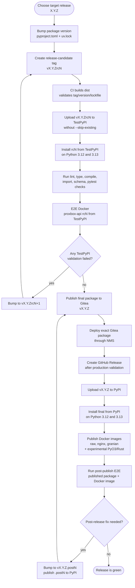
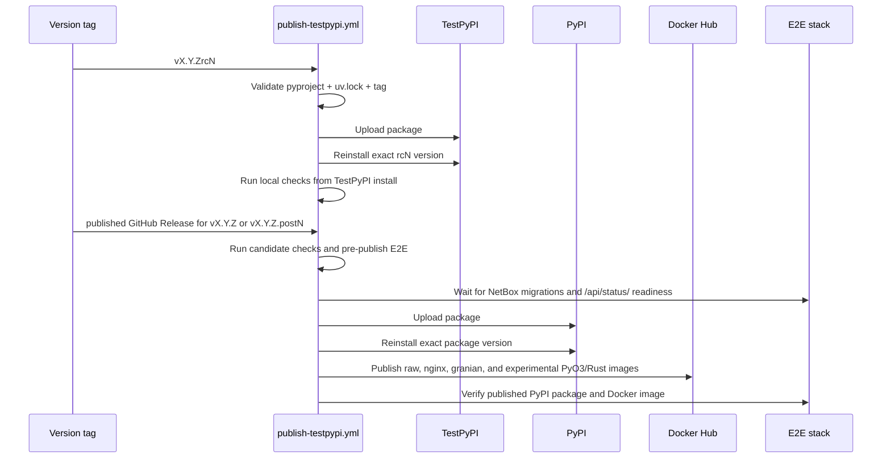

# Release Publishing

This page documents the staged `proxbox-api` package-release workflow. The
workflow validates release candidates on TestPyPI first, then promotes the
final release to PyPI and publishes Docker images only after PyPI installation
succeeds.

For the broader CI job map and NetBox-backed E2E matrix, see
[CI and E2E Workflows](ci-e2e-workflows.md).

## Release State Machine

```mermaid
flowchart TD
    Start([Choose target release\nX.Y.Z])
    Bump[Bump package version\npyproject.toml + uv.lock]
    RCTag[Create release-candidate tag\nvX.Y.ZrcN]
    RCCI[CI builds dist\nvalidates tag/version/lockfile]
    RCUpload[Upload vX.Y.ZrcN to TestPyPI\nwithout --skip-existing]
    RCValidate[Install rcN from TestPyPI\non Python 3.12 and 3.13]
    RCChecks[Run lint, type, compile,\nimport, schema, pytest checks]
    RCE2E[E2E Docker\nproxbox-api rcN from TestPyPI]
    RCFailed{Any TestPyPI\nvalidation failed?}
    NextRC[Bump to vX.Y.ZrcN+1]
    FinalPrivate[Publish final package to Gitea\nvX.Y.Z]
    Deploy[Deploy exact Gitea package\nthrough NMS]
    PublicRelease[Create GitHub Release\nafter production validation]
    FinalUpload[Upload vX.Y.Z to PyPI]
    FinalValidate[Install final from PyPI\non Python 3.12 and 3.13]
    Docker[Publish Docker images\nraw, nginx, granian\n+ experimental PyO3/Rust]
    FinalE2E[Run post-publish E2E\npublished package + Docker image]
    FinalFailed{Post-release fix needed?}
    Post[Bump to vX.Y.Z.postN\npublish .postN to PyPI]
    Done([Release is green])

    Start --> Bump --> RCTag --> RCCI --> RCUpload --> RCValidate --> RCChecks --> RCE2E --> RCFailed
    RCFailed -- yes --> NextRC --> RCTag
    RCFailed -- no --> FinalPrivate --> Deploy --> PublicRelease --> FinalUpload --> FinalValidate --> Docker --> FinalE2E --> FinalFailed
    FinalFailed -- yes --> Post --> FinalPrivate
    FinalFailed -- no --> Done
```

## Workflow Lanes

```mermaid
sequenceDiagram
    participant Tag as Version tag
    participant WF as publish-testpypi.yml
    participant TP as TestPyPI
    participant PY as PyPI
    participant DH as Docker Hub
    participant E2E as E2E stack

    Tag->>WF: vX.Y.ZrcN
    WF->>WF: Validate pyproject + uv.lock + tag
    WF->>TP: Upload package
    WF->>TP: Reinstall exact rcN version
    WF->>WF: Run local checks from TestPyPI install

    Tag->>WF: published GitHub Release for vX.Y.Z or vX.Y.Z.postN
    WF->>WF: Run candidate checks and pre-publish E2E
    WF->>E2E: Wait for NetBox migrations and /api/status/ readiness
    WF->>PY: Upload package
    WF->>PY: Reinstall exact package version
    WF->>DH: Publish raw, nginx, granian, and experimental PyO3/Rust images
    WF->>E2E: Verify published PyPI package and Docker image
```

## Workflow Rules

- `pyproject.toml`, `uv.lock`, and the Git tag must describe the same version.
- `rcN` tag pushes publish to TestPyPI for release-candidate validation.
- Final/post packages publish privately to Gitea, deploy through NMS, and reach
  PyPI only after an operator publishes the corresponding GitHub Release.
- The Gitea tag must equal current canonical `develop`. Each latest required CI
  status must resolve through authenticated Gitea API records to a successful
  `ci.yml` push run for that exact SHA, trusted actor, job name, and untrusted
  runner class. A credential-free job builds one wheel and one sdist using
  checksum-pinned uv in fresh per-run tool and managed Python roots. The
  protected publisher anonymously fetches the exact validated source, uses a
  locked toolchain, exposes the repository `PKG_TOKEN` only for registry writes,
  links the artifacts to this repository, and verifies the downloaded bytes
  against the canonical manifest. The unsupported Gitea Actions job token is
  never used as a package-registry credential.
- GitHub downloads those exact Gitea artifacts, installs both wheel and sdist on
  Python 3.12 and 3.13, and never rebuilds before TestPyPI/PyPI upload.
- A successful NMS `latest_package` production run publishes an immutable,
  repository-linked Gitea completion attestation. Final public promotion
  verifies its source SHA, artifact hashes, manifest digest, environment, and
  Gitea run identity.
- Manual workflow dispatch is TestPyPI-only and requires an RC version.
- Package uploads intentionally omit `twine --skip-existing`; if a version was
  consumed by any package index, fix forward with the next `.postN` or `rcN`.
- PyPI publication must pass package reinstall validation before Docker images
  are published.
- Docker image tags use the same version as the PyPI package that passed
  validation. Experimental PyO3/Rust images add `-pyo3-rust` tag suffixes and
  opt-in aliases (`experimental`, `pyo3-rust`, and HTTPS variant suffixes).
- Pre-publish and post-publish E2E jobs allow NetBox up to 20 minutes to finish
  migrations/search indexing and require `/api/status/` readiness before
  configuring tokens or backend endpoints.

## Operator Checklist

1. Bump `pyproject.toml` and refresh `uv.lock`.
2. Tag `vX.Y.Zrc1` for TestPyPI release-candidate validation. If validation
   fails after upload, continue with `rc2`, `rc3`, and so on.
3. Publish and verify final `vX.Y.Z` in Gitea, deploy that package through NMS,
   and validate production health.
4. Dispatch `promote-final-tag.yml` from canonical Gitea `main`; it verifies the
   exact private package and NMS attestation before pushing the tag to the
   authorized GitHub repository. Then create the GitHub Release with
   `--verify-tag`; its event verifies the protected Gitea
   attestation, publishes the exact bytes to PyPI, and then publishes Docker
   images after validation.
5. Use `vX.Y.Z.postN` for any code or packaging fix discovered after final
   PyPI publication.
