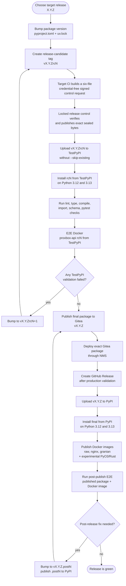
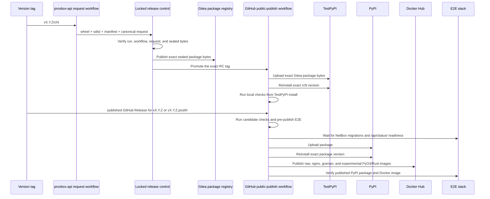

# Release Publishing

This page documents the staged `proxbox-api` package-release workflow. The
workflow validates release candidates on TestPyPI first, then promotes the
final release to PyPI and publishes Docker images only after PyPI installation
succeeds.

For the broader CI job map and NetBox-backed E2E matrix, see
[CI and E2E Workflows](ci-e2e-workflows.md).

## Release State Machine

```mermaid
flowchart TD
    Start([Choose target release\nX.Y.Z])
    Bump[Bump package version\npyproject.toml + uv.lock]
    RCTag[Create release-candidate tag\nvX.Y.ZrcN]
    RCCI[Target CI builds a six-file\ncredential-free signed control request]
    Control[Locked release control verifies\nand publishes exact sealed bytes]
    RCUpload[Upload vX.Y.ZrcN to TestPyPI\nwithout --skip-existing]
    RCValidate[Install rcN from TestPyPI\non Python 3.12 and 3.13]
    RCChecks[Run lint, type, compile,\nimport, schema, pytest checks]
    RCE2E[E2E Docker\nproxbox-api rcN from TestPyPI]
    RCFailed{Any TestPyPI\nvalidation failed?}
    NextRC[Bump to vX.Y.ZrcN+1]
    FinalPrivate[Publish final package to Gitea\nvX.Y.Z]
    Deploy[Deploy exact Gitea package\nthrough NMS]
    PublicRelease[Create GitHub Release\nafter production validation]
    FinalUpload[Upload vX.Y.Z to PyPI]
    FinalValidate[Install final from PyPI\non Python 3.12 and 3.13]
    Docker[Publish Docker images\nraw, nginx, granian\n+ experimental PyO3/Rust]
    FinalE2E[Run post-publish E2E\npublished package + Docker image]
    FinalFailed{Post-release fix needed?}
    Post[Bump to vX.Y.Z.postN\npublish .postN to PyPI]
    Done([Release is green])

    Start --> Bump --> RCTag --> RCCI --> Control --> RCUpload --> RCValidate --> RCChecks --> RCE2E --> RCFailed
    RCFailed -- yes --> NextRC --> RCTag
    RCFailed -- no --> FinalPrivate --> Deploy --> PublicRelease --> FinalUpload --> FinalValidate --> Docker --> FinalE2E --> FinalFailed
    FinalFailed -- yes --> Post --> FinalPrivate
    FinalFailed -- no --> Done
```

## Workflow Lanes

```mermaid
sequenceDiagram
    participant Tag as Version tag
    participant TargetWF as proxbox-api request workflow
    participant Control as Locked release control
    participant GP as Gitea package registry
    participant WF as GitHub public-publish workflow
    participant TP as TestPyPI
    participant PY as PyPI
    participant DH as Docker Hub
    participant E2E as E2E stack

    Tag->>TargetWF: vX.Y.ZrcN
    TargetWF->>Control: wheel + sdist + manifest + canonical request
    Control->>Control: Verify run, workflow, request, and sealed bytes
    Control->>GP: Publish exact sealed package bytes
    Control->>WF: Promote the exact RC tag
    WF->>TP: Upload exact Gitea package bytes
    WF->>TP: Reinstall exact rcN version
    WF->>WF: Run local checks from TestPyPI install

    Tag->>WF: published GitHub Release for vX.Y.Z or vX.Y.Z.postN
    WF->>WF: Run candidate checks and pre-publish E2E
    WF->>E2E: Wait for NetBox migrations and /api/status/ readiness
    WF->>PY: Upload package
    WF->>PY: Reinstall exact package version
    WF->>DH: Publish raw, nginx, granian, and experimental PyO3/Rust images
    WF->>E2E: Verify published PyPI package and Docker image
```

## Workflow Rules

- `pyproject.toml`, `uv.lock`, and the Git tag must describe the same version.
- `rcN` tag pushes publish to TestPyPI for release-candidate validation.
- Final/post packages publish privately to Gitea, deploy through NMS, and reach
  PyPI only after an operator publishes the corresponding GitHub Release.
- The Gitea tag must equal current canonical `develop`. Writer-controlled
  commit statuses are ignored; the newest authenticated `ci.yml` Actions run
  and its required jobs must prove a successful first push attempt for the
  exact SHA, trusted actor, job name, and untrusted runner class. Both release
  jobs use `ci-release-proxbox-api` and, before candidate execution, require
  their live runner ID/name/sole label to match the checksum-pinned acceptance
  record plus a fresh signed external-supervisor attestation bound to the
  repository/run/job/source, complete registered labels, runtime image, and
  network/runtime policy. Its zero/empty identity and all-zero key/image/policy
  digests intentionally disable tag releases until live acceptance. Missing,
  stale, invalidly signed, or mismatched evidence fails before candidate code. A
  disposable target job builds one wheel and one sdist behind the bounded
  token-free UID/Landlock boundary after verifying the pinned uv archive and
  selecting fresh per-run managed-Python and cache roots. It uploads exactly
  six data files: wheel, sdist, canonical manifest, canonical
  `release-request.json`, canonical `runner-completion-attestation.json`, and
  its detached signature. The external root-only supervisor creates that
  completion evidence only after candidate process cleanup and binds the exact
  request/artifact bytes plus live runner policy. The request binds repository
  ID 37, source/tag/version, first-attempt run identity, target workflow digest,
  manifest digest, and sorted artifact inventory. The target repository has no
  package or GitHub-mirror credential and cannot publish or push tags. The job
  verifies the root-owned completion client digest, executes a sealed in-memory
  snapshot of those exact bytes, and the client verifies the supervisor
  signature locally against its policy-pinned public key before the exact
  six-file upload. The
  separately administered release-control repository fetches that exact run,
  verifies the policy-pinned workflow, supervisor signature, and every byte on its isolated builder,
  then seals the handoff. Only its isolated publisher can read publication
  credentials and invoke fixed digest-locked tooling. Public no-authority
  downloads must match the manifest before the durable ledger advances.
- GitHub downloads those exact Gitea artifacts, installs both wheel and sdist on
  Python 3.12 and 3.13, and never rebuilds before TestPyPI/PyPI upload. The
  TestPyPI/PyPI upload jobs run separately on fresh GitHub-hosted
  `ubuntu-latest` runners, install the locked publisher group with
  `--no-install-project`, and pass credentials to Twine only through `TWINE_*`.
- A successful NMS `latest_package` production run exports a root-issued
  schema-2 receipt only after the exact sdist-built image, installed version,
  and production health are proven. Workflow code publishes those bytes but
  cannot create successful-production evidence. Final public promotion verifies
  its source SHA, artifact hashes, manifest digest, observed image identity,
  environment, and Gitea run identity.
- Manual workflow dispatch is TestPyPI-only and requires an RC version.
- Package uploads intentionally omit `twine --skip-existing`; if a version was
  consumed by any package index, fix forward with the next `.postN` or `rcN`.
- PyPI publication must pass package reinstall validation before Docker images
  are published.
- Docker image tags use the same version as the PyPI package that passed
  validation. Experimental PyO3/Rust images add `-pyo3-rust` tag suffixes and
  opt-in aliases (`experimental`, `pyo3-rust`, and HTTPS variant suffixes).
- The package-carried release Dockerfile pins the last reviewed raw runtime
  (`0.0.19.post5`) and uv 0.11.28 source image by full digest. The target build
  exports hash-locked runtime requirements with CPython 3.13, downloads only
  `musllinux_1_2_x86_64` or backward-compatible `musllinux_1_1_x86_64`
  CPython 3.13/ABI3/pure-Python wheels compatible with
  the pinned Alpine runtime, and embeds their exact canonical schema-2 inventory
  under `docker/build-cache`. The locked control independently rejects hash drift,
  mutable images, networked Docker instructions, parser directives, `ADD`, or a
  missing `uv sync --frozen --offline` path before sealing. Change either image
  digest only through a reviewed release update; production receipts bind the
  resulting active image ID.
- Pre-publish and post-publish E2E jobs allow NetBox up to 20 minutes to finish
  migrations/search indexing and require `/api/status/` readiness before
  configuring tokens or backend endpoints.

## Operator Checklist

1. Before merging the target cutover, require the private control repository's
   positive policy-pinned ID plus ready protected workflows, host boundaries,
   sockets, and repository-scoped runners. If readiness is incomplete, leave
   the existing publisher active and stop.
2. Bump `pyproject.toml` and refresh `uv.lock`.
3. Tag `vX.Y.Zrc1` and wait for `publish-gitea.yml` to produce the
   `release-control-request` artifact. Hash its canonical
   `release-request.json`.
4. Dispatch `validate.yml` with exactly the repository name, target run ID,
   and request SHA-256. After it succeeds, dispatch the separate irreversible
   `publish.yml` with those same three inputs. The control
   publishes the Gitea package and promotes only the exact RC tag to GitHub for
   TestPyPI release-candidate validation. If validation
   fails after upload, continue with `rc2`, `rc3`, and so on.
5. Publish and verify final `vX.Y.Z` through the same control handoff, deploy
   that package through NMS,
   and validate production health.
6. Dispatch `promote-final-tag.yml` from canonical Gitea `main`; it verifies the
   exact private package and NMS attestation before pushing the tag to the
   authorized GitHub repository. Then create the GitHub Release with
   `--verify-tag`; its event verifies the protected Gitea
   attestation, publishes the exact bytes to PyPI, and then publishes Docker
   images after validation.
7. Use `vX.Y.Z.postN` for any code or packaging fix discovered after final
   PyPI publication.
