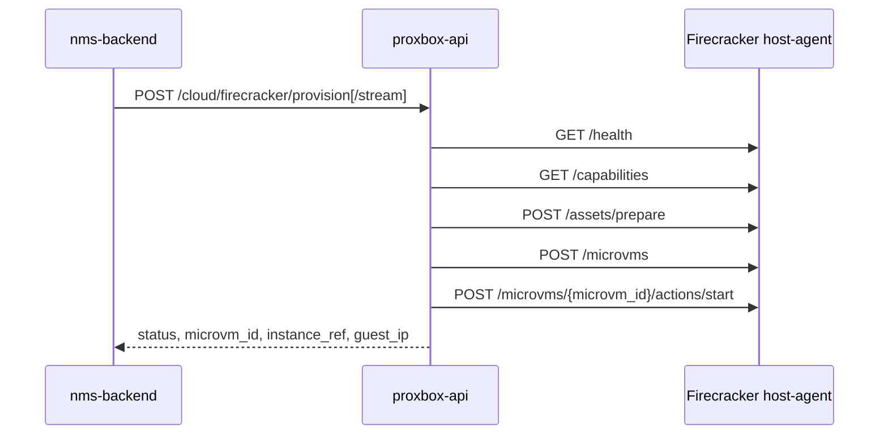

# Firecracker Host-Agent Provisioning

`proxbox-api` owns the HTTP contract between NMS Cloud and a Firecracker host-agent. NetBox inventory still lives in `netbox-proxbox`: host pools, hosts, image templates, and `FirecrackerMicroVM` records are resolved before this service is called.

## Flow



The non-streaming endpoint returns one JSON response. The streaming endpoint forwards progress as Server-Sent Events and finishes with `event: complete`.

## Endpoints

| Method | Path | Purpose |
|---|---|---|
| `POST` | `/cloud/firecracker/provision` | Provision a micro-VM through one host-agent and return final JSON |
| `POST` | `/cloud/firecracker/provision/stream` | Provision a micro-VM and stream progress as SSE |

Both routes require the normal `X-Proxbox-API-Key` middleware. `X-Proxbox-Actor` is optional and is forwarded into the host-agent metadata payload.

## Trust Boundary

`nms-backend` is expected to resolve the selected Firecracker host, host pool,
image, and `FirecrackerMicroVM` NetBox records before calling proxbox-api. The
request still carries `host_agent_base_url` and optional `host_agent_token`, so
proxbox-api validates the URL before any outbound request: only `http` and
`https` are accepted, the URL must include a host, credentials/query/fragment
components are refused, and the host must pass the shared SSRF guard. The token
is forwarded only to that validated host-agent.

The streaming route emits a generic `An unexpected error occurred.` failure by
default. Set `PROXBOX_EXPOSE_INTERNAL_ERRORS=true` only in trusted debugging
contexts when upstream host-agent error details may be exposed to clients.

## Request Shape

`FirecrackerProvisionRequest` accepts:

| Field | Purpose |
|---|---|
| `host_agent_base_url` | Validated HTTP(S) base URL for the selected Firecracker host-agent |
| `host_agent_token` | Optional bearer token passed to the host-agent |
| `host_id`, `host_pool_id` | NetBox Proxbox IDs used for traceability |
| `image` | Kernel/rootfs bundle with URLs, SHA256 digests, architecture, default user, and optional image ID |
| `netbox_microvm_id` | NetBox `FirecrackerMicroVM` primary key; derives `instance_ref=firecracker:<id>` |
| `microvm_id` | UUID sent to the host-agent |
| `name`, `tenant_id` | Cloud instance identity and tenant traceability |
| `network` | NAT or bridged network request with optional guest IP, gateway, bridge, TAP, and nameservers |
| `vcpus`, `memory_mib`, `disk_mib` | Requested capacity |
| `ssh_authorized_keys` | Public keys injected by the host-agent |
| `metadata` | Extra host-agent metadata; proxbox-api adds actor, tenant, NetBox ID, and instance ref |
| `start_after_provision` | Starts the micro-VM after creation when true |

## SSE Events

| Event | Payload |
|---|---|
| `provision_step` | `{step, label, status}` for `host_agent_health`, `capabilities`, `prepare_assets`, `create_microvm`, and `start_microvm` |
| `terminal_line` | Human-readable host-agent progress, currently asset preparation paths |
| `complete` | Final `FirecrackerProvisionResponse` on success, or `{ok:false,error}` on failure |

## Response Shape

Successful responses return:

```json
{
  "ok": true,
  "microvm_id": "6f78d7a3-3d4a-4ab2-8d7a-5f5b8615947d",
  "instance_ref": "firecracker:42",
  "host_id": 3,
  "host_pool_id": 1,
  "image_id": 7,
  "status": "running",
  "guest_ip": "10.10.0.21",
  "detail": null
}
```

`instance_ref` is present when `nms-backend` supplied `netbox_microvm_id`. The value is the Cloud identifier used by NMS detail routes and list rendering.
