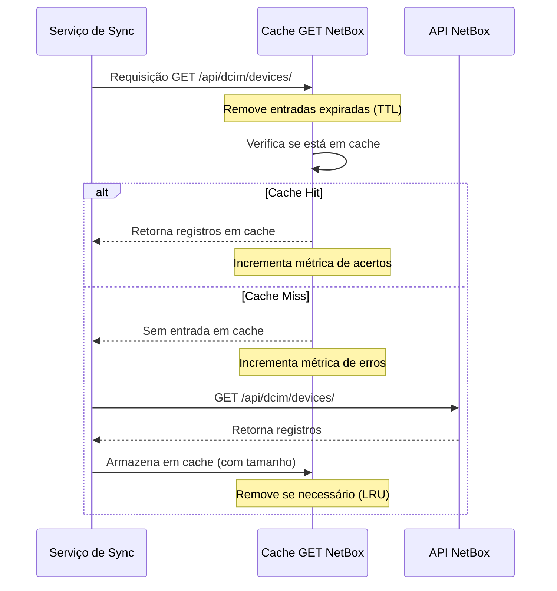
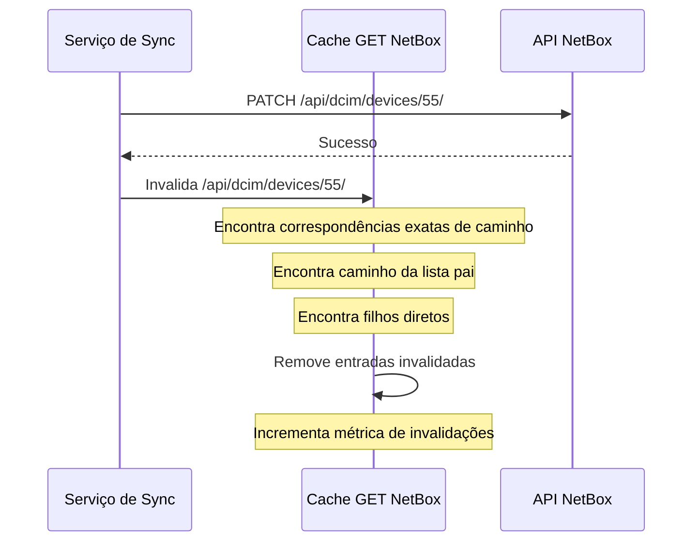
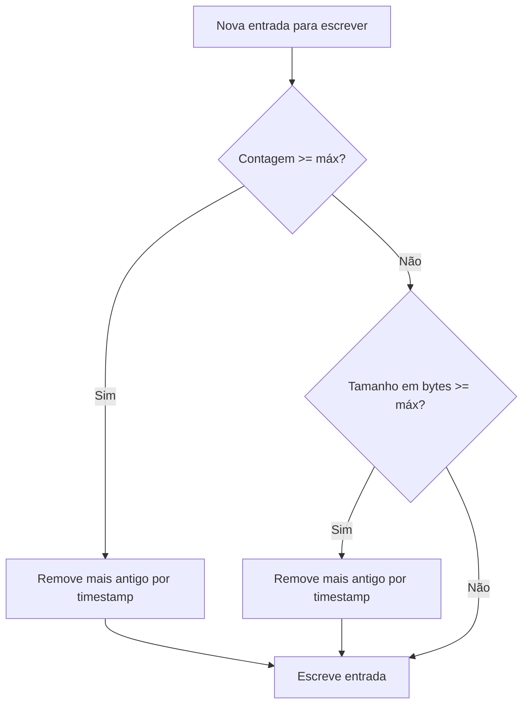

# Arquitetura de Cache

Este documento descreve a arquitetura de cache no proxbox-api, incluindo decisões de design, fluxogramas e opções de configuração.

## Visão Geral

O proxbox-api implementa uma camada de cache em nível de requisição para operações GET do NetBox para reduzir a carga no banco de dados durante operações de sincronização. O cache é apenas em memória e não persiste entre reinicializações.

## Tipos de Cache

### Cache GET do NetBox

Localizado em `proxbox_api/netbox_rest.py`, este cache armazena respostas de requisições GET da API REST do NetBox. Ele foi projetado para:

- Reduzir chamadas redundantes à API do NetBox durante sincronização
- Prover invalidação automática em mutações (POST/PATCH/PUT/DELETE)
- Oferecer observabilidade através de endpoints de métricas
- Suportar limites de contagem de entradas e tamanho em bytes

### Cache Interno do Proxbox

Localizado em `proxbox_api/cache.py`, este é um cache em memória separado para estruturas de dados internas do Proxbox. É usado para cache de propósito geral dentro da aplicação.

## Fluxo de Cache

### Fluxo de Requisição GET



### Fluxo de Invalidação de Cache



## Configuração de Cache

| Variável de Ambiente | Padrão | Descrição |
|---------------------|--------|------------|
| `PROXBOX_NETBOX_GET_CACHE_TTL` | 60.0 | TTL do cache em segundos (0 para desabilitar) |
| `PROXBOX_NETBOX_GET_CACHE_MAX_ENTRIES` | 4096 | Número máximo de entradas em cache |
| `PROXBOX_NETBOX_GET_CACHE_MAX_BYTES` | 52428800 | Tamanho máximo do cache em bytes (50MB) |
| `PROXBOX_DEBUG_CACHE` | 0 | Habilitar log de debug (1 para habilitar) |

## Política de Evictação

O cache usa uma política de evictação **LRU (Least Recently Used)**. Quando o limite de contagem de entradas ou o limite de tamanho em bytes é atingido, as entradas mais antigas (por timestamp de cache) são removidas primeiro.

### Gatilhos de Evictação

1. **Expiração de TTL**: Entradas mais antigas que `PROXBOX_NETBOX_GET_CACHE_TTL` segundos são automaticamente removidas
2. **Limite de Contagem de Entradas**: Quando `len(cache) >= max_entries`, entradas mais antigas são removidas
3. **Limite de Tamanho em Bytes**: Quando `current_bytes + nova_entrada > max_bytes`, entradas mais antigas são removidas

### Ordem de Evictação



## Estratégia de Invalidação de Cache

A invalidação de cache é **precisa** (não baseada em prefixo) para evitar over-invalidação:

- Atualizando `/api/dcim/devices/55/` invalida:
  - Caminho exato: `/api/dcim/devices/55/`
  - Lista pai: `/api/dcim/devices/`
  - Filhos diretos (se houver): nenhum para caminhos de detalhe

- Atualizando `/api/dcim/devices/` (lista) invalida:
  - Caminho exato: `/api/dcim/devices/`
  - Filhos diretos: `/api/dcim/devices/1/`, `/api/dcim/devices/2/`, etc.

Isso previne o problema de atualizar o dispositivo ID 1 incorretamente invalidar o dispositivo ID 10.

## Métricas e Observabilidade

### Métricas Disponíveis

| Métrica | Tipo | Descrição |
|---------|------|------------|
| `hits` | counter | Total de acertos no cache |
| `misses` | counter | Total de erros no cache |
| `hit_rate` | gauge | Porcentagem de acertos no cache |
| `invalidations` | counter | Número de invalidações de cache |
| `evictions_ttl` | counter | Entradas removidas por expiração de TTL |
| `evictions_size` | counter | Entradas removidas por limite de entradas |
| `evictions_bytes` | counter | Bytes removidos por limite de bytes |
| `current_entries` | gauge | Contagem atual de entradas em cache |
| `current_bytes` | gauge | Tamanho atual do cache em bytes |
| `max_entries` | gauge | Máximo de entradas permitidas |
| `max_bytes` | gauge | Máximo de bytes permitidos |

### Endpoints de Métricas

- `GET /cache` - Visualização combinada de cache com métricas
- `GET /cache/metrics` - Métricas em JSON
- `GET /cache/metrics/prometheus` - Formato Prometheus

## Log de Debug

Habilite o logging detalhado de cache com:

```bash
export PROXBOX_DEBUG_CACHE=1
```

Isso registra:
- Eventos de Cache HIT/MISS
- Cache DESABILITADO (TTL=0)
- Eventos de Cache EXPIRADO
- Eventos de Cache INVALIDATE com contagem

## Pontos de Integração

O cache está integrado na camada de helpers REST em `proxbox_api/netbox_rest.py`:

- `rest_list_async()` - Listar recursos com cache
- `rest_first_async()` - Obter primeiro resultado com cache
- `rest_get_async()` - Obter único recurso com cache
- `rest_create_async()` - Criar com invalidação de cache
- `rest_update_async()` - Atualizar com invalidação de cache
- `rest_delete_async()` - Deletar com invalidação de cache

Todos os serviços de sincronização se beneficiam automaticamente desta camada de cache centralizada sem necessidade de alterações.

## Considerações de Performance

### Taxa de Acerto do Cache

Uma alta taxa de acerto do cache (>70%) indica cache efetivo. Para melhorar a taxa de acerto:

1. Aumente o TTL para dados estáveis
2. Ajuste os limites de tamanho de cache para sua carga de trabalho
3. Certifique-se de que queries são determinísticas (mesma query = mesma chave de cache)

### Uso de Memória

O limite de bytes previne crescimento ilimitado de memória. Monitore a métrica `current_bytes` para garantir folga adequada.

### Benchmarking

Execute benchmarks de performance na CI para detectar regressões:

```bash
# Exemplo de comando de benchmark
uv run pytest tests/ --benchmark-only

```

Veja o workflow do GitHub Actions para benchmark automatizado.
