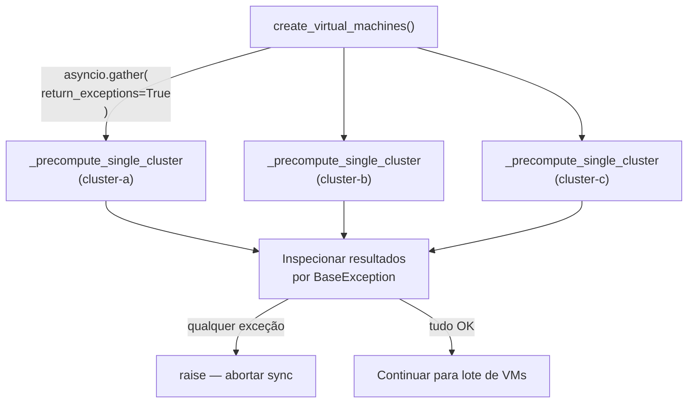
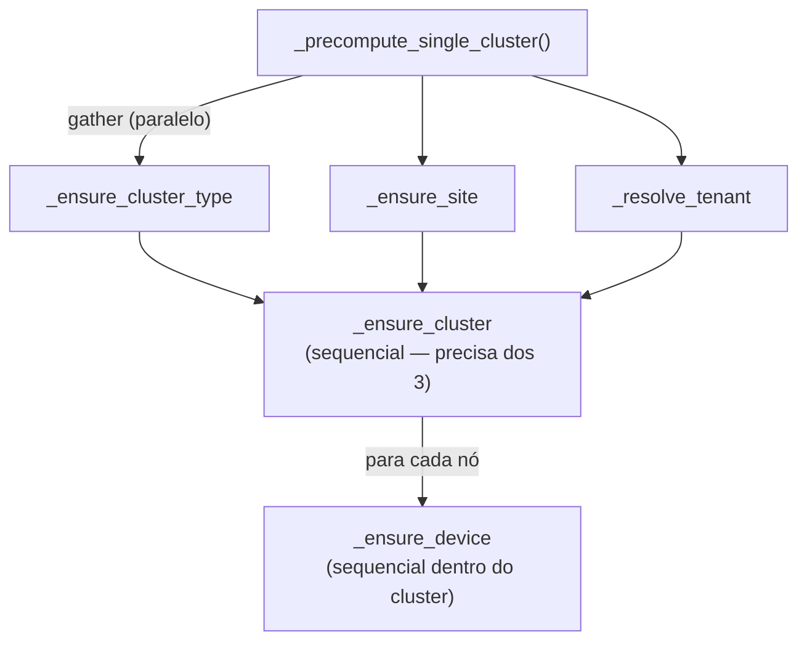

# Padrões de Gather Paralelo

## Básicos do `asyncio.gather`

`asyncio.gather(*coros)` executa todas as corrotinas concorrentemente e retorna
uma lista de seus resultados na mesma ordem. Se alguma corrotina levantar uma
exceção, `gather` cancela as restantes (por padrão) e propaga a primeira
exceção ao chamador.

```python
results = await asyncio.gather(coro_a(), coro_b(), coro_c())
# results = [resultado_a, resultado_b, resultado_c]
```

A variante `return_exceptions=True` muda esse comportamento: exceções são
retornadas como valores ao invés de serem levantadas. O chamador deve verificar
cada item.

```python
results = await asyncio.gather(coro_a(), coro_b(), coro_c(), return_exceptions=True)
# results pode conter exceções: [resultado_a, ValueError("..."), resultado_c]
for r in results:
    if isinstance(r, BaseException):
        tratar_falha(r)
```

## Padrão 1: Pré-Computação Paralela Entre Clusters

Todos os clusters em um passo de sincronização são processados concorrentemente.
Uma falha na pré-computação de qualquer cluster único deve abortar toda a
sincronização (os dados do cluster são necessários), então o código usa
`return_exceptions=True` para inspecionar resultados e então re-lança
explicitamente a primeira falha.

```python
cluster_precompute_results = await asyncio.gather(
    *[_precompute_single_cluster(cn, vrs)
      for cn, vrs in resources_by_cluster.items()],
    return_exceptions=True,
)
for _cluster_result in cluster_precompute_results:
    if isinstance(_cluster_result, BaseException):
        raise _cluster_result   # <- re-lança: aborta a sincronização
```



## Padrão 2: Resolução de Dependências Paralela Dentro do Cluster

Dentro da pré-computação de cada cluster, três lookups independentes executam
concorrentemente:

```python
cluster_type, site, tenant = await asyncio.gather(
    _ensure_cluster_type(nb, mode=cluster_mode, tag_refs=tag_refs),
    _ensure_site(nb, cluster_name=cluster_name, ...),
    _resolve_tenant(nb, placement=cluster_state),
)
# sequencial: _ensure_cluster depende de cluster_type, site, tenant
cluster = await _ensure_cluster(nb, cluster_type=cluster_type, site=site, ...)
```

Essas três são mutuamente independentes: tipo de cluster, site e tenant não
dependem um do outro. Executá-los em sequência triplicaria a latência.



Os ensures de dispositivos de nó executam **sequencialmente** dentro do cluster
porque dependem do id do cluster resolvido retornado por `_ensure_cluster`.

## Padrão 3: Fila de Despacho de Operações de VM

Todas as operações `CREATE`, `GET` e `UPDATE` de VM são despachadas
concorrentemente sob o semáforo de escrita. Falhas por VM são isoladas.

```python
async def _run_single(operation):
    key = _prepared_vm_result_key(operation.prepared)
    async with write_semaphore:
        try:
            result = await _dispatch_operation(nb, operation)
            resolved_records[key] = result
        except Exception as err:
            failed_keys.add(key)
            resolved_records.pop(key, None)

await asyncio.gather(
    *[_run_single(op) for op in operation_queue],
    return_exceptions=True,
)
return resolved_records, failed_keys
```

```mermaid
sequenceDiagram
    participant G as asyncio.gather
    participant R1 as _run_single (VM 1)
    participant R2 as _run_single (VM 2) FALHA
    participant R3 as _run_single (VM 3)

    G->>R1: iniciar concorrentemente
    G->>R2: iniciar concorrentemente
    G->>R3: iniciar concorrentemente

    R2->>R2: exceção capturada → failed_keys.add(key2)
    Note over R2: semáforo liberado; gather continua
    R1->>R1: sucesso → resolved_records[key1]
    R3->>R3: sucesso → resolved_records[key3]

    G-->>G: retorna [None, None, None] (return_exceptions dentro)
    Note over G: resolved_records = {key1, key3}, failed_keys = {key2}
```

## Escolhendo o Padrão Correto

| Cenário | Padrão | `return_exceptions` |
|---|---|---|
| Pré-computação entre clusters — qualquer falha aborta | Re-lançar após inspecionar | `True` |
| Lookups independentes dentro do cluster — qualquer falha aborta o cluster | gather simples | `False` (padrão) |
| Despacho de VM — falhas por item são contadas, não propagadas | Isolamento de falhas dentro de cada item | `True` (rede de segurança) |
