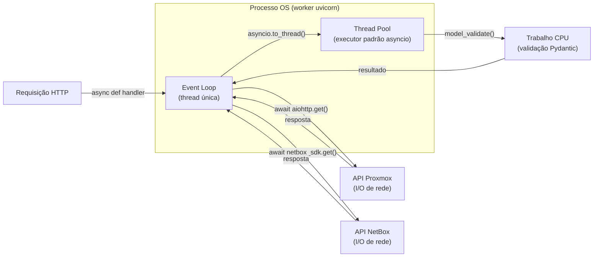
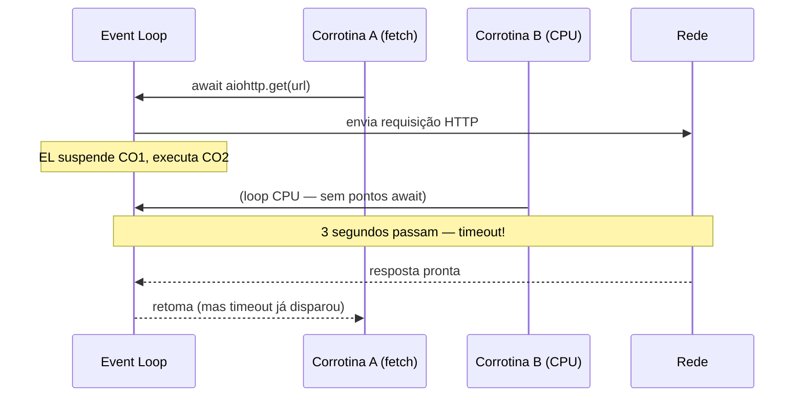

# Visão Geral da Arquitetura Assíncrona

## O Event Loop de Thread Única

O proxbox-api é uma aplicação FastAPI servida pelo uvicorn. Cada worker do
uvicorn executa um único **event loop** Python — um scheduler de thread única
que multiplexa milhares de corrotinas concorrentes de I/O sem usar threads do
sistema operacional.



O event loop é dono da sua thread. Sempre que uma corrotina executa `await`, o
loop a suspende e executa outra corrotina pronta. Por isso o trabalho de I/O
escala bem: enquanto aguarda uma resposta da API Proxmox, o loop continua
processando outras requisições.

## Por Que Trabalho CPU-Bound É Perigoso

Uma corrotina que executa Python puro sem nenhum ponto de `await` mantém o
event loop **exclusivamente** até terminar. Durante esse tempo:

- Toda outra corrotina pendente espera.
- Callbacks de I/O do aiohttp não são despachados.
- Timeouts wall-clock configurados no `ClientSession` podem disparar — não
  porque a rede está lenta, mas porque o event loop estava ocupado fazendo
  trabalho de CPU.



A solução é `asyncio.to_thread()`.

## `asyncio.to_thread` — Descarregando Trabalho CPU

`asyncio.to_thread(fn, *args)` executa `fn(*args)` em uma thread do pool e
retorna um awaitable. O event loop fica livre enquanto a thread executa.

```python
# RUIM — bloqueia o event loop para cada VM do lote
for vm_config in fetched_configs:
    prepared = _build_vm_payload(vm_config)      # CPU puro, sem await

# BOM — descarrega o trabalho CPU para o thread pool
for vm_config in fetched_configs:
    prepared = await asyncio.to_thread(
        _build_vm_payload, vm_config
    )
```

O lote de VMs em duas fases separa o fetch de I/O (fase 1) do processamento
CPU (fase 2) exatamente para que todas as conexões aiohttp sejam drenadas antes
que qualquer trabalho CPU ocupe o loop. Veja
[Lote de VMs em Duas Fases](async-two-phase-batch.md) para o design completo.

## Os Três Blocos de Construção Async

| Primitiva | Finalidade | Uso no proxbox-api |
|---|---|---|
| `asyncio.Semaphore` | Limitar acesso concorrente a um recurso compartilhado | Semáforos de fetch, escrita e lote de interfaces |
| `asyncio.gather` | Executar múltiplas corrotinas concorrentemente e coletar resultados | Pré-computação de clusters, despacho de VMs, resolução de dependências |
| `asyncio.to_thread` | Descarregar código CPU-bound ou síncrono legado | Pydantic `model_validate`, construtores de payload |

Cada um é abordado em detalhe nas seções seguintes:

- [Concorrência Limitada por Semáforo](async-semaphores.md)
- [Padrões de Gather Paralelo](async-gather.md)
- [Lote de VMs em Duas Fases](async-two-phase-batch.md)
- [Limitação de Timeout com Escopo](async-timeout-scoping.md)
- [Tunáveis de Concorrência em Runtime](async-tunables.md)
