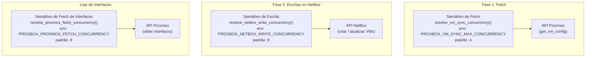
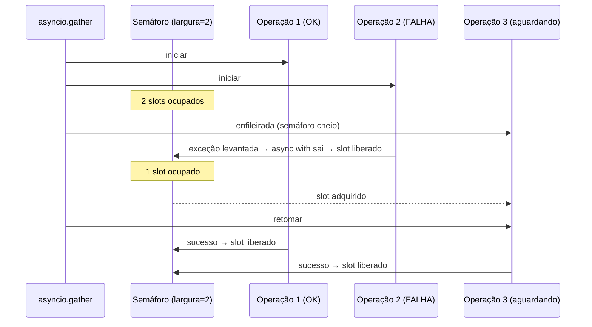

# Concorrência Limitada por Semáforo

## O Que É um `asyncio.Semaphore`?

Um `asyncio.Semaphore` é um contador que limita quantas corrotinas podem
mantê-lo ao mesmo tempo. Tentar `await` o semáforo quando seu contador é zero
suspende o chamador até que outra corrotina o libere.

```python
sem = asyncio.Semaphore(4)  # no máximo 4 detentores simultâneos

async def tarefa(i):
    async with sem:           # adquire (bloqueia se 4 já estiverem mantidos)
        await fazer_trabalho(i)  # até 4 tarefas executam simultaneamente
                               # liberação ocorre na saída
```

Ao contrário do `threading.Semaphore`, o `asyncio.Semaphore` nunca usa threads
ou locks do OS; é totalmente cooperativo e seguro de usar a partir de
corrotinas.

## Os Três Semáforos no Pipeline de Sincronização de VMs



### 1. Semáforo de Fetch

**Fonte:** `resolve_vm_sync_concurrency()` em
`proxbox_api/routes/virtualization/virtual_machines/helpers.py`

```python
fetch_semaphore = asyncio.Semaphore(max(1, resolve_vm_sync_concurrency()))

async def _fetch_with_limit(resource):
    async with fetch_semaphore:
        return await _fetch_vm_config_only(pxs=pxs, resource=resource)

fetch_results = await asyncio.gather(
    *[_fetch_with_limit(res) for _, res in operation_inputs],
    return_exceptions=True,
)
```

**Por que é necessário:** Clusters Proxmox podem ter milhares de VMs. Disparar
todas as requisições de configuração simultaneamente sobrecarregaria o rate
limiter da API Proxmox e esgotaria o pool de conexões do aiohttp. O semáforo
serializa os bursts para no máximo `PROXBOX_VM_SYNC_MAX_CONCURRENCY` requisições
concorrentes em voo.

### 2. Semáforo de Escrita

**Fonte:** `resolve_netbox_write_concurrency()` no mesmo arquivo de helpers.

```python
write_semaphore = asyncio.Semaphore(max(1, resolve_netbox_write_concurrency()))

async def _run_single(operation):
    key = _prepared_vm_result_key(operation.prepared)
    async with write_semaphore:          # <- dentro do try/except
        try:
            result = await _dispatch_operation(nb, operation)
            resolved_records[key] = result
        except Exception as err:
            failed_keys.add(key)
            resolved_records.pop(key, None)
            logger.warning("Despacho de VM falhou: key=%s error=%s", key, err)
```

**Por que é necessário:** O backend PostgreSQL do NetBox tem um pool de
conexões limitado. Enviar 500 requisições de escrita concorrentes causaria
esgotamento do pool, resultando em timeouts em cascata. O padrão de 8 escritas
mantém a pressão sobre o PostgreSQL gerenciável enquanto ainda alcança
paralelismo significativo.

### 3. Semáforo de Fetch de Interfaces

**Fonte:** `resolve_proxmox_fetch_concurrency()` — protege leituras Proxmox
concorrentes para enumeração de interfaces por VM, separado do fetch de
configuração de VM.

## Isolamento de Falhas Requer o Semáforo Dentro do Handler de Erro

O invariante crítico é:

**Uma operação que falha deve liberar seu slot de semáforo imediatamente** para
que operações subsequentes não sejam privadas. Como `async with` é um gerenciador
de contexto assíncrono, o slot é sempre liberado na saída independentemente de
uma exceção ter sido levantada — a cláusula `except` dentro pode registrar a
falha com segurança sem bloquear outras operações.



## Dimensionando o Semáforo

A largura correta depende do serviço downstream:

| Semáforo | Downstream | Restrição principal | Padrão |
|---|---|---|---|
| Fetch | API do cluster Proxmox | Rate limiting, pool de conexões | 4 |
| Escrita | PostgreSQL do NetBox | Tamanho do pool de conexões DB | 8 |
| Fetch de interfaces | Agente guest Proxmox | Rate limiting, overhead por VM | 8 |

Veja [Tunáveis de Concorrência em Runtime](async-tunables.md) para como ajustar
esses valores através de variáveis de ambiente ou da página de configurações do
plugin Proxbox no NetBox.
