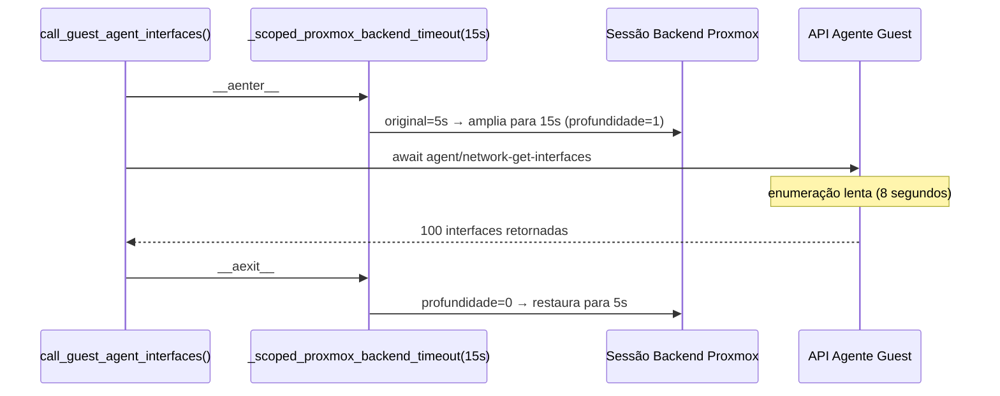
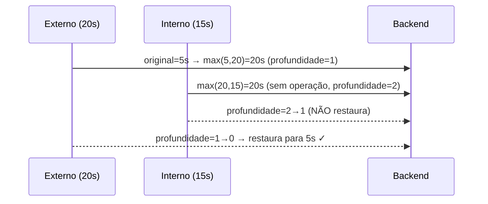

# Limitação de Timeout com Escopo

## O Problema: Enumeração do Agente Guest É Lenta

Ao sincronizar VMs com muitas interfaces (ex.: um roteador VRRP com 100+
interfaces virtuais), `agent/network-get-interfaces` pode levar 10–30 segundos
dentro do guest VM. O timeout padrão da sessão Proxmox (5 segundos) estava
silenciosamente descartando dados do agente guest para essas VMs.

Simplesmente aumentar o timeout global da sessão afetaria todas as requisições,
incluindo os fetches de configuração de VM na fase 1, potencialmente
sobrecarregando o event loop por mais tempo.

## `_scoped_proxmox_backend_timeout`

A solução é um gerenciador de contexto que **amplia** o timeout do backend
Proxmox apenas durante a chamada ao agente guest, depois restaura o timeout
original.

```python
@asynccontextmanager
async def _scoped_proxmox_backend_timeout(pxs, timeout_seconds: float):
    original = pxs._session.connector._timeout   # aiohttp ClientTimeout
    widened = aiohttp.ClientTimeout(
        total=max(original.total or 0, timeout_seconds),  # apenas amplia
        connect=original.connect,
        sock_connect=original.sock_connect,
        sock_read=original.sock_read,
    )
    pxs._session.connector._timeout = widened
    _depth_counter[pxs] += 1
    try:
        yield
    finally:
        _depth_counter[pxs] -= 1
        if _depth_counter[pxs] == 0:
            pxs._session.connector._timeout = original  # restaura apenas na última saída
```

### Invariante Somente-Ampliar

O novo `total` é sempre `max(original, solicitado)`. Isso significa:

- Se o timeout original já for maior, permanece inalterado.
- O gerenciador de contexto nunca pode _reduzir_ o timeout — uma chamada
  aninhada com um timeout menor solicitado não tem efeito no escopo externo.



### Contador de Profundidade — Segurança em Chamadas Aninhadas

Se duas chamadas sobrepostas a `_scoped_proxmox_backend_timeout` forem feitas
no mesmo backend, o timeout é restaurado apenas quando a _última_ saída
disparar.



Sem o contador de profundidade, a saída interna restauraria prematuramente `5s`
e a chamada externa executaria com o timeout original estreito.

## Configuração do Timeout do Agente Guest

O timeout do agente guest é configurado através de:

- **Variável de ambiente:** `PROXBOX_GUEST_AGENT_TIMEOUT` (segundos, float)
- **Chave de configurações do plugin:** `guest_agent_timeout` (na página de
  configurações do plugin Proxbox no NetBox)
- **Padrão:** 15 segundos
- **Intervalo:** 1–600 segundos

```python
guest_agent_timeout = get_float(
    settings_key="guest_agent_timeout",
    env="PROXBOX_GUEST_AGENT_TIMEOUT",
    default=15.0,
    minimum=1.0,
    maximum=600.0,
)

async def _get_guest_interfaces(pxs, vmid, node):
    async with _scoped_proxmox_backend_timeout(pxs, guest_agent_timeout):
        for attempt in range(2):   # uma única tentativa limitada
            try:
                return await pxs.agent_network_get_interfaces(vmid=vmid, node=node)
            except ProxmoxTimeoutError:
                if attempt == 0:
                    continue
                raise
```

A **única tentativa limitada** (não um loop infinito) lida com picos de timeout
transitórios sem mascarar falhas genuínas de conectividade.

## Quando Usar Este Padrão

Use `_scoped_proxmox_backend_timeout` sempre que uma chamada específica à API
Proxmox for sabidamente mais lenta que o padrão da sessão e você não quiser
aumentar o timeout global:

```python
# ✅ Correto — agente guest amplia apenas para a chamada específica
async with _scoped_proxmox_backend_timeout(pxs, timeout_seconds=30):
    data = await pxs.agent_exec(vmid=vmid, node=node, command="df -h")

# ❌ Errado — aumenta o timeout global para todas as requisições
pxs._session.connector._timeout = aiohttp.ClientTimeout(total=30)
data = await pxs.agent_exec(vmid=vmid, node=node, command="df -h")
# (timeout original nunca é restaurado)
```
