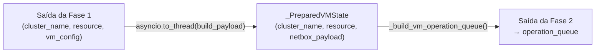

# Lote de VMs em Duas Fases

## O Problema: Misturar I/O e CPU em Uma Única Fase

Uma implementação ingênua da sincronização de VMs iteraria sobre todas as VMs,
buscaria cada configuração e a processaria imediatamente:

```python
# INGÊNUO — mistura I/O e CPU no mesmo loop
for cluster_name, resource in operation_inputs:
    vm_config = await _fetch_vm_config_only(pxs, resource)
    prepared = _build_netbox_virtual_machine_payload(vm_config)  # CPU
    prepared_vms.append(prepared)
```

Isso funciona para poucas VMs, mas falha em escala. `_build_netbox_virtual_machine_payload`
executa `model_validate` do Pydantic e várias etapas de transformação — trabalho
puro de CPU sem pontos `await`. Em um cluster com 500 VMs, o event loop fica
retido por centenas de milissegundos de tempo de CPU entre cada
`await _fetch_vm_config_only`, fazendo o aiohttp disparar timeouts wall-clock
mesmo que a rede esteja saudável.

```mermaid
gantt
    title Abordagem ingênua (500 VMs, 10ms CPU cada)
    dateFormat X
    axisFormat %Lms

    section Event Loop
    fetch VM 1  : 0, 50
    CPU VM 1 : 50, 60
    fetch VM 2  : 60, 110
    CPU VM 2 : 110, 120
    fetch VM 3  : 120, 170
    CPU VM 3 : 170, 180
    section Timeouts aiohttp
    Timer dispara (outras sessões) : crit, 100, 105
```



## A Solução: Duas Fases

`_run_full_update_vm_batch` separa o trabalho em duas fases estritamente
sequenciais:

### Fase 1 — Buscar Todas as Configurações (I/O-Bound)

Todas as requisições de configuração de VM do Proxmox disparam concorrentemente
sob o semáforo de fetch. O event loop fica livre para processar callbacks do
aiohttp entre as requisições.

```python
fetch_semaphore = asyncio.Semaphore(max(1, resolve_vm_sync_concurrency()))

async def _fetch_with_limit(resource):
    async with fetch_semaphore:
        return await _fetch_vm_config_only(pxs=pxs, resource=resource)

fetch_results = await asyncio.gather(
    *[_fetch_with_limit(resource) for _, resource in operation_inputs],
    return_exceptions=True,
)
```

A fase 1 termina somente após **cada** fetch de configuração ter completado ou
falhado.

### Fase 2 — Processar Configurações (CPU-Bound via `asyncio.to_thread`)

Configurações bem-sucedidas são processadas sequencialmente. Cada chamada a
`_prepare_vm_from_config` descarrega a validação Pydantic e construção de
payload intensivas em CPU para o thread pool via `asyncio.to_thread`.

```python
for cluster_name, resource, vm_config in fetched_vm_configs:
    try:
        prepared_vms.append(
            await _prepare_vm_from_config(
                cluster_name, resource, vm_config, prepare_context,
            )
        )
    except Exception as prepared_result:
        failed_vms += 1
```



```mermaid
gantt
    title Abordagem em duas fases (500 VMs, 10ms CPU cada)
    dateFormat X
    axisFormat %Lms

    section Fase 1 — Fetch (concorrente, largura semáforo=4)
    Lote 1 (4 VMs) : 0, 50
    Lote 2 (4 VMs) : 50, 100
    Lote N         : 100, 150
    section Fase 2 — Processar (thread pool)
    CPU VM 1 (thread) : 150, 160
    CPU VM 2 (thread) : 160, 170
    CPU VM 3 (thread) : 170, 180
    section Event Loop
    Livre durante trabalho de thread : 150, 180
```

## `_PreparedVMState` — O Tipo de Handoff

`_PreparedVMState` é um dataclass que carrega a saída da fase 1 (o dict de
configuração bruta do Proxmox) e da fase 2 (o payload NetBox validado pelo
Pydantic). É o contrato entre as duas fases.



## Contagem de Falhas Entre as Duas Fases

Uma VM pode falhar em qualquer fase:

| Fase | Causa da falha | Efeito |
|---|---|---|
| Fase 1 (fetch) | Erro na API Proxmox, timeout | `fetch_failed += 1`, `failed_vms += 1`, VM pulada |
| Fase 2 (processar) | Erro de validação Pydantic, erro de mapeamento | `failed_vms += 1`, VM pulada |
| Despacho | Erro de escrita no NetBox | `failed_keys.add(key)`, contado pelo chamador |

O chamador recebe `(synced_records, failed_vms)` de `_run_full_update_vm_batch`.
`total_vms = len(synced_records) + failed_vms` é sempre correto; uma fase onde
todas as VMs falharam reporta `total > 0, failed > 0` ao invés do enganoso
`total = 0, ok = 0, failed = 0`.

## Logs de Temporização

O lote emite um log INFO após a conclusão da fase 1:

```
VM full-update phase timing: fetch_ms=1234.56 process_ms=567.89 fetched_ok=480 fetch_failed=20
```

Use `fetch_ms` para diagnosticar latência da API Proxmox. Use `process_ms` para
diagnosticar overhead de CPU. Veja [Tunáveis de Concorrência em Runtime](async-tunables.md)
para como ajustar `PROXBOX_VM_SYNC_MAX_CONCURRENCY` para otimizar o throughput
de fetch.
