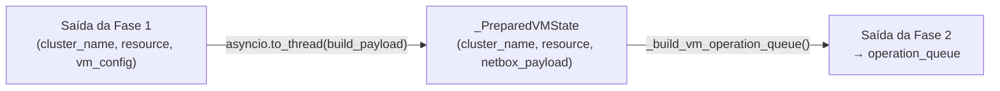

# Lote de VMs em Duas Fases

## O Problema: Misturar I/O e CPU em Uma Única Fase

Uma implementação ingênua da sincronização de VMs iteraria sobre todas as VMs,
buscaria cada configuração e a processaria imediatamente:

```python
# INGÊNUO — mistura I/O e CPU no mesmo loop
for cluster_name, resource in operation_inputs:
    vm_config = await _fetch_vm_config_only(pxs, resource)
    prepared = build_netbox_virtual_machine_payload(vm_config)  # CPU
    prepared_vms.append(prepared)
```

Isso funciona para poucas VMs, mas falha em escala. `build_netbox_virtual_machine_payload`
executa `model_validate` do Pydantic e várias etapas de transformação — trabalho
puro de CPU sem pontos `await`. Em um cluster com 500 VMs, o event loop fica
retido por centenas de milissegundos de tempo de CPU entre cada
`await _fetch_vm_config_only`, fazendo o aiohttp disparar timeouts wall-clock
mesmo que a rede esteja saudável.


```mermaid
gantt
    title Abordagem ingênua (500 VMs, 10ms CPU cada)
    dateFormat X
    axisFormat %Lms

    section Event Loop
    fetch VM 1  : 0, 50
    CPU VM 1 : 50, 60
    fetch VM 2  : 60, 110
    CPU VM 2 : 110, 120
    fetch VM 3  : 120, 170
    CPU VM 3 : 170, 180
    section Timeouts aiohttp
    Timer dispara (outras sessões) : crit, 100, 105
```

## A Solução: Duas Fases

`_run_full_update_vm_batch` separa o trabalho em duas fases estritamente
sequenciais:

### Fase 1 — Buscar Todas as Configurações (I/O-Bound)

As requisições de configuração de VM do Proxmox passam por um conjunto fixo de
workers e uma fila de entrada limitada. Isso limita as requisições ativas e o
trabalho pendente; o event loop fica livre para processar callbacks do aiohttp
entre as requisições.

```python
fetch_results = await _map_bounded_ordered(
    operation_inputs,
    _fetch_one,
    worker_count=resolve_vm_sync_concurrency(),
)
```

A fase 1 termina somente após **cada** fetch de configuração ter completado ou
falhado.

### Fase 2 — Processar Configurações (CPU-Bound via `asyncio.to_thread`)

Configurações bem-sucedidas são processadas sequencialmente. O trecho abaixo é
pseudocódigo; cada item preserva sua sessão específica de endpoint e as
configurações do cluster. Cada chamada a `_prepare_vm_from_config` descarrega a
validação Pydantic e construção de payload intensivas em CPU para o thread pool
via `asyncio.to_thread`.

```python
for endpoint_id, cluster_name, resource, vm_config, px_source, cluster_source in fetched_vm_configs:
    try:
        prepared_vms.append(
            await _prepare_vm_from_config(
                cluster_name, resource, vm_config, prepare_context,
                endpoint_id=endpoint_id,
                px_source=px_source,
                cluster_source=cluster_source,
            )
        )
    except Exception as prepared_result:
        failed_vms += 1
```

Dentro de `_prepare_vm_from_config`, o fluxo relevante equivale ao pseudocódigo
abaixo; o helper de produção também resolve dependências e fornece todos os
campos obrigatórios de `_PreparedVMState`:

```python
async def _prepare_vm_from_config(cluster_name, resource, vm_config, context):
    config_model, resource_model = await asyncio.to_thread(
        _validate_vm_inputs, vm_config, resource
    )
    desired_payload = await asyncio.to_thread(
        build_netbox_virtual_machine_payload,
        proxmox_resource=resource_model,
        proxmox_config=config_model,
        # IDs resolvidos de cluster, device, role, tag, site, tenant, tipo e platform
    )
    sync_state_fields = build_virtual_machine_sync_state_fields(
        proxmox_resource=resource_model,
        proxmox_config=config_model,
        # timestamp da execução e identidade limitada ao endpoint
    )
    return build_complete_prepared_state(
        resource=resource,
        vm_config=vm_config,
        vm_config_obj=config_model,
        desired_payload=desired_payload,
        sync_state_fields=sync_state_fields,
        # lookup, timestamp, tipo de VM e campos de política resolvidos
    )
```


```mermaid
gantt
    title Abordagem em duas fases (500 VMs, 10ms CPU cada)
    dateFormat X
    axisFormat %Lms

    section Fase 1 — Fetch (quatro workers fixos, fila limitada)
    Lote 1 (4 VMs) : 0, 50
    Lote 2 (4 VMs) : 50, 100
    Lote N         : 100, 150
    section Fase 2 — Processar (thread pool)
    CPU VM 1 (thread) : 150, 160
    CPU VM 2 (thread) : 160, 170
    CPU VM 3 (thread) : 170, 180
    section Event Loop
    Livre durante trabalho de thread : 150, 180
```

## `_PreparedVMState` — O Tipo de Handoff

`_PreparedVMState` é um dataclass que carrega a saída da fase 1 (o dict de
configuração bruta do Proxmox) e da fase 2 (o payload NetBox validado pelo
Pydantic). É o contrato entre as duas fases.


```mermaid
flowchart LR
    P1["Saída da Fase 1\n(cluster_name, resource, vm_config)"]
    PS["_PreparedVMState\n(cluster_name, resource, netbox_payload)"]
    P2["Saída da Fase 2\n→ operation_queue"]

    P1 -->|"asyncio.to_thread(build_payload)"| PS
    PS -->|"_build_vm_operation_queue()"| P2
```

## Contagem de Falhas Entre as Duas Fases

Uma VM pode falhar em qualquer fase:

| Fase | Causa da falha | Efeito |
|---|---|---|
| Fase 1 (fetch) | Erro na API Proxmox, timeout | `fetch_failed += 1`, `failed_vms += 1`, VM pulada |
| Fase 2 (processar) | Erro de validação Pydantic, erro de mapeamento | `failed_vms += 1`, VM pulada |
| Despacho | Erro de escrita no NetBox | `failed_keys.add(key)`, contado pelo chamador |

O chamador recebe `(synced_records, failed_vms)` de `_run_full_update_vm_batch`.
`total_vms = len(synced_records) + failed_vms` é sempre correto; uma fase onde
todas as VMs falharam reporta `total > 0, failed > 0` ao invés do enganoso
`total = 0, ok = 0, failed = 0`.

## Logs de Temporização

O lote emite um log INFO após a conclusão da fase 1:

```
VM full-update phase timing: fetch_ms=1234.56 process_ms=567.89 fetched_ok=480 fetch_failed=20
```

Use `fetch_ms` para diagnosticar latência da API Proxmox. Use `process_ms` para
diagnosticar overhead de CPU. Veja [Tunáveis de Concorrência em Runtime](async-tunables.md)
para como ajustar `PROXBOX_VM_SYNC_MAX_CONCURRENCY` para otimizar o throughput
de fetch.

O lote completo também registra `process_cpu_ms` e as durações de carregamento
do snapshot, hidratação do sidecar, resolução de nomes, canonicalização,
reconciliação, despacho e persistência. Wall time e tempo de CPU do processo
respondem perguntas diferentes; não some durações de requisições sobrepostas e
apresente o resultado como duração end-to-end. O log inclui a quantidade de
workers e a capacidade da fila limitada. `process_cpu_ms` mede todo o processo e
só pode ser atribuído a este sync durante uma execução isolada. Contagens e latências de requisições
upstream devem vir das métricas do transporte SDK em execuções controladas no
staging.

Depois da resolução de nomes, os payloads desejados finais são validados uma
vez fora do event loop e mantidos em `_PreparedVMState.desired_state`. O planner
Python reutiliza esse modelo canônico. Se houver cancelamento antes do retorno
desse offload, o resultado não alcança o despacho; escritas já emitidas mantêm
o tratamento de resultado existente.
