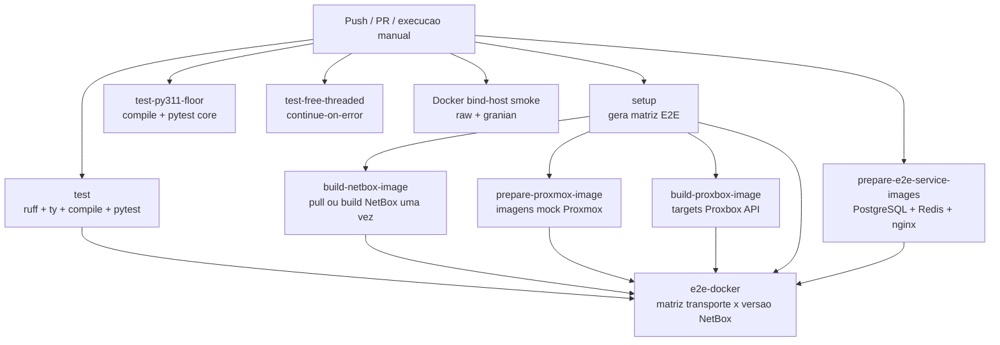
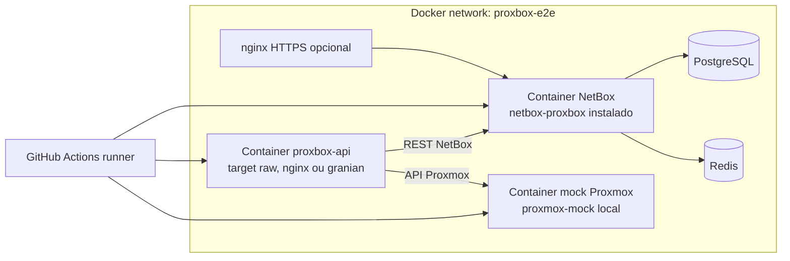
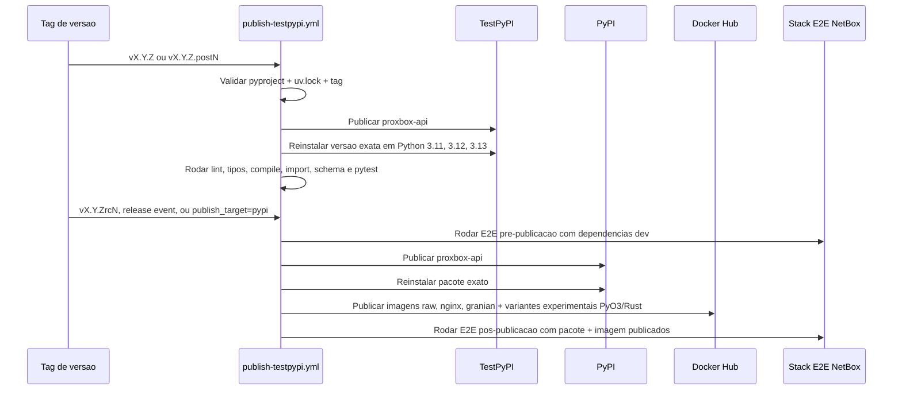

# Workflows de CI e E2E

Esta pagina documenta a superficie de GitHub Actions para desenvolvedores do
`proxbox-api`: validacao rapida, smoke tests de imagens Docker, matriz E2E com
NetBox e publicacao em etapas.

## Mapa dos workflows

| Workflow | Gatilho | Finalidade |
|---|---|---|
| `.github/workflows/ci.yml` | Push, pull request, release, dispatch manual | Roda checagens principais e a matriz E2E Docker com NetBox + Proxmox. |
| `.github/workflows/publish-testpypi.yml` | Tag de versao, GitHub release, dispatch manual | Publica versoes imutaveis no TestPyPI, candidatos PyPI, releases finais PyPI, imagens Docker e E2E pos-publicacao. |
| `.github/workflows/docker-hub-publish.yml` | Workflow reutilizavel / dispatch manual | Constroi e publica variantes raw, nginx, granian e experimentais PyO3/Rust da imagem Docker. |
| `.github/workflows/release-docker-verify.yml` | Release / dispatch manual | Baixa as tags Docker publicadas, incluindo as tags experimentais PyO3/Rust, e verifica startup dos conteineres. |
| `.github/workflows/docs.yml` | Mudancas de docs em main / PR | Constroi e publica o site MkDocs. |
| `.github/workflows/nightly-schema-refresh.yml` | Agendamento / dispatch manual | Atualiza schemas Proxmox gerados e abre PR quando houver mudanca. |

## Fluxo do CI

O CI prepara imagens Docker uma vez como artefatos temporarios do workflow, e
cada job da matriz E2E carrega esses artefatos antes de subir a stack. Isso
evita pulls repetidos do Docker Hub e rebuilds do Proxbox API em uma matriz
grande de versoes do NetBox. Imagens oficiais de Python, PostgreSQL, Redis,
nginx e a base fallback do NetBox sao baixadas por `mirror.gcr.io/library` para
evitar falhas por cota do Docker Hub. A imagem mock do Proxmox e construida a
partir do pacote local `proxmox-mock/` para cada marcador de servico `pve`,
`pbs` e `pdm`. O job do NetBox baixa a imagem publica quando disponivel e faz
fallback para build a partir do codigo-fonte quando a imagem do registro nao
existe. Esse build fallback segue a base atual do `netbox-docker`,
`ubuntu:26.04`, usando a referencia via mirror.

## Stack E2E

O `ci.yml` sobe uma stack real e verifica que o `proxbox-api` consegue
autenticar, configurar endpoints do NetBox e rodar testes de sincronizacao em
todos os transportes suportados.

Regras importantes do E2E:

- A prontidao do NetBox aguarda ate 20 minutos por migracoes/indexacao.
- `/api/status/` precisa estar pronto antes de configurar tokens e endpoints.
- Imagens Docker sao carregadas a partir de artefatos preparados; os jobs da
  matriz E2E nao fazem pull do Docker Hub nem rebuild direto dos conteineres
  Proxbox API.
- Containers mock do Proxmox usam o pacote local de mock schema-driven e expoem
  `PROXMOX_MOCK_SERVICE` para validar o marcador ativo em testes PBS/PDM.
- Testes Docker com mock Proxmox usam o marker `mock_http`.
- A passagem em processo com `MockBackend` roda separadamente com o marker
  `mock_backend`.
- Eventos de release rodam modos `dev` e `pypi` do `netbox-proxbox`; CI normal
  de push/PR usa o modo de desenvolvimento.

## Validacao de release

Uploads de pacote intencionalmente nao usam `twine --skip-existing`. Se alguma
validacao falhar depois do upload, publique uma versao fix-forward:
`vX.Y.Z.postN` para TestPyPI ou correcoes pos-release, e `vX.Y.ZrcN` para novas
tentativas de release candidate no PyPI.
