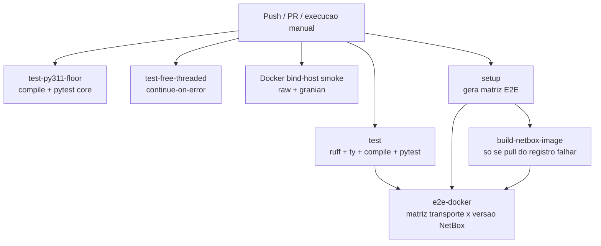
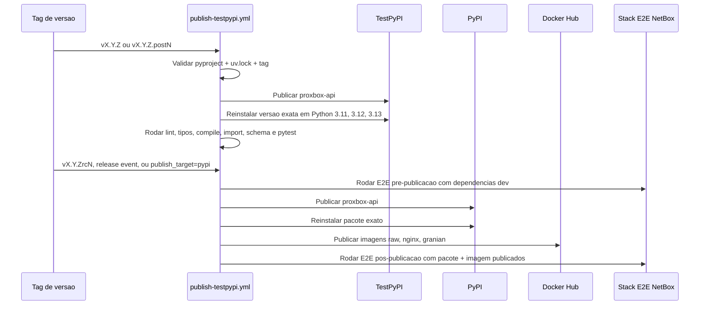

# Workflows de CI e E2E

Esta pagina documenta a superficie de GitHub Actions para desenvolvedores do
`proxbox-api`: validacao rapida, smoke tests de imagens Docker, matriz E2E com
NetBox e publicacao em etapas.

## Mapa dos workflows

| Workflow | Gatilho | Finalidade |
|---|---|---|
| `.github/workflows/ci.yml` | Push, pull request, release, dispatch manual | Roda checagens principais e a matriz E2E Docker com NetBox + Proxmox. |
| `.github/workflows/publish-testpypi.yml` | Tag de versao, GitHub release, dispatch manual | Publica versoes imutaveis no TestPyPI, candidatos PyPI, releases finais PyPI, imagens Docker e E2E pos-publicacao. |
| `.github/workflows/docker-hub-publish.yml` | Workflow reutilizavel / dispatch manual | Constroi e publica variantes raw, nginx e granian da imagem Docker. |
| `.github/workflows/release-docker-verify.yml` | Release / dispatch manual | Baixa as tags Docker publicadas e verifica startup dos conteineres. |
| `.github/workflows/docs.yml` | Mudancas de docs em main / PR | Constroi e publica o site MkDocs. |
| `.github/workflows/nightly-schema-refresh.yml` | Agendamento / dispatch manual | Atualiza schemas Proxmox gerados e abre PR quando houver mudanca. |

## Fluxo do CI

Os jobs E2E tentam baixar primeiro a imagem publica do NetBox. Eles so baixam o
artefato de imagem construido a partir do codigo-fonte quando esse pull falha.

## Stack E2E

O `ci.yml` sobe uma stack real e verifica que o `proxbox-api` consegue
autenticar, configurar endpoints do NetBox e rodar testes de sincronizacao em
todos os transportes suportados.

Regras importantes do E2E:

- A prontidao do NetBox aguarda ate 20 minutos por migracoes/indexacao.
- `/api/status/` precisa estar pronto antes de configurar tokens e endpoints.
- Testes Docker com mock Proxmox usam o marker `mock_http`.
- A passagem em processo com `MockBackend` roda separadamente com o marker
  `mock_backend`.
- Eventos de release rodam modos `dev` e `pypi` do `netbox-proxbox`; CI normal
  de push/PR usa o modo de desenvolvimento.

## Validacao de release

Uploads de pacote intencionalmente nao usam `twine --skip-existing`. Se alguma
validacao falhar depois do upload, publique uma versao fix-forward:
`vX.Y.Z.postN` para TestPyPI ou correcoes pos-release, e `vX.Y.ZrcN` para novas
tentativas de release candidate no PyPI.
