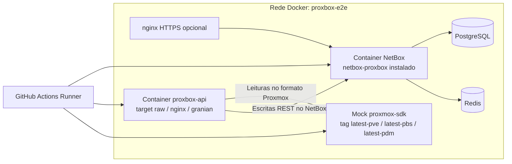

# Matriz E2E por servico Proxmox

A suite E2E do `proxbox-api` executa cada celula em Docker contra um container
mock dedicado de `proxmox-sdk`. O mock e separado por servico Proxmox
(`pve`, `pbs`, `pdm`) e o CI paraleliza a suite nos tres, garantindo que um
unico push exercita todos os stubs de servico suportados.

Para o desenho dos demais workflows — jobs de CI, modos de dependencia, fases
de publicacao escalonadas no TestPyPI/PyPI e variantes de imagem Docker — veja
[CI and E2E Workflows](ci-e2e-workflows.md).

## Por que existe o eixo de servico

O `proxmox-sdk` publica tres tags de imagem por servico em
[`emersonfelipesp/proxmox-sdk`](https://github.com/emersonfelipesp/proxmox-sdk):

| Servico | Tag da imagem | Cobertura |
|---|---|---|
| `pve` | `emersonfelipesp/proxmox-sdk:latest-pve` | Superficie completa de OpenAPI do Proxmox VE (646 endpoints). Executa o pipeline historico de sync. |
| `pbs` | `emersonfelipesp/proxmox-sdk:latest-pbs` | Stub do Proxmox Backup Server. Apenas `/health` (generico) + `/` (identificador de servico); rotas no formato PVE sao propositalmente ausentes. |
| `pdm` | `emersonfelipesp/proxmox-sdk:latest-pdm` | Stub do Proxmox Datacenter Manager. Hoje tem o mesmo formato do PBS. |

Rodar o mesmo backend, o mesmo container NetBox e as mesmas fixtures contra as
tres tags e a maneira mais barata de pegar regressoes que quebrariam uma
conexao real com PBS ou PDM — mesmo antes do contrato OpenAPI estar
totalmente gerado upstream.

## Formato da matriz

### `ci.yml`

A matriz de CI e gerada dinamicamente pelo job `setup`. O gerador emite o
produto cartesiano de:

| Eixo | Origem | Padrao |
|---|---|---|
| `base` (combinacao de transporte) | Lista hard-coded em `setup.gen` | 7 combinacoes cobrindo `http_manage`, `https_nginx`, `https_granian` e dual-stack IPv6 |
| `netbox_proxbox_mode` | Input `INPUT_NETBOX_PROXBOX_MODE` e o tipo de evento | `dev` em push/PR, `[dev, pypi]` em release |
| `netbox_version` | `.github/netbox-versions.json` | Tags NetBox certificadas: `v4.5.8`, `v4.5.9` e `v4.6.0` ate `v4.6.4` |
| `proxmox_service` | Lista hard-coded `["pve", "pbs", "pdm"]` | Tres servicos em todas as execucoes |

O produto cartesiano e portanto **7 (transporte) × 1–2 (modo) × 7 (NetBox) × 3 (servico) = 147–294 celulas**.
Cada celula usa `fail-fast: false`, entao a falha de uma celula nao aborta o
restante do run.

A tag da imagem e injetada no runner a partir da matriz e usada tanto no
`docker pull` quanto no container `proxmox-e2e-mock`:

```yaml
env:
  PROXMOX_OPENAPI_IMAGE: emersonfelipesp/proxmox-sdk:latest-${{ matrix.proxmox_service }}
  PROXMOX_SERVICE: ${{ matrix.proxmox_service }}
```

### `publish-testpypi.yml`

Os jobs de E2E pre e pos publicacao fixam o mesmo eixo estaticamente com
`proxmox_service: [pve, pbs, pdm]` para que os artefatos publicados (dist no
TestPyPI, imagem no Docker Hub) sejam validados contra todos os stubs de
servico antes da release ser finalizada.

## Arquitetura

Toda celula sobe o mesmo layout fisico no runner. A unica diferenca entre
celulas e qual tag de `proxmox-sdk` esta carregada em `proxmox-e2e-mock`.



## Camada de fixtures

A camada Python de fixtures vive em
`proxbox_api/e2e/fixtures/proxmox_sdk_mock.py` e e o unico ponto que decide
"este run e no formato PVE, ou e um stub de servico sem dados de VM/cluster?".

| Helper | Responsabilidade |
|---|---|
| `_resolve_proxmox_service(service="pve")` | Resolver atento a variaveis. Le `PROXMOX_SERVICE` quando o chamador nao passou servico explicito, normaliza para minusculas e cai em `pve`. |
| `_empty_cluster(name, service)` | Retorna um cluster rotulado com o servico, sem nos/VMs. Usado nas celulas PBS e PDM. |
| `create_minimal_cluster(prefix, service="pve")` | Um no e duas VMs (QEMU + LXC) em PVE; cluster vazio em servico nao-PVE. |
| `create_multi_cluster(prefix, service="pve")` | Dois clusters PVE com varios nos/VMs; um unico cluster vazio em servico nao-PVE. |
| `create_cluster_with_backups(prefix, service="pve")` | Cluster PVE + metadados de backup; em servico nao-PVE retorna cluster vazio e lista de backups vazia. |
| `create_custom_cluster(name, nodes_spec, vms_spec, prefix, service="pve")` | Topologia PVE customizada; cluster vazio em servico nao-PVE. |

Os testes **nao** precisam saber qual servico esta carregado — pedem a fixture
e a fixture devolve o estado PVE realista ou um cluster vazio rotulado. O que
muda entre servicos e a *selecao de testes*, nao a superficie da fixture.

## Politica de skip

`tests/e2e/conftest.py` expoe duas fixtures session-scope que controlam o
roteamento por servico:

```python
@pytest.fixture(scope="session")
def proxmox_service() -> str:
    return (os.environ.get("PROXMOX_SERVICE", "pve").strip().lower() or "pve")


@pytest.fixture(scope="session")
def requires_pve_schema(proxmox_service: str) -> None:
    if proxmox_service != "pve":
        pytest.skip(f"requires PVE schema; service={proxmox_service}")
```

Modulos de teste que rodam o pipeline completo de sync PVE declaram o
requisito de fixture no escopo do modulo:

```python
pytestmark = pytest.mark.usefixtures("requires_pve_schema")
```

Hoje isso vale em:

- `tests/e2e/test_backups_sync.py`
- `tests/e2e/test_devices_sync.py`
- `tests/e2e/test_vm_sync.py`

Quando `PROXMOX_SERVICE` e `pbs` ou `pdm` os modulos inteiros sao pulados
automaticamente, com uma razao visivel nos logs do CI. As fixtures
`minimal_cluster` / `multi_cluster` / `mock_proxmox_session` continuam
montando o cluster vazio rotulado, entao nenhum import de fixture quebra
quando um stub esta carregado.

## Smoke de servico

Um modulo dedicado verifica que a tag correta esta de fato carregada.
`tests/e2e/test_proxmox_mock_health.py` roda apenas em celulas PBS e PDM.
Garante que `/health` responde (probe generico de readiness) e que o payload
da raiz `/` do mock identifica o stub de servico carregado:

```python
@pytest.mark.asyncio(loop_scope="session")
@pytest.mark.mock_http
async def test_pbs_pdm_mock_root_reports_loaded_service(proxmox_service: str):
    if proxmox_service == "pve":
        pytest.skip("PBS/PDM service smoke only")

    base_url = os.environ.get(
        "PROXMOX_MOCK_PUBLISHED_URL", "http://localhost:8006"
    ).rstrip("/")
    async with httpx.AsyncClient(base_url=base_url, timeout=10.0) as client:
        health = await client.get("/health")
        root = await client.get("/")

    assert health.status_code == 200
    assert root.status_code == 200
    assert proxmox_service in root.text.lower()
```

Este e o teste que pegaria a tag errada sendo puxada, ou um stub de servico
regredindo o campo `service` no payload da raiz. (`/health` e propositalmente
generico em todas as variantes do mock `proxmox-sdk`.)

## Markers pytest e cabos do CI

Dois markers controlam a camada E2E em Docker:

- `mock_http` — roda contra o container real do `proxmox-sdk` na rede
  `proxbox-e2e`. Todas as celulas executam esta camada.
- `mock_backend` — roda contra o `MockBackend` in-process. Usado apenas como
  passada separada.

O workflow do CI roda os dois passos dentro de cada celula:

```yaml
- name: Run E2E tests (Docker proxmox mock)
  env:
    PROXMOX_SERVICE: ${{ matrix.proxmox_service }}
  run: uv run pytest tests/e2e/ -m "mock_http" --tb=short -v

- name: Run E2E tests with in-process MockBackend
  if: github.ref == 'refs/heads/main' && matrix.proxmox_service == 'pve'
  env:
    PROXMOX_SERVICE: ${{ matrix.proxmox_service }}
  run: uv run pytest tests/e2e/ -m "mock_backend" --tb=short -v
```

O passo `mock_backend` e protegido por `main` **e** por `pve`. O backend
in-process reusa as fixtures no formato PVE e nao serve para validar o
container de servico em si, entao rodar `pbs` / `pdm` ali nao acrescentaria
sinal.

## O que cada celula verifica

| Verificacao | `pve` | `pbs` | `pdm` |
|---|:---:|:---:|:---:|
| Prontidao da stack (NetBox API, proxbox-api API, `proxmox-sdk` `/openapi.json`) | sim | sim | sim |
| Raiz `/` do mock reporta o servico carregado | (smoke pulado) | sim | sim |
| Smoke `auth/register-key` + `netbox/endpoint` + `netbox/status` | sim | sim | sim |
| Smoke `extras/custom-fields/create` | sim | sim | sim |
| `test_backups_sync.py` (`requires_pve_schema`) | sim | skip | skip |
| `test_devices_sync.py` (`requires_pve_schema`) | sim | skip | skip |
| `test_vm_sync.py` (`requires_pve_schema`) | sim | skip | skip |
| Passada `mock_backend` in-process (apenas main) | sim | skip | skip |

Celulas PVE seguem certificando o pipeline completo de sync, enquanto celulas
PBS e PDM certificam que o plugin, o backend, o NetBox e o mock conseguem
coexistir e se alcancar sob aquelas tags de servico.

## Rodando uma celula isolada localmente

```bash
# Escolha o servico que voce quer reproduzir
export PROXMOX_SERVICE=pbs

# Puxe o mock correspondente e suba na porta padrao
docker pull "emersonfelipesp/proxmox-sdk:latest-${PROXMOX_SERVICE}"
docker run -d --name proxmox-e2e-mock -p 8006:8000 \
  -e PROXMOX_API_MODE=mock \
  "emersonfelipesp/proxmox-sdk:latest-${PROXMOX_SERVICE}" \
  sh -c 'exec uvicorn ${APP_MODULE} --host 0.0.0.0 --port 8000'

# Rode a suite E2E do jeito que o CI roda
export PROXBOX_E2E_NETBOX_URL=http://127.0.0.1:8000
export PROXBOX_E2E_NETBOX_TOKEN=<seu token NetBox local>
export PROXMOX_MOCK_PUBLISHED_URL=http://localhost:8006

uv run pytest tests/e2e/ -m "mock_http" --tb=short -v
```

Em `pbs` ou `pdm` os modulos protegidos por `requires_pve_schema` reportam
`SKIPPED [requires PVE schema; service=...]` e o smoke em
`test_proxmox_mock_health.py` verifica que o container em execucao realmente
expoe a tag de servico solicitada.

## Quando atualizar esta pagina

- Um novo valor de `proxmox_service` for adicionado (ou removido) — atualize a
  tabela de tags e a tabela de verificacoes por celula.
- Um novo helper de fixture ganhar parametro `service` — liste em
  [Camada de fixtures](#camada-de-fixtures).
- Um novo modulo de teste passar a depender (ou deixar de depender) do schema
  PVE — atualize [Politica de skip](#politica-de-skip).
- A protecao por marker do pytest mudar — atualize
  [Markers pytest e cabos do CI](#markers-pytest-e-cabos-do-ci).

Mantenha `docs/development/e2e-proxmox-service-matrix.md` sincronizado com este
arquivo quando o conteudo mudar.
