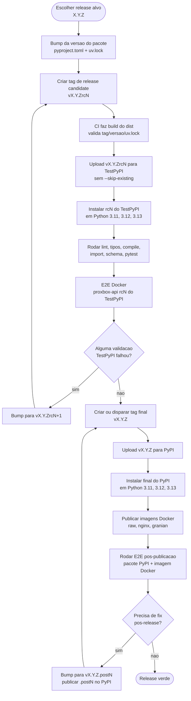
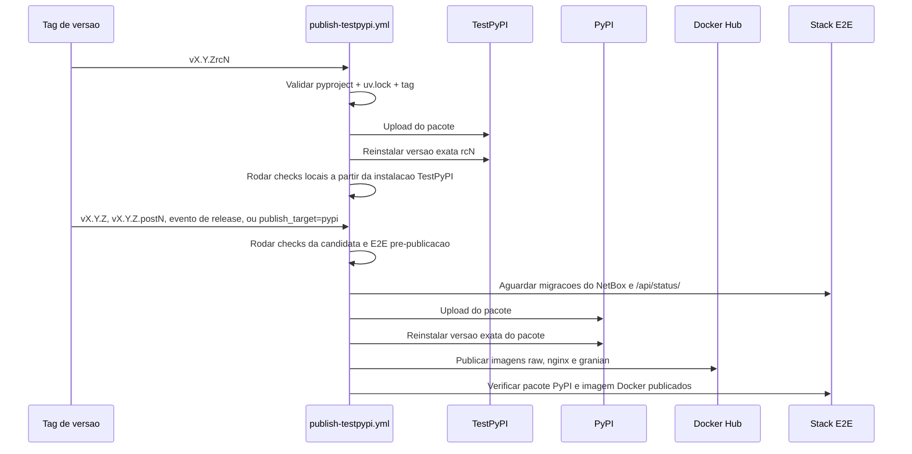

# Publicacao de Release

Esta pagina documenta o workflow de publicacao em etapas do pacote
`proxbox-api`. O workflow valida release candidates no TestPyPI primeiro, e
so promove a release final ao PyPI e publica as imagens Docker depois que a
instalacao a partir do PyPI funciona.

Para o mapa completo dos jobs de CI e da matriz E2E com NetBox, veja
[Workflows de CI e E2E](ci-e2e-workflows.md).

## Maquina de Estados da Release

## Lanes do Workflow

## Regras do Workflow

- `pyproject.toml`, `uv.lock` e a tag Git precisam descrever a mesma versao.
- Push de tags `rcN` publica no TestPyPI para validacao de release candidate.
- Push de tags nao-rc (`vX.Y.Z`, `vX.Y.Z.postN`), releases do GitHub, ou
  dispatch manual com `publish_target=pypi` publica no PyPI.
- Uploads de pacote intencionalmente nao usam `twine --skip-existing`; se uma
  versao foi consumida por qualquer indice, corrija para frente com o proximo
  `.postN` ou `rcN`.
- Publicacao no PyPI precisa passar pela validacao de reinstalacao do pacote
  antes das imagens Docker serem publicadas.
- Tags Docker usam a mesma versao do pacote PyPI que passou na validacao.
- Jobs E2E pre-publicacao e pos-publicacao aguardam ate 20 minutos para o
  NetBox concluir migracoes/indexacao e exigem `/api/status/` pronto antes de
  configurar tokens ou endpoints do backend.

## Checklist Operacional

1. Atualize `pyproject.toml` e regenere `uv.lock`.
2. Crie a tag `vX.Y.Zrc1` para validacao de release candidate no TestPyPI. Se
   a validacao falhar depois do upload, continue com `rc2`, `rc3`, e assim
   por diante.
3. Publique a final `vX.Y.Z` no PyPI apenas depois de uma lane rc verde.
4. Use `vX.Y.Z.postN` para qualquer fix de codigo ou empacotamento descoberto
   depois da publicacao final no PyPI.
