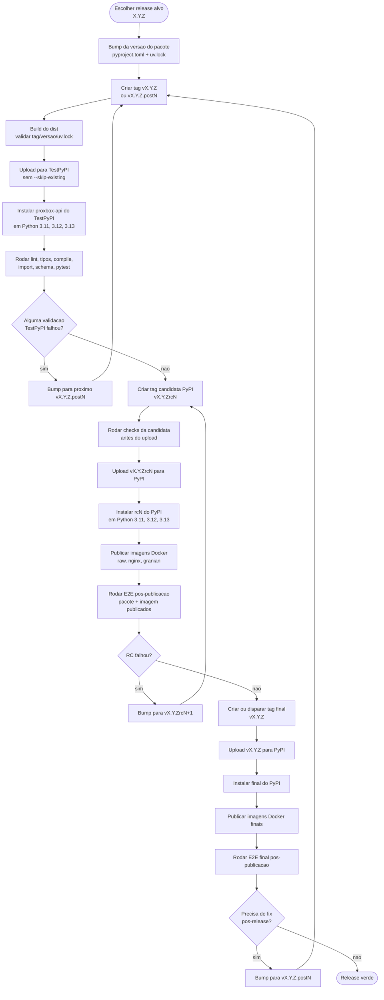
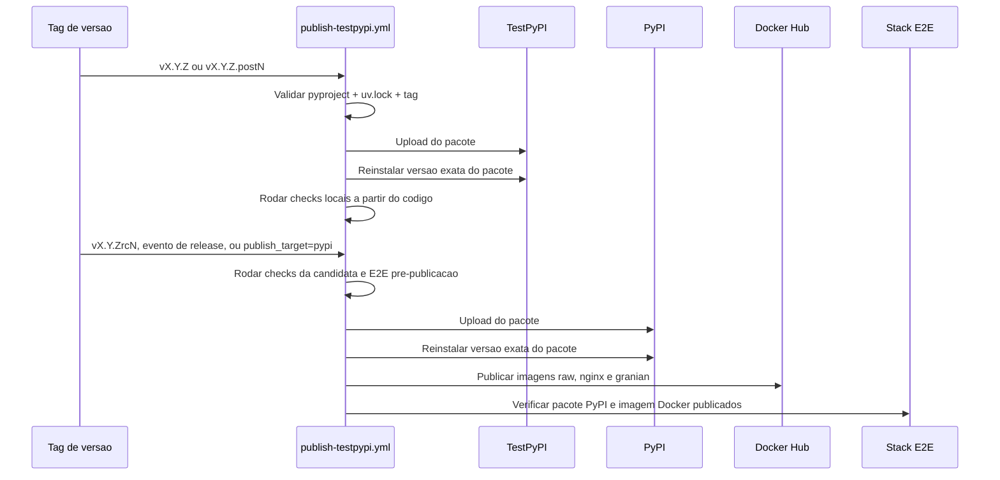

# Publicacao de Release

Esta pagina documenta o workflow de publicacao em etapas do pacote
`proxbox-api`. O workflow valida pacotes no TestPyPI primeiro, promove release
candidates no PyPI, e so publica a release final no PyPI e as imagens Docker
depois que o pacote esta instalavel.

## Maquina de Estados da Release

## Lanes do Workflow

## Regras do Workflow

- `pyproject.toml`, `uv.lock` e a tag Git precisam descrever a mesma versao.
- Push de tags normais e `.postN` publica no TestPyPI.
- Push de tags `rcN`, releases do GitHub, ou dispatch manual com
  `publish_target=pypi` publica no PyPI.
- Uploads de pacote intencionalmente nao usam `twine --skip-existing`; se uma
  versao foi consumida por qualquer indice, corrija para frente com o proximo
  `.postN` ou `rcN`.
- Publicacao no PyPI precisa passar pela validacao de reinstalacao do pacote
  antes das imagens Docker serem publicadas.
- Tags Docker usam a mesma versao do pacote PyPI que passou na validacao.

## Checklist Operacional

1. Atualize `pyproject.toml` e regenere `uv.lock`.
2. Crie a tag `vX.Y.Z` e deixe o workflow publicar no TestPyPI.
3. Se a validacao do TestPyPI falhar depois do upload, atualize para
   `vX.Y.Z.post1`, depois `post2`, ate ficar verde.
4. Crie a tag `vX.Y.Zrc1` para validacao de release candidate no PyPI. Se
   falhar depois do upload, continue com `rc2`, `rc3`, e assim por diante.
5. Publique a final `vX.Y.Z` no PyPI apenas depois de uma lane RC verde.
6. Use `vX.Y.Z.postN` para qualquer fix de codigo ou empacotamento descoberto
   depois da publicacao final.
