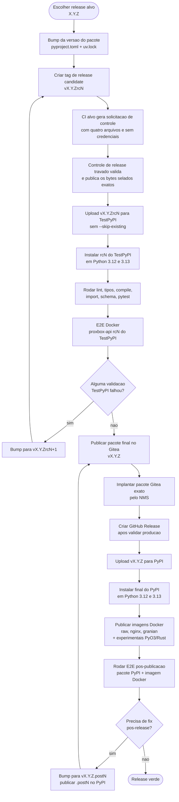
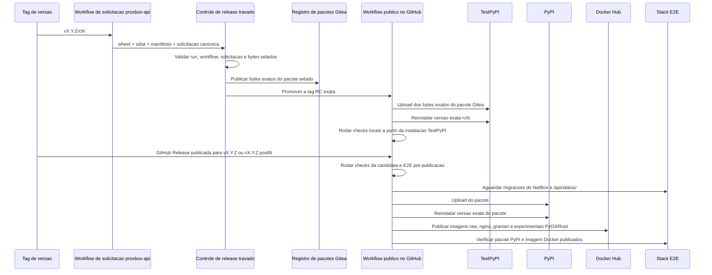

# Publicacao de Release

Esta pagina documenta o workflow de publicacao em etapas do pacote
`proxbox-api`. O workflow valida release candidates no TestPyPI primeiro, e
so promove a release final ao PyPI e publica as imagens Docker depois que a
instalacao a partir do PyPI funciona.

Para o mapa completo dos jobs de CI e da matriz E2E com NetBox, veja
[Workflows de CI e E2E](ci-e2e-workflows.md).

## Maquina de Estados da Release

```mermaid
flowchart TD
    Start([Escolher release alvo\nX.Y.Z])
    Bump[Bump da versao do pacote\npyproject.toml + uv.lock]
    RCTag[Criar tag de release candidate\nvX.Y.ZrcN]
    RCCI[CI alvo gera solicitacao de controle\ncom quatro arquivos e sem credenciais]
    Control[Controle de release travado valida\ne publica os bytes selados exatos]
    RCUpload[Upload vX.Y.ZrcN para TestPyPI\nsem --skip-existing]
    RCValidate[Instalar rcN do TestPyPI\nem Python 3.12 e 3.13]
    RCChecks[Rodar lint, tipos, compile,\nimport, schema, pytest]
    RCE2E[E2E Docker\nproxbox-api rcN do TestPyPI]
    RCFailed{Alguma validacao\nTestPyPI falhou?}
    NextRC[Bump para vX.Y.ZrcN+1]
    FinalPrivate[Publicar pacote final no Gitea\nvX.Y.Z]
    Deploy[Implantar pacote Gitea exato\npelo NMS]
    PublicRelease[Criar GitHub Release\napos validar producao]
    FinalUpload[Upload vX.Y.Z para PyPI]
    FinalValidate[Instalar final do PyPI\nem Python 3.12 e 3.13]
    Docker[Publicar imagens Docker\nraw, nginx, granian\n+ experimentais PyO3/Rust]
    FinalE2E[Rodar E2E pos-publicacao\npacote PyPI + imagem Docker]
    FinalFailed{Precisa de fix\npos-release?}
    Post[Bump para vX.Y.Z.postN\npublicar .postN no PyPI]
    Done([Release verde])

    Start --> Bump --> RCTag --> RCCI --> Control --> RCUpload --> RCValidate --> RCChecks --> RCE2E --> RCFailed
    RCFailed -- sim --> NextRC --> RCTag
    RCFailed -- nao --> FinalPrivate --> Deploy --> PublicRelease --> FinalUpload --> FinalValidate --> Docker --> FinalE2E --> FinalFailed
    FinalFailed -- sim --> Post --> FinalPrivate
    FinalFailed -- nao --> Done
```

## Lanes do Workflow

```mermaid
sequenceDiagram
    participant Tag as Tag de versao
    participant TargetWF as Workflow de solicitacao proxbox-api
    participant Control as Controle de release travado
    participant GP as Registro de pacotes Gitea
    participant WF as Workflow publico no GitHub
    participant TP as TestPyPI
    participant PY as PyPI
    participant DH as Docker Hub
    participant E2E as Stack E2E

    Tag->>TargetWF: vX.Y.ZrcN
    TargetWF->>Control: wheel + sdist + manifesto + solicitacao canonica
    Control->>Control: Validar run, workflow, solicitacao e bytes selados
    Control->>GP: Publicar bytes exatos do pacote selado
    Control->>WF: Promover a tag RC exata
    WF->>TP: Upload dos bytes exatos do pacote Gitea
    WF->>TP: Reinstalar versao exata rcN
    WF->>WF: Rodar checks locais a partir da instalacao TestPyPI

    Tag->>WF: GitHub Release publicada para vX.Y.Z ou vX.Y.Z.postN
    WF->>WF: Rodar checks da candidata e E2E pre-publicacao
    WF->>E2E: Aguardar migracoes do NetBox e /api/status/
    WF->>PY: Upload do pacote
    WF->>PY: Reinstalar versao exata do pacote
    WF->>DH: Publicar imagens raw, nginx, granian e experimentais PyO3/Rust
    WF->>E2E: Verificar pacote PyPI e imagem Docker publicados
```

## Regras do Workflow

- `pyproject.toml`, `uv.lock` e a tag Git precisam descrever a mesma versao.
- Push de tags `rcN` publica no TestPyPI para validacao de release candidate.
- Pacotes finais/post sao publicados primeiro no Gitea, implantados pelo NMS e
  chegam ao PyPI somente quando o operador publica a GitHub Release correspondente.
- A tag do Gitea deve ser o `develop` canonico atual. Status de commit
  controlados por escritores sao ignorados; o run Actions autenticado mais
  recente de `ci.yml` e seus jobs obrigatorios devem comprovar a primeira
  tentativa `push` bem-sucedida no SHA exato, ator confiavel, nome de job e
  classe de runner esperados. Os dois jobs de release usam
  `ci-release-proxbox-api` e, antes de executar codigo candidato, exigem que ID,
  nome e unico label do runner correspondam ao registro de aceitacao fixado por
  checksum e a uma atestacao recente e assinada pelo supervisor externo,
  vinculada a repositorio/run/job/fonte, labels registrados completos, imagem
  runtime e politicas de rede/runtime. ID/nome vazios e digests zerados de
  chave/imagem/politica desativam releases por tag ate a aceitacao ao vivo. Um
  job alvo descartavel valida o arquivo uv fixado, usa raizes novas por run
  para Python/cache e gera wheel e sdist no limite UID/Landlock sem token e sem
  acesso ao socket Docker. Depois da limpeza dos processos candidatos, o
  supervisor externo root-only assina o inventario exato. O job envia exatamente
  seis arquivos de dados: wheel, sdist, manifesto canonico,
  `release-request.json` canonico, `runner-completion-attestation.json` canonico
  e sua assinatura destacada. A solicitacao vincula o ID 37 do
  repositorio, fonte/tag/versao, identidade do primeiro run, digest do workflow
  alvo, digest do manifesto e inventario ordenado. O repositorio alvo nao possui
  credencial de pacote ou espelho GitHub e nao pode publicar nem enviar tags. O
  repositorio de controle administrado separadamente busca o run exato, valida
  workflow fixado, assinatura de conclusao e todos os bytes no builder isolado
  e sela a transferencia.
  Somente o publisher isolado pode ler credenciais e executar ferramentas de
  publicacao fixas por digest. Downloads publicos sem autoridade precisam
  coincidir com o manifesto antes do avanco do ledger duravel.
- O GitHub baixa esses artefatos exatos, instala wheel e sdist em Python 3.12 e
  3.13 e nunca recompila antes do upload para TestPyPI/PyPI. Os jobs de upload
  para TestPyPI/PyPI rodam separadamente em runners GitHub-hosted
  `ubuntu-latest` novos, instalam somente o grupo travado do publicador com
  `--no-install-project` e passam credenciais ao Twine apenas por `TWINE_*`.
- Um run de producao NMS `latest_package` bem-sucedido exporta um recibo
  schema-2 emitido pelo helper root somente apos comprovar a imagem construida
  do sdist exato, a versao instalada e a saude de producao. O workflow publica
  esses bytes, mas nao pode criar a propria evidencia de sucesso. A promocao
  publica valida SHA, hashes, manifesto, identidade observada da imagem,
  ambiente e identidade do run no Gitea.
- O dispatch manual do workflow e exclusivo do TestPyPI e exige uma versao RC.
- Uploads de pacote intencionalmente nao usam `twine --skip-existing`; se uma
  versao foi consumida por qualquer indice, corrija para frente com o proximo
  `.postN` ou `rcN`.
- Publicacao no PyPI precisa passar pela validacao de reinstalacao do pacote
  antes das imagens Docker serem publicadas.
- Tags Docker usam a mesma versao do pacote PyPI que passou na validacao. As
  imagens experimentais PyO3/Rust adicionam sufixos `-pyo3-rust` e aliases
  opt-in (`experimental`, `pyo3-rust` e sufixos para variantes HTTPS).
- O Dockerfile de release incluido no pacote fixa por digest completo o ultimo
  runtime raw revisado (`0.0.19.post5`) e a imagem uv 0.11.28. O build alvo
  exporta requisitos com hashes usando CPython 3.13, baixa apenas wheels
  `musllinux_1_2_x86_64` CPython 3.13/ABI3/Python puro compativeis com o runtime
  Alpine fixado e inclui o inventario canonico schema-2 exato em
  `docker/build-cache`. O controle travado rejeita independentemente divergencia
  de hash, imagens mutaveis, instrucoes Docker com rede, diretivas do parser,
  `ADD` ou ausencia de `uv sync --frozen --offline` antes de selar. Altere os
  digests somente em uma atualizacao de release revisada; o recibo de producao
  vincula o ID da imagem ativa resultante.
- Jobs E2E pre-publicacao e pos-publicacao aguardam ate 20 minutos para o
  NetBox concluir migracoes/indexacao e exigem `/api/status/` pronto antes de
  configurar tokens ou endpoints do backend.

## Checklist Operacional

1. Nao faca merge do corte do repositorio alvo ate que o repositorio de
   controle privado tenha ID positivo fixado na politica e seus workflows
   protegidos, limites de host, sockets e runners por repositorio passem na
   verificacao de prontidao. Ate la, mantenha o existing publisher ativo.
2. Atualize `pyproject.toml` e regenere `uv.lock`.
3. Crie a tag `vX.Y.Zrc1`, aguarde `publish-gitea.yml` gerar o artefato
   `release-control-request` e calcule o SHA-256 do `release-request.json`
   canonico.
4. Dispare `validate.yml` com exatamente o repository name, target run ID e
   request SHA-256. Depois do sucesso, dispare o `publish.yml` irreversivel e
   separado com os mesmos tres valores. O controle publica o
   pacote Gitea e promove somente a tag RC exata para validacao no TestPyPI. Se
   a validacao falhar depois do upload, continue com `rc2`, `rc3`, e assim
   por diante.
5. Publique e verifique `vX.Y.Z` pela mesma transferencia de controle, implante
   esse pacote pelo NMS e
   valide a saude de producao.
6. Dispare `promote-final-tag.yml` no `main` canonico do Gitea; ele valida o
   pacote privado exato e a atestacao NMS antes de enviar a tag ao repositorio
   GitHub autorizado. Depois crie a GitHub Release com `--verify-tag`; o evento
   valida a atestacao protegida do Gitea,
   publica os mesmos bytes no PyPI e depois as imagens no Docker Hub.
7. Use `vX.Y.Z.postN` para qualquer fix de codigo ou empacotamento descoberto
   depois da publicacao final no PyPI.
