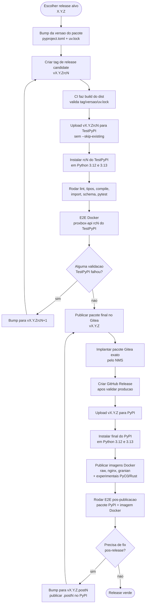
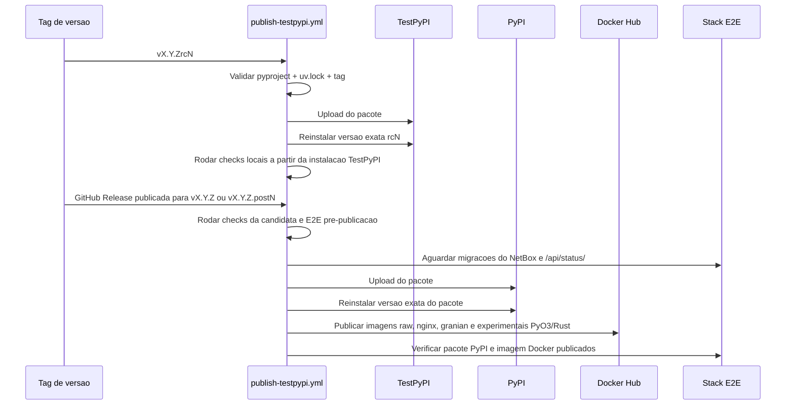

# Publicacao de Release

Esta pagina documenta o workflow de publicacao em etapas do pacote
`proxbox-api`. O workflow valida release candidates no TestPyPI primeiro, e
so promove a release final ao PyPI e publica as imagens Docker depois que a
instalacao a partir do PyPI funciona.

Para o mapa completo dos jobs de CI e da matriz E2E com NetBox, veja
[Workflows de CI e E2E](ci-e2e-workflows.md).

## Maquina de Estados da Release

```mermaid
flowchart TD
    Start([Escolher release alvo\nX.Y.Z])
    Bump[Bump da versao do pacote\npyproject.toml + uv.lock]
    RCTag[Criar tag de release candidate\nvX.Y.ZrcN]
    RCCI[CI faz build do dist\nvalida tag/versao/uv.lock]
    RCUpload[Upload vX.Y.ZrcN para TestPyPI\nsem --skip-existing]
    RCValidate[Instalar rcN do TestPyPI\nem Python 3.12 e 3.13]
    RCChecks[Rodar lint, tipos, compile,\nimport, schema, pytest]
    RCE2E[E2E Docker\nproxbox-api rcN do TestPyPI]
    RCFailed{Alguma validacao\nTestPyPI falhou?}
    NextRC[Bump para vX.Y.ZrcN+1]
    FinalPrivate[Publicar pacote final no Gitea\nvX.Y.Z]
    Deploy[Implantar pacote Gitea exato\npelo NMS]
    PublicRelease[Criar GitHub Release\napos validar producao]
    FinalUpload[Upload vX.Y.Z para PyPI]
    FinalValidate[Instalar final do PyPI\nem Python 3.12 e 3.13]
    Docker[Publicar imagens Docker\nraw, nginx, granian\n+ experimentais PyO3/Rust]
    FinalE2E[Rodar E2E pos-publicacao\npacote PyPI + imagem Docker]
    FinalFailed{Precisa de fix\npos-release?}
    Post[Bump para vX.Y.Z.postN\npublicar .postN no PyPI]
    Done([Release verde])

    Start --> Bump --> RCTag --> RCCI --> RCUpload --> RCValidate --> RCChecks --> RCE2E --> RCFailed
    RCFailed -- sim --> NextRC --> RCTag
    RCFailed -- nao --> FinalPrivate --> Deploy --> PublicRelease --> FinalUpload --> FinalValidate --> Docker --> FinalE2E --> FinalFailed
    FinalFailed -- sim --> Post --> FinalPrivate
    FinalFailed -- nao --> Done
```

## Lanes do Workflow

```mermaid
sequenceDiagram
    participant Tag as Tag de versao
    participant WF as publish-testpypi.yml
    participant TP as TestPyPI
    participant PY as PyPI
    participant DH as Docker Hub
    participant E2E as Stack E2E

    Tag->>WF: vX.Y.ZrcN
    WF->>WF: Validar pyproject + uv.lock + tag
    WF->>TP: Upload do pacote
    WF->>TP: Reinstalar versao exata rcN
    WF->>WF: Rodar checks locais a partir da instalacao TestPyPI

    Tag->>WF: GitHub Release publicada para vX.Y.Z ou vX.Y.Z.postN
    WF->>WF: Rodar checks da candidata e E2E pre-publicacao
    WF->>E2E: Aguardar migracoes do NetBox e /api/status/
    WF->>PY: Upload do pacote
    WF->>PY: Reinstalar versao exata do pacote
    WF->>DH: Publicar imagens raw, nginx, granian e experimentais PyO3/Rust
    WF->>E2E: Verificar pacote PyPI e imagem Docker publicados
```

## Regras do Workflow

- `pyproject.toml`, `uv.lock` e a tag Git precisam descrever a mesma versao.
- Push de tags `rcN` publica no TestPyPI para validacao de release candidate.
- Pacotes finais/post sao publicados primeiro no Gitea, implantados pelo NMS e
  chegam ao PyPI somente quando o operador publica a GitHub Release correspondente.
- A tag do Gitea deve ser o `develop` canonico atual. Cada status CI obrigatorio
  mais recente precisa resolver, via registros autenticados da API Gitea, para
  um run `push` bem-sucedido de `ci.yml` no SHA exato, ator confiavel, nome de
  job e classe de runner nao confiavel esperados. Um job descartavel sem
  credenciais baixa e valida diretamente o arquivo uv fixado, limpa o estado
  `UV_*` herdado, desativa configuracao descoberta e usa raizes novas por run
  para cache e Python gerenciado antes de gerar wheel e sdist. Outro job
  descartavel sem credenciais busca a fonte validada exata, instala as
  ferramentas travadas sem instalar o projeto, verifica o candidato e sela
  wheel, sdist, manifesto, helper, metadados do projeto e lock. Um job publicador
  novo verifica esse selo antes de expor o `PKG_TOKEN` do repositorio somente na
  etapa de escrita do registro. O Twine le `TWINE_USERNAME` /
  `TWINE_PASSWORD`; a vinculacao ao repositorio usa netrc com modo 0600; e o
  helper de manifesto le o token do ambiente, portanto nenhuma credencial entra
  em argv. Um job final novo, sem credenciais, baixa anonimamente e compara os
  bytes do registro. Todos os estagios privados usam
  `ci-untrusted-python312`; o token do job do Gitea Actions nunca autentica o
  registro de pacotes.
- O GitHub baixa esses artefatos exatos, instala wheel e sdist em Python 3.12 e
  3.13 e nunca recompila antes do upload para TestPyPI/PyPI. Os jobs de upload
  para TestPyPI/PyPI rodam separadamente em runners GitHub-hosted
  `ubuntu-latest` novos, instalam somente o grupo travado do publicador com
  `--no-install-project` e passam credenciais ao Twine apenas por `TWINE_*`.
- Um run de producao NMS `latest_package` bem-sucedido exporta um recibo
  schema-2 emitido pelo helper root somente apos comprovar a imagem construida
  do sdist exato, a versao instalada e a saude de producao. O workflow publica
  esses bytes, mas nao pode criar a propria evidencia de sucesso. A promocao
  publica valida SHA, hashes, manifesto, identidade observada da imagem,
  ambiente e identidade do run no Gitea.
- O dispatch manual do workflow e exclusivo do TestPyPI e exige uma versao RC.
- Uploads de pacote intencionalmente nao usam `twine --skip-existing`; se uma
  versao foi consumida por qualquer indice, corrija para frente com o proximo
  `.postN` ou `rcN`.
- Publicacao no PyPI precisa passar pela validacao de reinstalacao do pacote
  antes das imagens Docker serem publicadas.
- Tags Docker usam a mesma versao do pacote PyPI que passou na validacao. As
  imagens experimentais PyO3/Rust adicionam sufixos `-pyo3-rust` e aliases
  opt-in (`experimental`, `pyo3-rust` e sufixos para variantes HTTPS).
- Jobs E2E pre-publicacao e pos-publicacao aguardam ate 20 minutos para o
  NetBox concluir migracoes/indexacao e exigem `/api/status/` pronto antes de
  configurar tokens ou endpoints do backend.

## Checklist Operacional

1. Atualize `pyproject.toml` e regenere `uv.lock`.
2. Crie a tag `vX.Y.Zrc1` para validacao de release candidate no TestPyPI. Se
   a validacao falhar depois do upload, continue com `rc2`, `rc3`, e assim
   por diante.
3. Publique e verifique `vX.Y.Z` no Gitea, implante esse pacote pelo NMS e
   valide a saude de producao.
4. Dispare `promote-final-tag.yml` no `main` canonico do Gitea; ele valida o
   pacote privado exato e a atestacao NMS antes de enviar a tag ao repositorio
   GitHub autorizado. Depois crie a GitHub Release com `--verify-tag`; o evento
   valida a atestacao protegida do Gitea,
   publica os mesmos bytes no PyPI e depois as imagens no Docker Hub.
5. Use `vX.Y.Z.postN` para qualquer fix de codigo ou empacotamento descoberto
   depois da publicacao final no PyPI.
