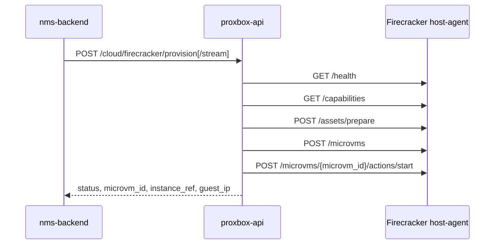

# Provisionamento Firecracker via Host-Agent

`proxbox-api` define o contrato HTTP entre o NMS Cloud e um host-agent Firecracker. O inventario do NetBox continua no `netbox-proxbox`: pools, hosts, imagens e registros `FirecrackerMicroVM` sao resolvidos antes desta API ser chamada.

## Fluxo

O endpoint sem stream retorna JSON final. O endpoint com stream envia Server-Sent Events e termina com `event: complete`.

## Endpoints

| Metodo | Caminho | Finalidade |
|---|---|---|
| `POST` | `/cloud/firecracker/provision` | Provisiona uma micro-VM em um host-agent e retorna JSON final |
| `POST` | `/cloud/firecracker/provision/stream` | Provisiona uma micro-VM e envia progresso por SSE |

Ambos usam o middleware normal `X-Proxbox-API-Key`. `X-Proxbox-Actor` e opcional e entra nos metadados enviados ao host-agent.

## Eventos SSE

| Evento | Payload |
|---|---|
| `provision_step` | `{step, label, status}` para `host_agent_health`, `capabilities`, `prepare_assets`, `create_microvm` e `start_microvm` |
| `terminal_line` | Linha de progresso legivel, hoje usada para caminhos de assets |
| `complete` | `FirecrackerProvisionResponse` final em sucesso ou `{ok:false,error}` em falha |

## Resposta

Respostas de sucesso incluem `ok`, `microvm_id`, `instance_ref`, `host_id`,
`host_pool_id`, `image_id`, `status`, `guest_ip` e `detail`. Quando
`netbox_microvm_id` e informado, `instance_ref` usa o formato
`firecracker:<id>` e e o identificador usado pelo NMS Cloud.
