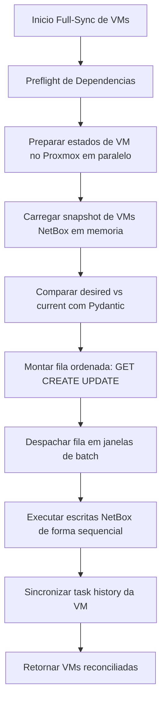
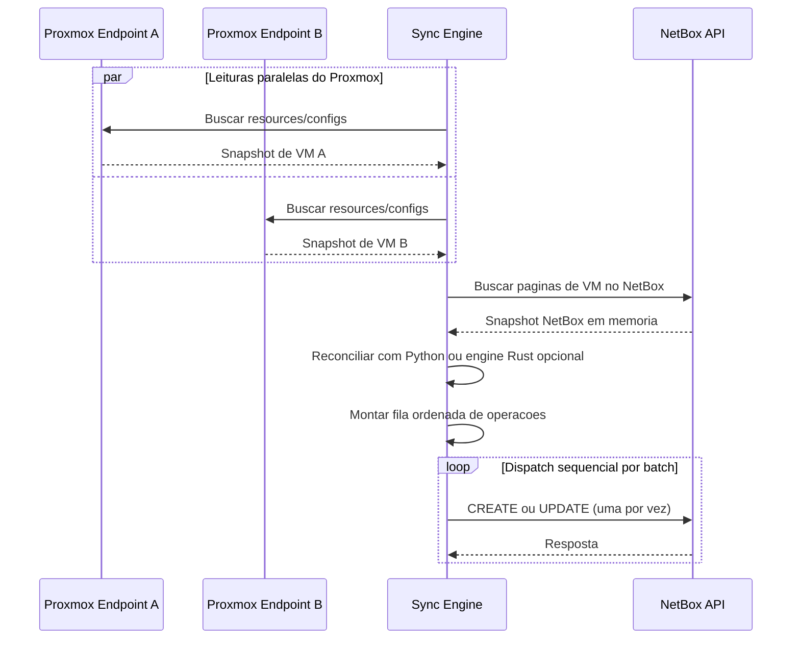

# Arquitetura de Reconciliacao de VMs

Esta pagina documenta a arquitetura de reconciliacao do full-sync de VMs usada pelo `proxbox-api` quando o sync de VM roda no modo full-update (`sync_vm_network=false`).

O objetivo e maximizar throughput de leitura no Proxmox, mantendo a pressao de escrita no NetBox baixa e deterministica.

## Motivacao

O modelo anterior misturava fetch/reconcile/write por VM e podia intercalar muitas escritas no NetBox durante a descoberta.

O novo modelo separa o fluxo em fases explicitas:

1. Ler todos os dados necessarios do Proxmox em memoria (paralelo).
2. Ler todo o estado necessario do NetBox em memoria (snapshot unico).
3. Comparar desired vs current com payloads normalizados por Pydantic.
4. Montar fila deterministica de operacoes (`GET`, `CREATE`, `UPDATE`).
5. Despachar operacoes de forma sequencial em janelas de batch controladas por configuracao global.

## Fases de Execucao

### Fase 1: Preflight de Dependencias

Antes da reconciliacao de VMs, o sync garante objetos pai no NetBox:

- Manufacturer
- Device type
- Role de node Proxmox
- Cluster type
- Cluster
- Site
- Device do node
- Role de VM (QEMU/LXC)

### Fase 2: Snapshot de Leitura Proxmox (Paralelo)

Para cada VM candidata, o sync prepara um estado em memoria contendo:

- Identidade de cluster + VM
- Resource da VM no Proxmox
- Config da VM no Proxmox
- Payload desired normalizado para NetBox
- Chaves de lookup no NetBox (cluster + `cf_proxmox_vm_id`)

A preparacao roda com concorrencia limitada usando `asyncio.gather` + semaforo.

### Fase 3: Snapshot de Leitura NetBox (Memoria)

O sync le todas as VMs do NetBox em paginas (`limit/offset`) e monta um indice em memoria com chave:

- `(cluster_id, proxmox_vm_id, proxmox_vm_type)`

O segmento de tipo evita colisao entre uma VM QEMU 100 e um CT LXC 100 no mesmo cluster.
Registros legados sem `custom_fields.proxmox_vm_type` so sao reaproveitados quando a identidade
`(cluster_id, proxmox_vm_id)` e inequivoca.

### Fase 4: Reconciliacao da Fila

O engine padrao de reconciliacao e Python. Para cada VM preparada:

1. Validar payload desired com `NetBoxVirtualMachineCreateBody`.
2. Normalizar registro current do NetBox com o mesmo schema.
3. Calcular delta de campos.

Classificacao:

- `GET`: objeto existe e nao ha delta.
- `CREATE`: objeto nao encontrado no indice.
- `UPDATE`: objeto existe e ha delta.

Existe uma implementacao Rust opcional atras de uma fronteira JSON pura:

```text
Input  : prepared_vms + netbox_snapshot + flags  (JSON bytes)
Output : operation queue (CREATE | GET | UPDATE + patch_payload)  (JSON bytes)
```

A funcao Rust nao executa HTTP, async, banco de dados, retry ou dispatch. Essas responsabilidades
continuam no Python. Quando o pacote nativo esta instalado, a ponte Python serializa a entrada com
Pydantic v2, chama a extensao PyO3 com o GIL liberado, decodifica o resultado e adapta as operacoes
de volta para as dataclasses usadas pelo dispatch.

Selecao de engine usa runtime settings. A configuracao normal para operadores e
`ProxboxPluginSettings.reconciliation_engine` no plugin NetBox; `PROXBOX_RECONCILIATION_ENGINE`
continua sendo o override por variavel de ambiente.

| Variavel | Valor | Comportamento |
|----------|-------|----------------|
| `PROXBOX_RECONCILIATION_ENGINE` | `python` | Padrao. Usa apenas a saida Python. |
| `PROXBOX_RECONCILIATION_ENGINE` | `compare` | Roda Python e Rust quando Rust esta instalado, loga divergencias e retorna Python. |
| `PROXBOX_RECONCILIATION_ENGINE` | `rust` | Retorna a saida Rust adaptada. |
| `PROXBOX_RECONCILIATION_COMPARE_STRICT` | `true` | Falha em divergencia no compare mode. Uso previsto para CI. |

Se o pacote Rust nao estiver instalado, o modo `python` funciona normalmente e o modo `compare`
retorna a saida Python. O modo `rust` requer o pacote nativo e falha claramente quando ele nao esta
disponivel.

Divergencias em compare mode incrementam `proxbox_reconcile_mismatch_total`, exposto em:

- `/cache/metrics`
- `/cache/metrics/prometheus`

### Fase 5: Dispatch Sequencial para NetBox em Janelas de Batch

As operacoes sao executadas em ordem deterministica.

- Tamanho da janela de batch vem de `PROXBOX_NETBOX_WRITE_CONCURRENCY`.
- Dentro da janela, escritas continuam uma-a-uma (sequencial).
- `GET` nao escreve no NetBox.
- `CREATE` executa POST no NetBox.
- `UPDATE` executa PATCH por ID no NetBox.

## Diagramas Mermaid

### Fluxo de Reconciliacao de Ponta a Ponta



### Modelo de Leitura Paralela + Escrita Sequencial



## Semantica das Operacoes

`GET`

- Nao requer escrita no NetBox.
- Reaproveita registro do snapshot em memoria.

`CREATE`

- Nao existe correspondencia por `(cluster_id, proxmox_vm_id, proxmox_vm_type)`.
- Executa POST no NetBox durante o dispatch.

`UPDATE`

- Objeto existe, mas payload reconciliado difere.
- Executa PATCH apenas com campos alterados.

## Configuracao

- `PROXBOX_VM_SYNC_MAX_CONCURRENCY`: controla concorrencia de preparacao/fetch de VMs no Proxmox.
- `PROXBOX_NETBOX_WRITE_CONCURRENCY`: define tamanho da janela de batch no dispatch.
- `reconciliation_engine` / `PROXBOX_RECONCILIATION_ENGINE`: seleciona `python`, `compare` ou `rust`.
- `PROXBOX_RECONCILIATION_COMPARE_STRICT`: falha em drift no compare mode quando `true`.

Observacao: tamanho de batch nao implica escrita paralela; as escritas continuam sequenciais para proteger o NetBox em ambiente de instancia unica.

## Politica de Rollout do Rust

Rust nao e o engine padrao. O rollout e conservador:

1. Construir e testar wheels de `proxbox-reconcile-rs` no CI.
2. Publicar `proxbox-reconcile-rs` apenas pelo workflow de release do repositorio.
3. Manter `reconciliation_engine=python` como padrao no `proxbox-api`.
4. Rodar `reconciliation_engine=compare` em staging por pelo menos duas semanas.
5. Monitorar `proxbox_reconcile_mismatch_total` e logs de mismatch.
6. Recomendar `PROXBOX_RECONCILIATION_ENGINE=rust` apenas depois de zero divergencias em syncs reais diversos.
7. Considerar trocar o padrao apenas em uma release minor futura e somente se benchmarks de wall time do sync completo provarem ganho real.

Rollback e imediato: volte `reconciliation_engine` para `python` no NetBox ou remova `PROXBOX_RECONCILIATION_ENGINE` se um override de ambiente foi usado.

A evidencia atual de benchmark nao justifica tornar Rust o padrao. O caminho Rust completo ficou
mais lento que Python no benchmark sintetico, e a medicao real mostrou que reconciliacao nao era o
custo dominante do sync.
