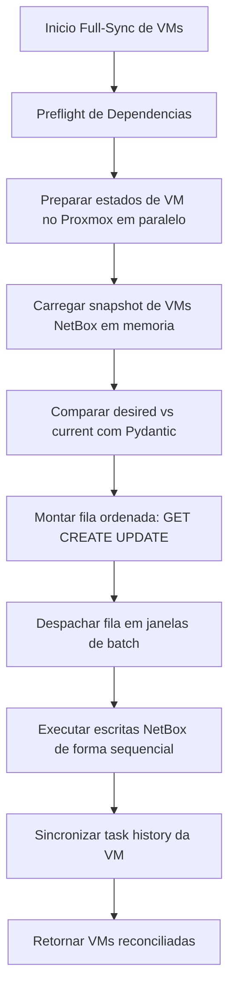
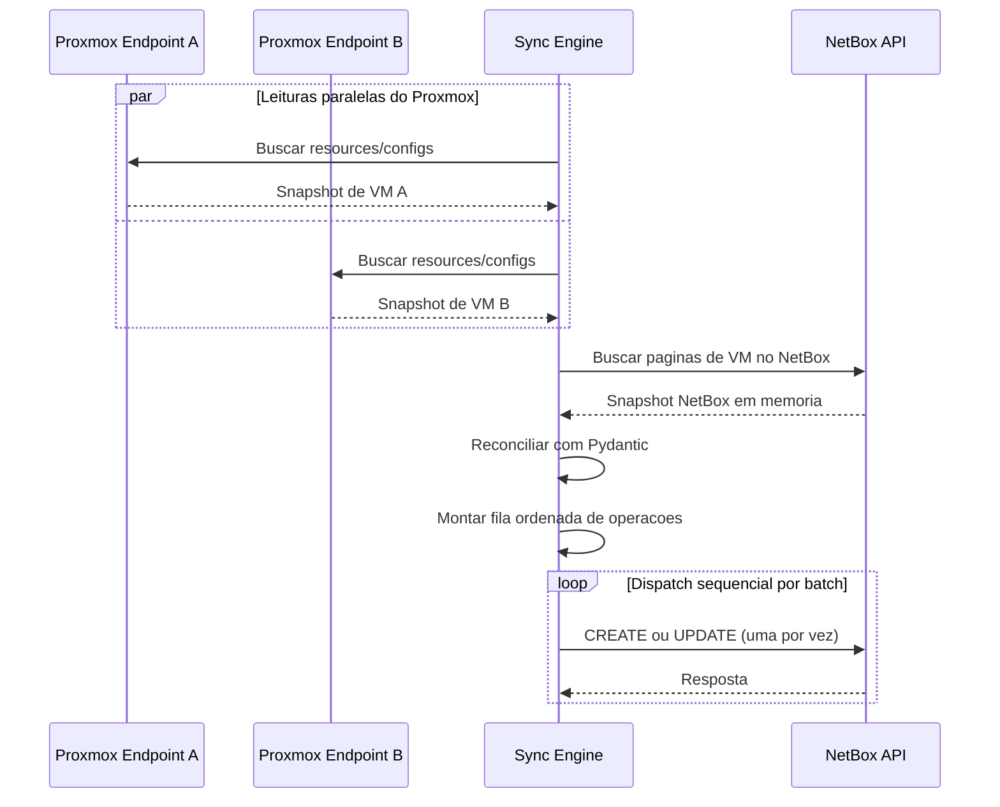

# Arquitetura de Reconciliacao de VMs

Esta pagina documenta a arquitetura de reconciliacao do full-sync de VMs usada pelo `proxbox-api` quando o sync de VM roda no modo full-update (`sync_vm_network=false`).

O objetivo e maximizar throughput de leitura no Proxmox, mantendo a pressao de escrita no NetBox baixa e deterministica.

## Motivacao

O modelo anterior misturava fetch/reconcile/write por VM e podia intercalar muitas escritas no NetBox durante a descoberta.

O novo modelo separa o fluxo em fases explicitas:

1. Ler todos os dados necessarios do Proxmox em memoria (paralelo).
2. Ler todo o estado necessario do NetBox em memoria (snapshot unico).
3. Comparar desired vs current com payloads normalizados por Pydantic.
4. Montar fila deterministica de operacoes (`GET`, `CREATE`, `UPDATE`).
5. Despachar operacoes de forma sequencial em janelas de batch controladas por configuracao global.

## Fases de Execucao

### Fase 1: Preflight de Dependencias

Antes da reconciliacao de VMs, o sync garante objetos pai no NetBox:

- Manufacturer
- Device type
- Role de node Proxmox
- Cluster type
- Cluster
- Site
- Device do node
- Role de VM (QEMU/LXC)

### Fase 2: Snapshot de Leitura Proxmox (Paralelo)

Para cada VM candidata, o sync prepara um estado em memoria contendo:

- Identidade de cluster + VM
- Resource da VM no Proxmox
- Config da VM no Proxmox
- Payload desired normalizado para NetBox
- Chaves de lookup no NetBox (cluster + `cf_proxmox_vm_id`)

A preparacao roda com concorrencia limitada usando `asyncio.gather` + semaforo.

### Fase 3: Snapshot de Leitura NetBox (Memoria)

O sync le todas as VMs do NetBox em paginas (`limit/offset`) e monta um indice em memoria com chave:

- `(cluster_id, proxmox_vm_id)`

### Fase 4: Reconciliacao com Pydantic

Para cada VM preparada:

1. Validar payload desired com `NetBoxVirtualMachineCreateBody`.
2. Normalizar registro current do NetBox com o mesmo schema.
3. Calcular delta de campos.

Classificacao:

- `GET`: objeto existe e nao ha delta.
- `CREATE`: objeto nao encontrado no indice.
- `UPDATE`: objeto existe e ha delta.

### Fase 5: Dispatch Sequencial para NetBox em Janelas de Batch

As operacoes sao executadas em ordem deterministica.

- Tamanho da janela de batch vem de `PROXBOX_NETBOX_WRITE_CONCURRENCY`.
- Dentro da janela, escritas continuam uma-a-uma (sequencial).
- `GET` nao escreve no NetBox.
- `CREATE` executa POST no NetBox.
- `UPDATE` executa PATCH por ID no NetBox.

## Diagramas Mermaid

### Fluxo de Reconciliacao de Ponta a Ponta

### Modelo de Leitura Paralela + Escrita Sequencial

## Semantica das Operacoes

`GET`

- Nao requer escrita no NetBox.
- Reaproveita registro do snapshot em memoria.

`CREATE`

- Nao existe correspondencia por `(cluster_id, proxmox_vm_id)`.
- Executa POST no NetBox durante o dispatch.

`UPDATE`

- Objeto existe, mas payload reconciliado difere.
- Executa PATCH apenas com campos alterados.

## Configuracao

- `PROXBOX_VM_SYNC_MAX_CONCURRENCY`: controla concorrencia de preparacao/fetch de VMs no Proxmox.
- `PROXBOX_NETBOX_WRITE_CONCURRENCY`: define tamanho da janela de batch no dispatch.

Observacao: tamanho de batch nao implica escrita paralela; as escritas continuam sequenciais para proteger o NetBox em ambiente de instancia unica.
