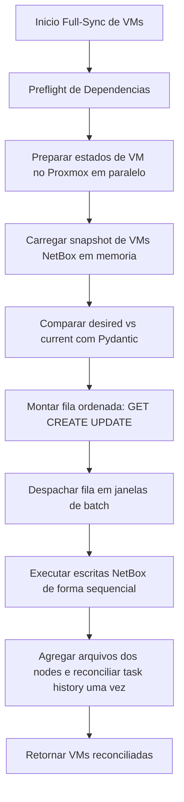
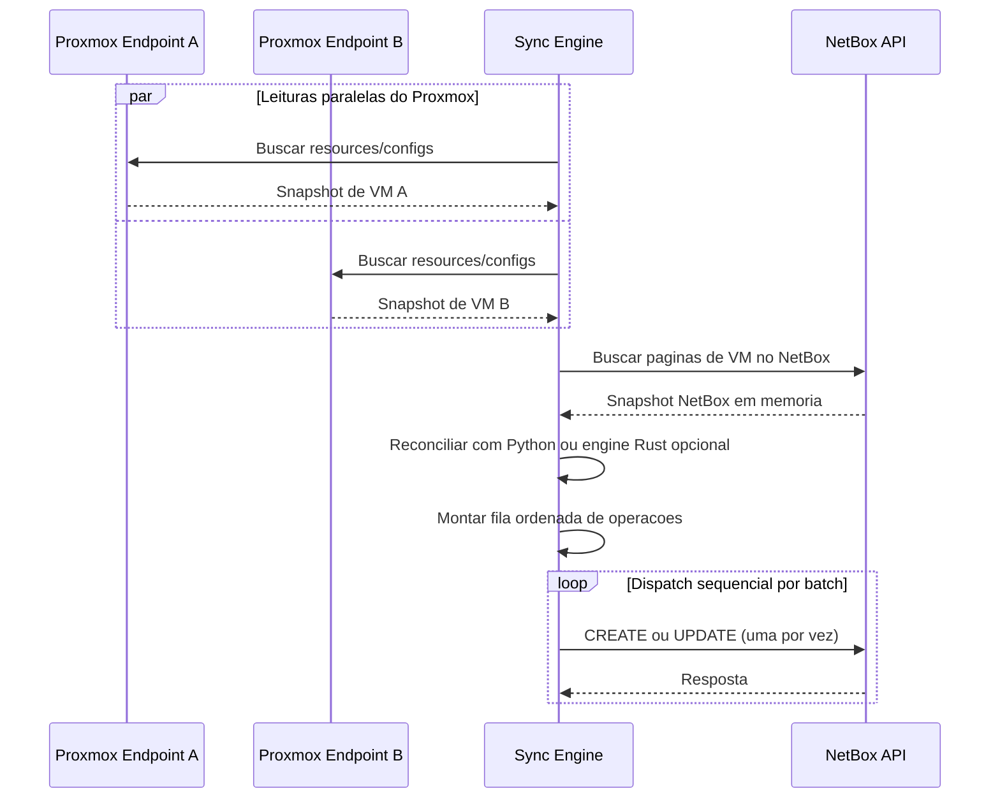

# Arquitetura de Reconciliacao de VMs

Esta pagina documenta a arquitetura de reconciliacao do full-sync de VMs usada pelo `proxbox-api` quando o sync de VM roda no modo full-update (`sync_vm_network=false`).

O objetivo e maximizar throughput de leitura no Proxmox, mantendo a pressao de escrita no NetBox baixa e deterministica.

## Motivacao

O modelo anterior misturava fetch/reconcile/write por VM e podia intercalar muitas escritas no NetBox durante a descoberta.

O novo modelo separa o fluxo em fases explicitas:

1. Ler todos os dados necessarios do Proxmox em memoria (paralelo).
2. Ler todo o estado necessario do NetBox em memoria (snapshot unico).
3. Comparar desired vs current com payloads normalizados por Pydantic.
4. Montar fila deterministica de operacoes (`GET`, `CREATE`, `UPDATE`).
5. Despachar operacoes de forma sequencial em janelas de batch controladas por configuracao global.

## Fases de Execucao

### Fase 1: Preflight de Dependencias

Antes da reconciliacao de VMs, o sync garante objetos pai no NetBox:

- Manufacturer
- Device type
- Role de node Proxmox
- Cluster type
- Cluster
- Site
- Device do node
- Role de VM (QEMU/LXC)

### Fase 2: Snapshot de Leitura Proxmox (Paralelo)

Para cada VM candidata, o sync prepara um estado em memoria contendo:

- Identidade de cluster + VM
- Resource da VM no Proxmox
- Config da VM no Proxmox
- Payload desired normalizado para NetBox
- Um lookup impossivel de criacao (`id=0`), usado somente depois que a
  resolucao do sidecar tipado prova que nenhuma VM existente possui a identidade

A preparacao roda com concorrencia limitada usando `asyncio.gather` + semaforo.

### Fase 3: Snapshot de Leitura NetBox (Memoria)

O sync le todas as VMs do NetBox em paginas (`limit/offset`) e monta um indice em memoria com chave:

- `(cluster_id, proxmox_vm_id, proxmox_vm_type)`

A travessia REST compartilhada segue a URL `next` fornecida pelo NetBox,
inclusive filtros com valores repetidos, e nao considera uma pagina curta
limitada pelo servidor como fim. Objetos/links de paginacao malformados, pagina
vazia com `next` e qualquer sobreposicao de registros entre paginas falham de
forma fechada. Cada link `next` deve manter o mesmo caminho normalizado do
recurso e todos os filtros que nao pertencem a paginacao, alem de avancar por
um unico offset continuo e nao negativo. O `count` nao negativo do servidor
deve permanecer estavel e corresponder ao agregado final. Leituras exaustivas
tem limites de seguranca de 10.000 paginas e 1.000.000 de registros;
`max_offset` e aplicado antes da proxima requisicao. Qualquer lacuna, mudanca de
escopo, cursor malformado, divergencia de contagem ou limite ultrapassado retorna
HTTP 502 sem devolver nem armazenar uma colecao parcial em cache.

Nos seletores de VM, backup, snapshot e disco virtual, omitir
`netbox_vm_ids` significa todas as VMs. Um seletor presente vazio ou malformado
retorna HTTP 422 e nunca amplia o escopo. IDs validos sao deduplicados e
consultados em grupos de no maximo 100 como parametros `id` repetidos
(`?id=1&id=2`); falhas de consulta encerram de forma fechada.

O segmento de tipo evita colisao entre uma VM QEMU 100 e um CT LXC 100 no mesmo cluster.

#### Guarda entre clusters e ids de endpoint obsoletos

O `proxmox_endpoint_id` gravado no sidecar de estado de uma VM identifica a
sessao de endpoint que sincronizou a VM pela ultima vez. Ele vem de um espaco de
ids independente por implantacao: ids do banco do proxbox-api quando a origem do
endpoint e o banco (padrao), ou chaves primarias de endpoint do plugin NetBox
quando a origem e o NetBox. Gerenciar esse espaco de ids e responsabilidade do
operador e do plugin: recriar o banco do proxbox-api ou registrar novamente os
endpoints reatribui ids, e os ids gravados podem ficar obsoletos ou colidir com
os de endpoints nao relacionados. Por isso o proxbox-api nunca considera uma
correspondencia por endpoint suficiente por si so.

**Guarda de cluster.** Toda busca por `(id do endpoint, vmid)` deve confirmar que
a VM NetBox encontrada pertence ao cluster em sincronizacao antes de ser usada:

- selecao da fila de reconciliacao (`select_existing_vm_record`), tambem usada
  pela hidratacao via sidecar e pelo pre-passo de colisao de nomes;
- sincronizacao de interfaces e IPs (`_resolve_vm_from_index_or_unique_vmid`),
  para que NICs e IPs nunca sejam gravados na VM de outro cluster quando ids
  colidem;
- sincronizacao de snapshots (`_snapshot_sessions_for_vm`), que so consulta as
  sessoes Proxmox do cluster da VM quando esse cluster e conhecido;
- operacoes retornadas pelo engine Rust opcional: uma que aponta para a VM de
  outro cluster e reconstruida pelo seletor Python sobre o snapshot completo do
  NetBox, de modo que a VM do proprio cluster ainda e atualizada, e so vira
  `CREATE` quando o cluster em sincronizacao nao tem nenhum candidato.

A comparacao usa o id do cluster NetBox quando os dois lados o conhecem e, caso
contrario, o nome do cluster sem diferenciar maiusculas de minusculas. Um
registro e usado apenas quando e verificavel para o cluster em sincronizacao:

- divergencia positiva descarta o registro;
- registro com cluster explicitamente `null` (VM legada, anterior as relacoes de
  cluster) ou sem dado de cluster (campo ausente ou sem id nem nome) enquanto o
  cluster em sincronizacao e conhecido e **nao verificavel**: qualquer cluster
  com a mesma chave `(id do endpoint, vmid)` poderia adota-lo: nao e atualizado
  (um PATCH poderia reatribuir o cluster de outra VM) e a VM preparada e
  **ignorada com aviso em vez de gerar `CREATE`**, porque o cluster desconhecido
  pode ser o proprio cluster e criar duplicaria a VM. A excecao e quando o seletor consegue resolver um registro verificado
  indexado por `(id do cluster, vmid)` (que nao cite outro endpoint); nesse
  caso esse registro e adotado e nada e ignorado. Com o cluster em sincronizacao desconhecido nao ha o que
  verificar e a correspondencia e mantida.

O carregador do snapshot de VMs pede linhas completas (sem `fields=`/`brief=`),
entao `cluster` esta presente. Linhas sem o campo (apenas linhas anomalas ou
reduzidas) sao todas completadas por id, com no maximo oito leituras
simultaneas e falhas toleradas, antes da guarda. Toda VM ignorada porque seu
candidato continua nao verificavel e reportada como aviso estruturado da etapa
(id da VM NetBox, vmid, cluster, motivo), e a etapa termina degradada em vez de
apenas registrar em log. A omissao por candidato nao verificavel roda antes de
qualquer motor de reconciliacao, entao Python e Rust recebem sempre o mesmo
conjunto preparado e o Rust nao pode gerar um `CREATE` para uma VM que o Python
ignora.

A correspondencia descartada gera um aviso com o id da
VM NetBox, o vmid, o id do endpoint e ambos os clusters, e o registro nunca e
gravado. Quando dois clusters expoem a mesma chave `(id do endpoint, vmid)`, a
VM do cluster em sincronizacao ainda e encontrada.

**Autocorrecao de id obsoleto.** Quando a busca no sidecar por `(endpoint,
cluster, vmid, tipo)` nao encontra nada, a hidratacao repete a busca por `(vmid,
cluster NetBox)` sem o id do endpoint e so adota a VM quando todas as condicoes
abaixo sao verdadeiras:

1. existe exatamente um candidato no cluster;
2. o tipo de VM no sidecar e igual ao tipo atual;
3. o nome de cluster no sidecar esta vazio ou e igual ao cluster atual (sem
   diferenciar maiusculas de minusculas);
4. o id de endpoint do sidecar esta ausente ou nao e o id de nenhum endpoint
   configurado. O inventario configurado completo e verificado (endpoints do
   banco e do plugin NetBox, habilitados ou nao), e nao apenas as sessoes desta
   execucao; assim uma execucao restrita a um endpoint nao toma uma VM de outro
   endpoint configurado. Se o inventario nao puder ser carregado, nada e adotado;
5. o nome da VM atual no Proxmox e igual, sem diferenciar maiusculas de
   minusculas, ao nome da VM no NetBox ou ao nome Proxmox gravado no sidecar. E
   uma protecao de melhor esforco contra uma VM substituta que reutiliza o VMID:
   uma VM recriada com o mesmo nome e VMID e um risco residual aceito.

O id de endpoint do sidecar e entao reescrito para o id do endpoint atual, uma
linha informativa e registrada e a VM e reconciliada como registro existente:
nenhum sufixo ` (2)` e aplicado e nenhuma VM duplicada e criada. Se a reescrita
nao puder ser persistida, nada e adotado. Qualquer caso ambiguo (zero ou varios
candidatos, divergencia de tipo, de cluster ou de nome, id pertencente a um endpoint
configurado) mantem o comportamento anterior, e o operador deve corrigir esses ids no
NetBox ou no plugin. O sufixo de colisao de nomes para VMs realmente distintas
(vmid diferente) nao muda.

### Fase 4: Reconciliacao da Fila

O engine padrao de reconciliacao e Python. Para cada VM preparada:

1. Validar payload desired com `NetBoxVirtualMachineCreateBody`.
2. Normalizar registro current do NetBox com o mesmo schema.
3. Calcular delta de campos.

Classificacao:

- `GET`: objeto existe e nao ha delta.
- `CREATE`: objeto nao encontrado no indice.
- `UPDATE`: objeto existe e ha delta.

Existe uma implementacao Rust opcional atras de uma fronteira JSON pura:

```text
Input  : prepared_vms + netbox_snapshot + flags  (JSON bytes)
Output : operation queue (CREATE | GET | UPDATE + patch_payload)  (JSON bytes)
```

A funcao Rust nao executa HTTP, async, banco de dados, retry ou dispatch. Essas responsabilidades
continuam no Python. Quando o pacote nativo esta instalado, a ponte Python serializa a entrada com
Pydantic v2, chama a extensao PyO3 com o GIL liberado, decodifica o resultado e adapta as operacoes
de volta para as dataclasses usadas pelo dispatch.

Seleção de engine usa exclusivamente as configurações do plugin NetBox. Variáveis
de ambiente do backend não substituem esse controle.

| Configuração | Valor | Comportamento |
|----------|-------|----------------|
| `reconciliation_engine` | `python` | Padrão. Usa apenas a saída Python. |
| `reconciliation_engine` | `compare` | Roda Python e Rust quando Rust está instalado, registra divergências e retorna Python. |
| `reconciliation_engine` | `rust` | Retorna a saída Rust adaptada. |
| `reconciliation_compare_strict` | `true` | Falha em divergência no compare mode. Uso previsto para validação. |

Se o pacote Rust nao estiver instalado, o modo `python` funciona normalmente e o modo `compare`
retorna a saida Python. O modo `rust` requer o pacote nativo e falha claramente quando ele nao esta
disponivel.

Divergencias em compare mode incrementam `proxbox_reconcile_mismatch_total`, exposto em:

- `/cache/metrics`
- `/cache/metrics/prometheus`

### Fase 5: Dispatch Sequencial para NetBox em Janelas de Batch

As operacoes sao executadas em ordem deterministica.

Antes de gravar uma VM, o dispatch aplica a politica de propriedade da funcao
independente do engine. Ele carrega
`ProxboxVirtualMachineSyncState.proxmox_last_synced_role_id` uma vez por
execucao, compara o snapshot com as funcoes atual e desejada e preserva uma
edicao do operador, registra evidencia ausente sem alterar a funcao ou avanca
uma funcao ainda gerenciada. Isso ocorre depois da construcao da fila
Python/Rust, mantendo enforcement identico nos dois engines. O novo snapshot so
e persistido depois que a operacao termina com sucesso.
Leituras indisponiveis, com falha ou conflitantes preservam a funcao sem
registrar um snapshot. A gravacao obrigatoria e tentada tres vezes; se todas as
respostas falharem, uma releitura autoritativa aceita um snapshot novo ja
confirmado. Caso contrario, o guard restaura e confirma tanto a funcao anterior
quanto o snapshot anterior antes de marcar a VM como falha. Assim, perda de
resposta nao vira uma falsa edicao do operador.

- Tamanho da janela de batch vem de `PROXBOX_NETBOX_WRITE_CONCURRENCY`.
- Dentro da janela, escritas continuam uma-a-uma (sequencial).
- `GET` nao escreve no NetBox.
- `CREATE` executa POST no NetBox.
- `UPDATE` executa PATCH por ID no NetBox.

Apos reconciliar os objetos, o sync de task history recebe o conjunto completo
de IDs NetBox das VMs bem-sucedidas. Ele percorre uma vez o arquivo de cada node
selecionado e executa uma unica reconciliacao global; nunca roda dentro do loop
de dispatch por VM. IDs selecionados sao resolvidos por consultas limitadas de
valores repetidos no NetBox, e cada escopo endpoint/cluster solicitado precisa
ter cobertura de node descoberta; lacunas parciais sao degradadas e a perda
total de cobertura e fatal. Veja
[Sincronizacao de Task History](./task-history.md).

## Diagramas Mermaid

### Fluxo de Reconciliacao de Ponta a Ponta


```mermaid
flowchart TD
    A[Inicio Full-Sync de VMs] --> B[Preflight de Dependencias]
    B --> C[Preparar estados de VM no Proxmox em paralelo]
    C --> D[Carregar snapshot de VMs NetBox em memoria]
    D --> E[Comparar desired vs current com Pydantic]
    E --> F[Montar fila ordenada: GET CREATE UPDATE]
    F --> G[Despachar fila em janelas de batch]
    G --> H[Executar escritas NetBox de forma sequencial]
    H --> I[Agregar arquivos dos nodes e reconciliar task history uma vez]
    I --> J[Retornar VMs reconciliadas]
```

### Modelo de Leitura Paralela + Escrita Sequencial


```mermaid
sequenceDiagram
    participant P1 as Proxmox Endpoint A
    participant P2 as Proxmox Endpoint B
    participant S as Sync Engine
    participant N as NetBox API

    par Leituras paralelas do Proxmox
        S->>P1: Buscar resources/configs
        P1-->>S: Snapshot de VM A
    and
        S->>P2: Buscar resources/configs
        P2-->>S: Snapshot de VM B
    end

    S->>N: Buscar paginas de VM no NetBox
    N-->>S: Snapshot NetBox em memoria

    S->>S: Reconciliar com Python ou engine Rust opcional
    S->>S: Montar fila ordenada de operacoes

    loop Dispatch sequencial por batch
        S->>N: CREATE ou UPDATE (uma por vez)
        N-->>S: Resposta
    end
```

## Semantica das Operacoes

`GET`

- Nao requer escrita no NetBox.
- Reaproveita registro do snapshot em memoria.

`CREATE`

- Nao existe correspondencia por `(cluster_id, proxmox_vm_id, proxmox_vm_type)`.
- Executa POST no NetBox durante o dispatch.

`UPDATE`

- Objeto existe, mas payload reconciliado difere.
- Executa PATCH apenas com campos alterados.

## Configuracao

- `PROXBOX_VM_SYNC_MAX_CONCURRENCY`: controla concorrencia de preparacao/fetch de VMs no Proxmox.
- `PROXBOX_NETBOX_WRITE_CONCURRENCY`: define tamanho da janela de batch no dispatch.
- `reconciliation_engine`: seleciona `python`, `compare` ou `rust` nas configurações do plugin NetBox.
- `reconciliation_compare_strict`: falha em drift no compare mode quando `true`.

Observacao: tamanho de batch nao implica escrita paralela; as escritas continuam sequenciais para proteger o NetBox em ambiente de instancia unica.

## Politica de Rollout do Rust

Rust nao e o engine padrao. O rollout e conservador:

1. Construir e testar wheels de `proxbox-reconcile-rs` no CI.
2. Publicar `proxbox-reconcile-rs` apenas pelo workflow de release do repositorio.
3. Manter `reconciliation_engine=python` como padrao no `proxbox-api`.
4. Rodar `reconciliation_engine=compare` em staging por pelo menos duas semanas.
5. Monitorar `proxbox_reconcile_mismatch_total` e logs de mismatch.
6. Recomendar `reconciliation_engine=rust` apenas depois de zero divergências em syncs reais diversos.
7. Considerar trocar o padrao apenas em uma release minor futura e somente se benchmarks de wall time do sync completo provarem ganho real.

Rollback é imediato: volte `reconciliation_engine` para `python` nas configurações do plugin NetBox.

A evidencia atual de benchmark nao justifica tornar Rust o padrao. O caminho Rust completo ficou
mais lento que Python no benchmark sintetico, e a medicao real mostrou que reconciliacao nao era o
custo dominante do sync.

A expansão do Rust customizado está pausada. A direção de produção é reutilizar
entradas Pydantic já validadas e o modelo desejado canônico criado depois da
resolução de nomes, manter o algoritmo Python de identidade indexada e limitar
o agendamento de fetch. Reavalie trabalho nativo somente se medições da operação
completa deixarem um gargalo de CPU substancial após essas mudanças Python.
Nunca troque escopo de validação, identidade de endpoint/tipo, propriedade do
operador, completude do snapshot, autoridade de escrita, recuperação ou
persistência obrigatória por velocidade de benchmark.
