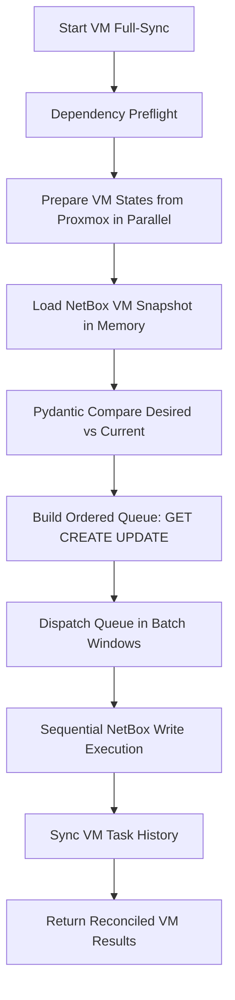
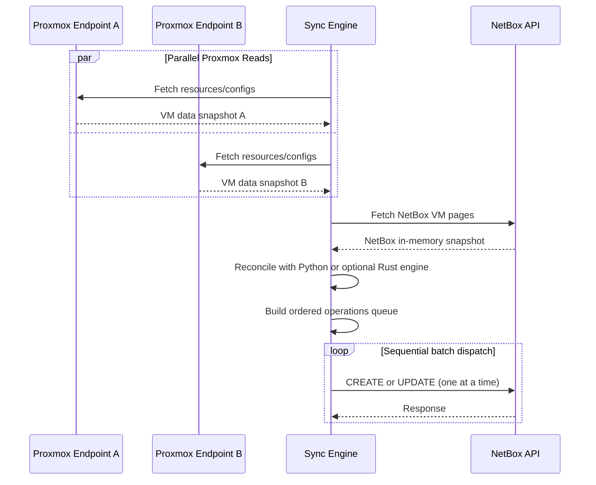

# VM Reconciliation Architecture

This page documents the VM full-sync reconciliation architecture used by `proxbox-api` when VM sync runs in full-update mode (`sync_vm_network=false`).

The design goal is to maximize read throughput from Proxmox while keeping NetBox write pressure low and deterministic.

## Why This Architecture Exists

The old model mixed fetch/reconcile/write per VM and could interleave many NetBox writes while still discovering data.

The new model separates the workflow into explicit phases:

1. Read all required Proxmox VM inputs into memory (parallel).
2. Read all required NetBox VM state into memory (single snapshot pass).
3. Compare desired vs current with Pydantic-normalized payloads.
4. Build a deterministic operation queue (`GET`, `CREATE`, `UPDATE`).
5. Dispatch operations sequentially in batch windows controlled by global configuration.

This keeps NetBox updates controlled for a single shared NetBox instance while still allowing parallel Proxmox data collection.

## Execution Phases

### Phase 1: Dependency Preflight

Before reconciling VMs, the sync ensures parent dependencies in NetBox:

- Manufacturer
- Device type
- Proxmox node role
- Cluster type
- Cluster
- Site
- Node device
- VM role (QEMU/LXC)

These are required for deterministic VM payload generation.

### Phase 2: Proxmox Read Snapshot (Parallel)

For each VM candidate, sync prepares an in-memory state object containing:

- Cluster + VM identity
- Proxmox VM resource record
- Proxmox VM config
- Normalized desired NetBox VM payload
- NetBox lookup keys (cluster + `cf_proxmox_vm_id`)

Preparation runs with bounded concurrency using `asyncio.gather` + semaphore.

### Phase 3: NetBox Read Snapshot (In-Memory)

The sync reads all NetBox VMs in paginated batches (`limit/offset`) and builds an in-memory index keyed by:

- `(cluster_id, proxmox_vm_id, proxmox_vm_type)`

This avoids repeated NetBox list/filter calls during per-VM comparison.
The VM type segment prevents QEMU VM 100 and LXC CT 100 in the same cluster from colliding.
Legacy records that do not yet have `custom_fields.proxmox_vm_type` are matched only when the
`(cluster_id, proxmox_vm_id)` identity is unambiguous.

### Phase 4: Queue Reconciliation

The default reconciliation engine is Python. For each prepared VM:

1. Validate desired payload with `NetBoxVirtualMachineCreateBody`.
2. Normalize current NetBox record with the same schema.
3. Compute delta fields.

Classification result:

- `GET`: Object exists and no delta.
- `CREATE`: Object missing in snapshot index.
- `UPDATE`: Object exists and delta is non-empty.

An optional Rust implementation exists behind a pure JSON boundary:

```text
Input  : prepared_vms + netbox_snapshot + flags  (JSON bytes)
Output : operation queue (CREATE | GET | UPDATE + patch_payload)  (JSON bytes)
```

The Rust function performs no HTTP, async work, database access, retry logic, or dispatch.
Those concerns remain in Python. When the native package is installed, the Python bridge can
serialize inputs with Pydantic v2, call the PyO3 extension with the GIL released, decode the
result, and adapt operations back to the Python dataclasses used by dispatch.

Engine selection is controlled by runtime settings. The NetBox plugin setting
`ProxboxPluginSettings.reconciliation_engine` is the normal operator-facing
control, and `PROXBOX_RECONCILIATION_ENGINE` remains an environment override.

| Variable | Value | Behavior |
|----------|-------|----------|
| `PROXBOX_RECONCILIATION_ENGINE` | `python` | Default. Use Python output only. |
| `PROXBOX_RECONCILIATION_ENGINE` | `compare` | Run Python and Rust when Rust is installed, log mismatches, return Python output. |
| `PROXBOX_RECONCILIATION_ENGINE` | `rust` | Return adapted Rust output. |
| `PROXBOX_RECONCILIATION_COMPARE_STRICT` | `true` | Raise on compare-mode mismatch. Intended for CI. |

If the Rust package is not installed, `python` mode works normally and `compare` mode returns
Python output. `rust` mode requires the native package and fails clearly if it is unavailable.

Compare-mode mismatches increment `proxbox_reconcile_mismatch_total`, which is exposed in:

- `/cache/metrics`
- `/cache/metrics/prometheus`

### Phase 5: Sequential NetBox Dispatch in Batch Windows

Operations are executed in deterministic queue order.

- Batch window size is read from `PROXBOX_NETBOX_WRITE_CONCURRENCY`.
- Inside each batch window, writes are still executed one-by-one (sequential).
- `GET` operations are no-op reads from in-memory state.
- `CREATE` operations call NetBox create.
- `UPDATE` operations call NetBox patch by record ID.

After object reconciliation, VM task-history sync is executed per resolved VM record.

## Mermaid Diagrams

### End-to-End Reconciliation Flow



### Parallel Read + Sequential Write Model



## Operation Semantics

`GET`

- Means no NetBox write is required.
- Record is reused from in-memory NetBox snapshot.

`CREATE`

- Means no matching `(cluster_id, proxmox_vm_id, proxmox_vm_type)` was found.
- NetBox POST is executed once during dispatch.

`UPDATE`

- Means object exists but reconciled payload differs.
- NetBox PATCH includes only changed fields.

## Configuration and Tuning

- `PROXBOX_VM_SYNC_MAX_CONCURRENCY`: controls concurrent VM preparation/fetch from Proxmox.
- `PROXBOX_NETBOX_WRITE_CONCURRENCY`: defines dispatch batch window size.
- `reconciliation_engine` / `PROXBOX_RECONCILIATION_ENGINE`: selects `python`, `compare`, or `rust`.
- `PROXBOX_RECONCILIATION_COMPARE_STRICT`: raises on compare-mode drift when set to `true`.

Note: batch window size does not imply parallel writes; writes remain sequential to protect NetBox under single-instance operation.

## Rust Rollout Policy

Rust is not the default engine. Rollout is intentionally conservative:

1. Build and test `proxbox-reconcile-rs` wheels in CI.
2. Publish `proxbox-reconcile-rs` only through the repository release workflow.
3. Keep `reconciliation_engine=python` as the default in `proxbox-api`.
4. Run `reconciliation_engine=compare` in staging for at least two weeks.
5. Watch `proxbox_reconcile_mismatch_total` and reconciliation mismatch logs.
6. Recommend `PROXBOX_RECONCILIATION_ENGINE=rust` only after zero mismatches across diverse real syncs.
7. Consider a default-engine change only in a later minor release and only after full sync wall-time benchmarks show a real win.

Rollback is immediate: set `reconciliation_engine` back to `python` in NetBox, or unset `PROXBOX_RECONCILIATION_ENGINE` if an env override was used.

Current benchmark evidence does not justify making Rust the default. The full Rust path is slower
than Python in the synthetic benchmark harness, and live measurement showed reconciliation was not
the dominant sync cost.

## Benefits

- Predictable NetBox write load.
- Reduced duplicate or conflicting updates.
- Clear phase boundaries for troubleshooting.
- Better observability of planned vs executed operations.
- Easier future extension for dry-run/export of operation plans.
